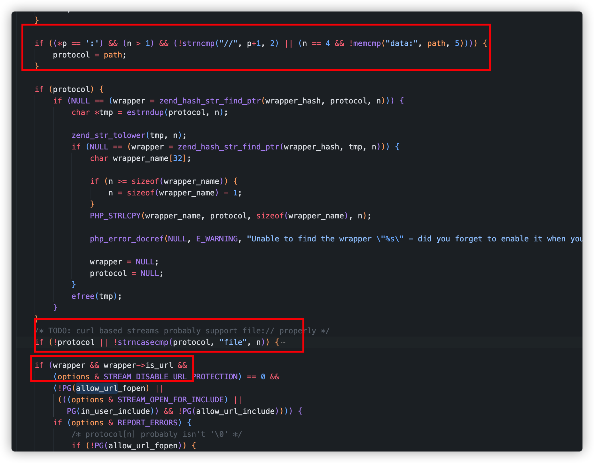
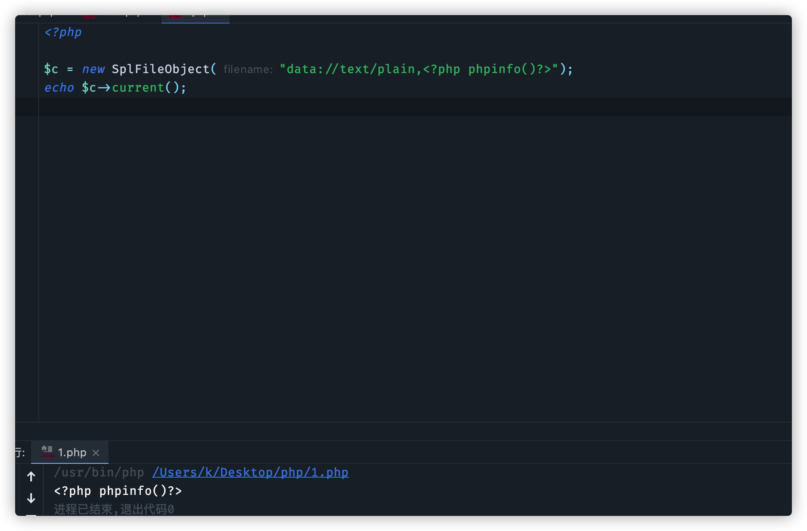
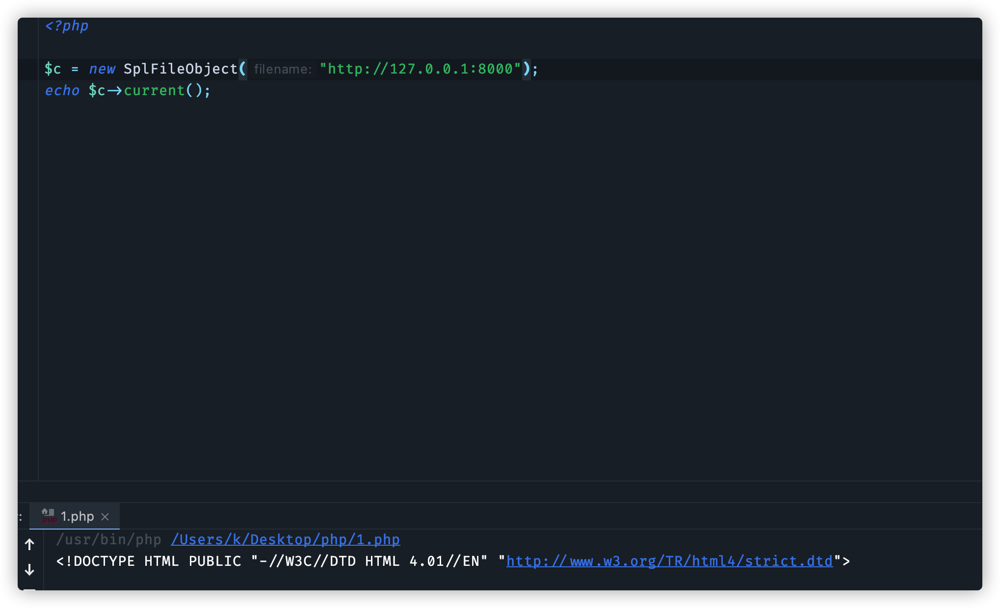

今天帮朋友遇到一道CTF题目

源码简化如下:

```php
<?php
error_reporting(0);
show_source(__FILE__);

$a = $_GET["a"];
$b = $_GET["b"];
$c = $_GET["c"];
$d = $_GET["d"];
$e = $_GET["e"];
$f = $_GET["f"];
$g = $_GET["g"];

if(preg_match("/Error|ArrayIterator|Exception/i", $a)) {
    die("hello");
}

$class = new $a($b);
$str1 = substr($class->$c(),$d,$e);
$str2 = substr($class->$c(),$f,$g);
$str1($str2);
?>
```

这题以前曾经出现过，主要考点是对php原生类的利用，常规解法就是

```php
$e = new Exception("systemid");
echo $e->getMessage();
```

但是这题`if(preg_match("/Error|ArrayIterator|Exception/i", $a)) {`通过一个if来拦截了常用的这些原生类,这个就需要我们在这些类以外，再寻找一个符合条件的原生类，需要符合一下条件

1.php原生类

2.存在构造方法，参数为字符串或者数组

3.存在返回值为字符串的无参方法，并且内容可控


根据这个条件找到SplFileObject这个类


# SplFileObject

该类可用来读取文件，这个类构造方法如下,只需要传入一个文件名即可

```php
public __construct(
    string $filename,
    string $mode = "r",
    bool $useIncludePath = false,
    ?resource $context = null
)
```

还存在一个current无参方法，可返回文件第一行内容

`public current(): string|array|false`


根据php源码，该类起码支持三种协议data，file，以及http协议



file协议就不考虑了，因为本地文件我们是不可控的。

data协议需要php.ini配置如下:

```ini
allow_url_fopen ：on
allow_url_include：on
```

要求较高，但是在配置的情况下，可通过如下方法利用



在allow_url_include为off的情况下，我们还可以通过http协议即可，控制返回内容




在内容可控之后就是第二个问题了，如何获得flag？

常规思路就是通过eval来实现一个一句话，例如

```php
$a = "eval";
$b = "phpinfo();";

$a($b);
```

但是你会发现

`Fatal error: Uncaught Error: Call to undefined function eval() in /Users/k/Desktop/php/1.php:9`

为什么因为php eval是一个语言结构，和echo一样不属于函数，同理就算你通过配置disable_functions也是禁用不了eval函数的。

这个时候自然而然就会想起eval的代替品`assert`,这是一个实打实的函数,但是不好意思php7中禁止了动态调用assert

`Warning: Cannot call assert() with string argument dynamically in /Users/k/Desktop/php/1.php on line 8`

尝试直接进行命令执行 sysmtem、exec等等执行了都没有成功。

执行命令没成功，尝试直接进行文件读取，使用show_source("/flag"),盲猜flag位置成功获得flag

# 扩展

通过这个类想到ctf题目中出现过的SoapClient这个class，这个类一般在sstf场景中利用。如果SoapClient该class被禁用了的话，也可以尝试用SplFileObject此类代替。
