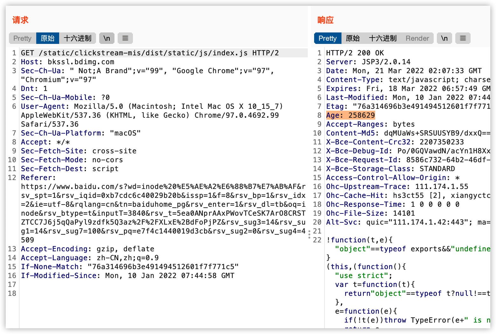
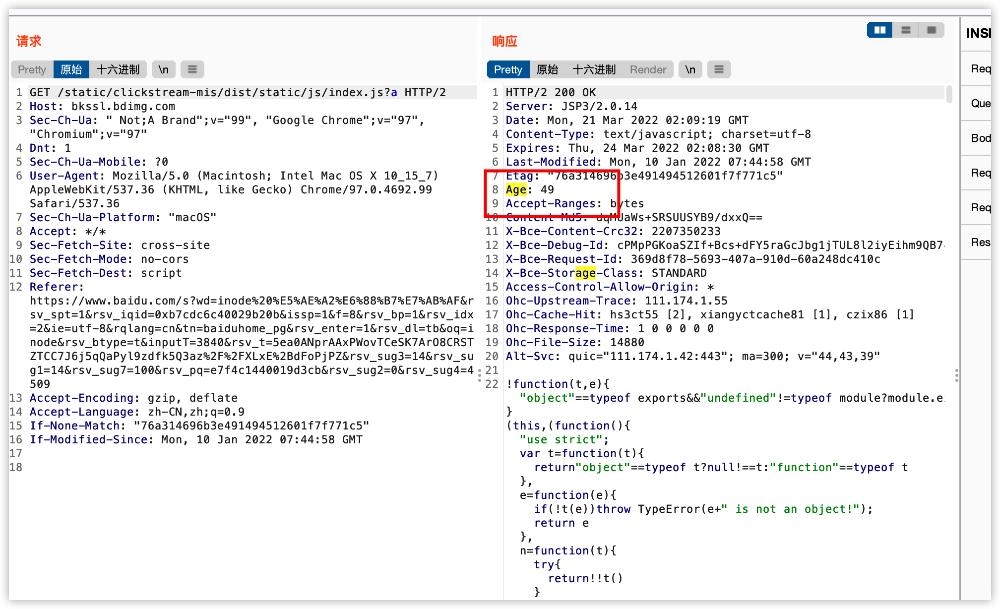
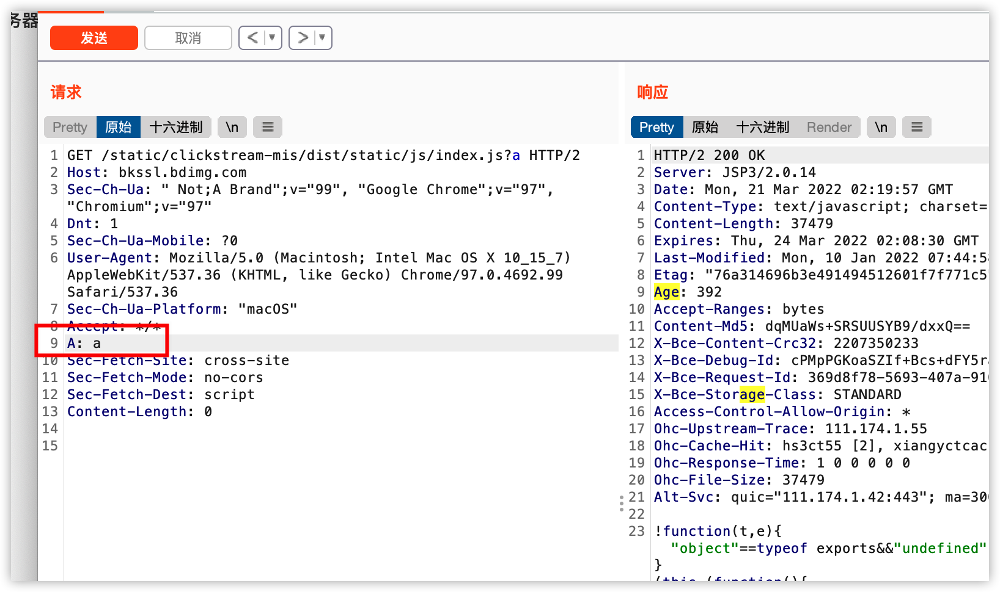
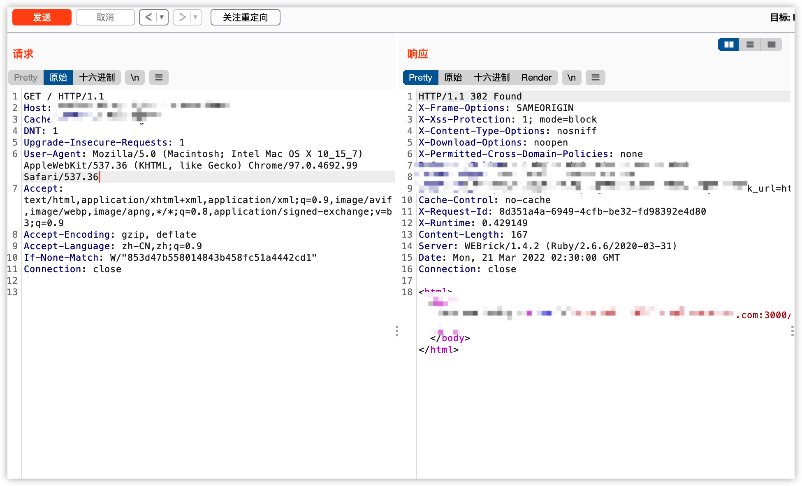
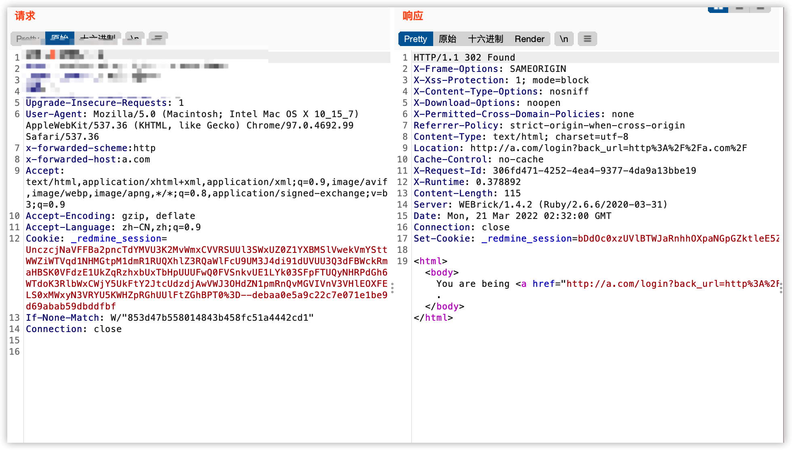
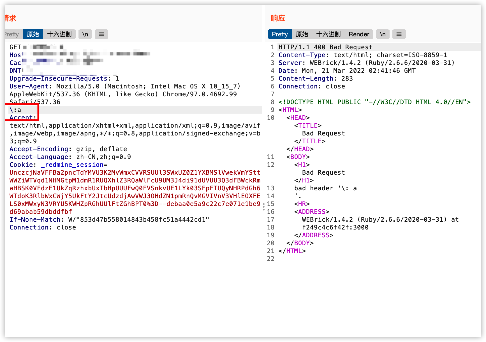

在先知上看到了一篇关于缓存投毒的分享，属实是小刀拉屁股，开了眼。

但是那篇翻译的文章属实还是有点抽象，根据那篇文章，说说我理解的缓存投毒漏洞。


首先利用条件需要目标，存在CDN网络，或者前置的缓存服务器。


# 1.缓存服务器原理

缓存服务器可以简单理解为一个`map[string]string`结构，根据不同key来返回不同的缓存内容。

但是这个key的来源各个cdn或者缓存服务器上就又很大差别，这也就是缓存投毒问题的来源。


以百度的一个静态资源来看



添加?a以后，缓存时间变了



说明这两个url对应的是不同的缓存文件，缓存的key可能就是 url的path。


额外请求头不影响到返回的缓存内容。




# 2.缓存投毒实例

在Rack 中间件中，会根据用户传递的x-forwarded请求头，来生成重定向链接

```
x-forwarded-scheme:http
x-forwarded-host:a.com
```

正常请求时，重定向到内页



在添加x-forwarded-host请求头以后，页面重定向到了我们提供的域名




根据刚才的缓存规则，这个网站如果存在缓存服务器，正常的301页面会被恶意的301页面缓存，其他普通用户集中了我们的缓存就会被重定向到恶意页面中。


# 3.前后端服务器差异

除了可控的请求头外，前后端服务器差异也是缓存投毒的一个重要原因。

根据[RFC7230](https://datatracker.ietf.mrg/doc/html/rfc7230)定义header中\是不合法的，后端服务器应该拒绝请求



但是如果在cdn中未实现此规范，将\转发到后端服务器，很可能会将400页面作为url的响应进行缓存，造成正常页面的DOS。

# 4.总结

可见缓存投毒产生的原因大部分都是未预期的请求头，但是大部分所能造成的危害有限。

但是这种攻击排查起来难度极高，攻击成本低，可能仅需要一条请求就成造成全站DOS。

# 参考文章

> https://xz.aliyun.com/t/10848