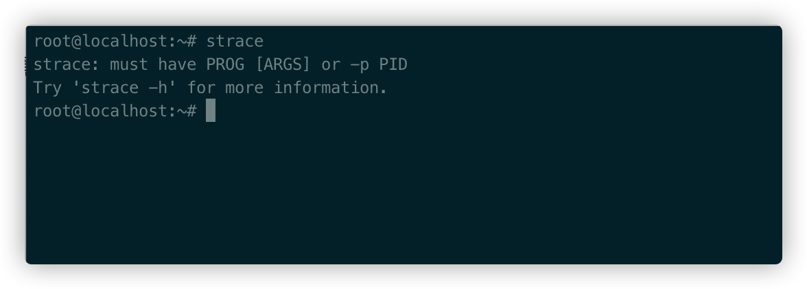
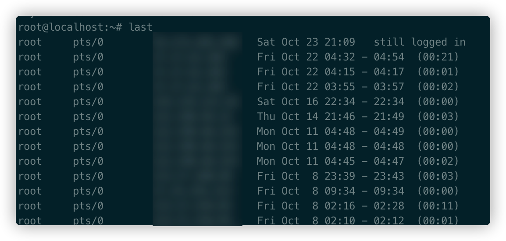
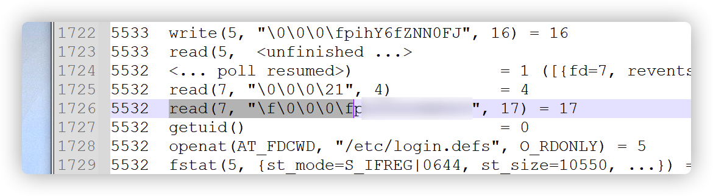

# 1.前言

在window下获取到administraot权限以后，使用mimikatz不管是抓取明文密码或是hash都很方便，但是在Linux就算获取到root权限了，获取hash倒是很简单cat一下就行，但是大概率很难解密出来。那么如何在Linux抓取root用户的明文密码，方面后续渗透呢？

# 2.使用strace抓取密码

strace是一个可用于诊断、调试和教学的Linux用户空间跟踪器。我们用它来监控用户空间进程和内核的交互，比如系统调用、信号传递、进程状态变更等。

> strace底层使用内核的ptrace特性来实现其功能。

在运维的日常工作中，故障处理和问题诊断是个主要的内容，也是必备的技能。strace作为一种动态跟踪工具，能够帮助运维高效地定位进程和服务故障。它像是一个侦探，通过系统调用的蛛丝马迹，告诉你异常的真相。

最重要的是，一般在Linux发行版下都已经默认安装了，无需自行安装。

使用strace抓取密码，必须要管理员登录才行，我们可以使用last命令来查看管理员最后登录的时间，登录顺序，由近到远

像这台，昨天就登录过，就可以尝试使用strace获取密码。

首先`ps -elf |grep sshd` 找到sshd的pid,使用`nohup strace -f -p pid -o sshd.out.txt &`来跟踪sshd进程

然后当管理员使用密码登录以后，下载 sshd.out.txt文件,在文件中搜索`read(7, "\f\0\0\0\f`,字符串后面的即是明文密码

