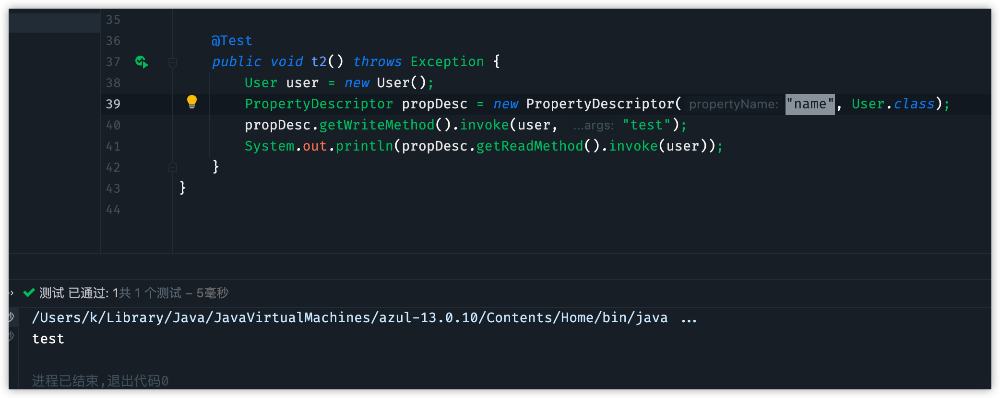
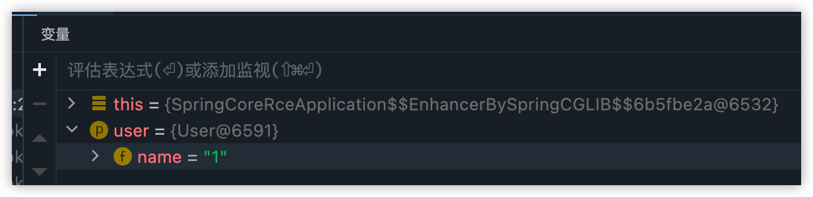

# 1.java bean

要分析spring漏洞首先要了解一下java bean，

bean并非java中的如反射、重载等等这些实打实的一些功能，而是一组class的设计规范，你设计的class，符合这个规范。你的class就可以看做是java bean。


bean特点是提供无参构造器，提供getter方法和setter方法访问对象的属性。

如

```java
public class User {
    private String name;

    public String getName() {
        return name;
    }

    public void setName(String name) {
        this.name = name;
    }
}
```


这就可以看做是一个bean，在各种源码中都可以看到他的存在。


但是第一次看到这种class的时候，就有一个问题，既然你都提供了get和set方法，说明是需要被外部读写的，那我我为什么不直接用public修饰name呢？还用private、get、set这一套组合拳来多此一举呢？


因为使用这套机制，可以实现相对于public更细致的操作。

1.可以实现只读，或者只写的操作。只需要单独设置set或者get方法就行。

2.可以对入参进行检测，比如name，只允许输入中文姓名等等


java既然提供了这个bean这个规范，肯定要提供对应的API来方便操作。


这就是**Java 内省(Introspector)**


PropertyDescriptor类:

PropertyDescriptor类表示JavaBean类通过存储器导出一个属性。主要方法：

1. getPropertyType()，获得属性的Class对象;
2. getReadMethod()，获得用于读取属性值的方法；getWriteMethod()，获得用于写入属性值的方法;
3. hashCode()，获取对象的哈希值;
4. setReadMethod(Method readMethod)，设置用于读取属性值的方法;
5. setWriteMethod(Method writeMethod)，设置用于写入属性值的方法。


简单demo如下:

```java
User user = new User();
PropertyDescriptor propDesc = new PropertyDescriptor("name", User.class);
propDesc.getWriteMethod().invoke(user, "test");
System.out.println(propDesc.getReadMethod().invoke(user));        
```




为什么要了解bean，因为spring mvc的依赖注入就是利用这个来完成的。

# 2.spring mvc 依赖注入

在spring core中申明一个控制器，参数是User class

```java
@RequestMapping("/test")
    public String test(User user) throws Exception {
        return "Hello World";
    }
```

然后访问`http://localhost:18080/spring_core_rce_war/test?name=1`,会把1注入到User的name属性，然后作为参数传递给控制器



