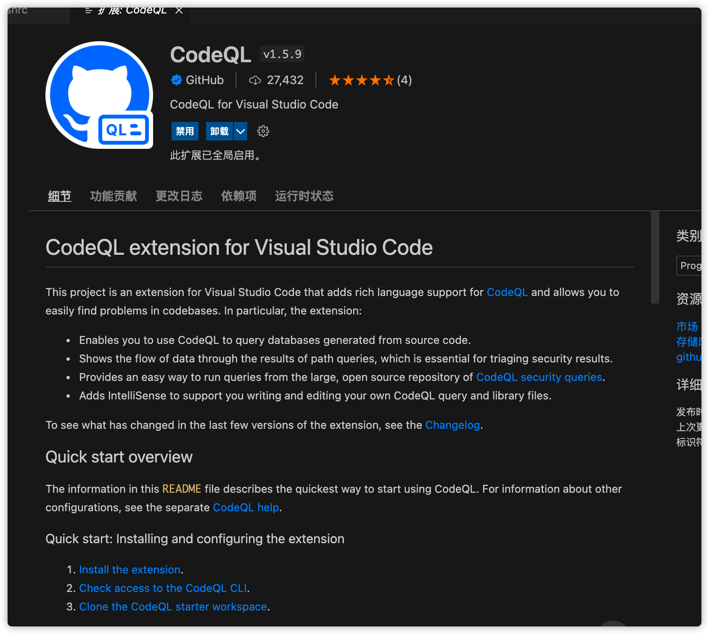
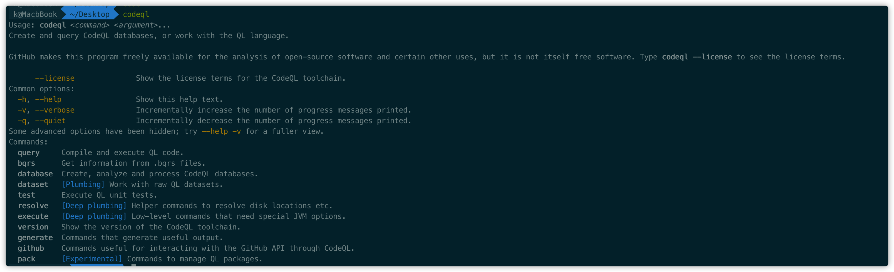
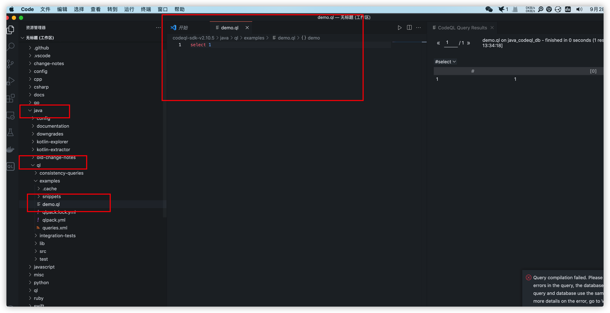

# 相关资料

codeql-cli

> https://github.com/github/codeql-cli-binaries

Ql

>https://github.com/Semmle/ql

go-ql

> https://github.com/github/codeql-go

# 1.codeql环境搭建

vscode中下载codeql插件



启动插件以后，插件会自动下载codeql可执行文件，mac下的路径为`/Users/k/Library/Application Support/Code/User/globalStorage/github.vscode-codeql/distribution2/codeql/`


创建软连接方便终端使用

`ln -s /Users/k/Library/Application\ Support/Code/User/globalStorage/github.vscode-codeql/distribution2/codeql/codeql /usr/local/bin`




# 2.database create

## java


```
codeql database create ./java_codeql_db  --language="java"  --command="mvn clean install --file pom.xml -Dmaven.test.skip=true" --source-root=micro_service_seclab-main --overwrite
```

## golang

```
codeql database create /Users/safe6/codeql/database/gf --language="go" --source-root=/Users/safe6/Desktop/grafana-8.2.6 --overwrite
```

## js

```
codeql database create jstest --language=javascript
```


# 3.vscode 查询

首先打开codeql-sdk文件夹

然后在对应语言的目录下创建demo.ql文件，vscode右键即可查询



# 参考文章

1.CodeqlNote

> https://github.com/safe6Sec/CodeqlNote

2.CodeQL从入门到放弃

> https://www.freebuf.com/articles/web/283795.html

