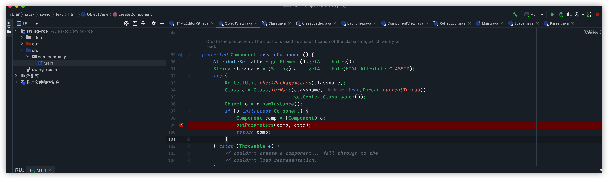

```java
protected Component createComponent() {
        AttributeSet attr = getElement().getAttributes();
        String classname = (String) attr.getAttribute(HTML.Attribute.CLASSID);
        try {
            ReflectUtil.checkPackageAccess(classname);
            Class c = Class.forName(classname, true,Thread.currentThread().
                                    getContextClassLoader());
            Object o = c.newInstance();
            if (o instanceof Component) {
                Component comp = (Component) o;
                setParameters(comp, attr);
                return comp;
            }
        } catch (Throwable e) {
            // couldn't create a component... fall through to the
            // couldn't load representation.
        }

        return getUnloadableRepresentation();
    }
```