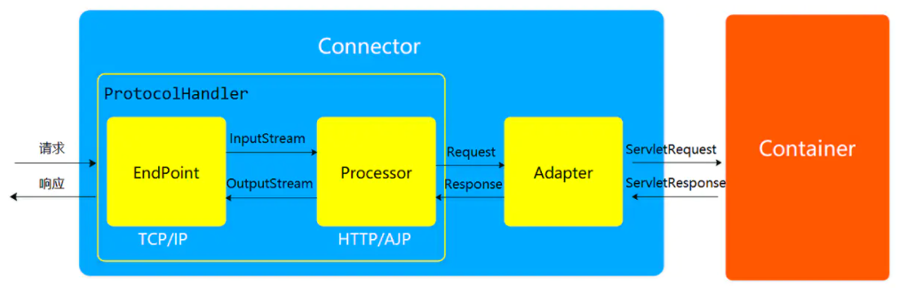
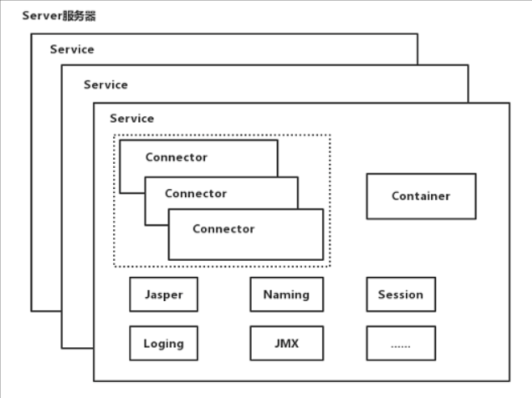
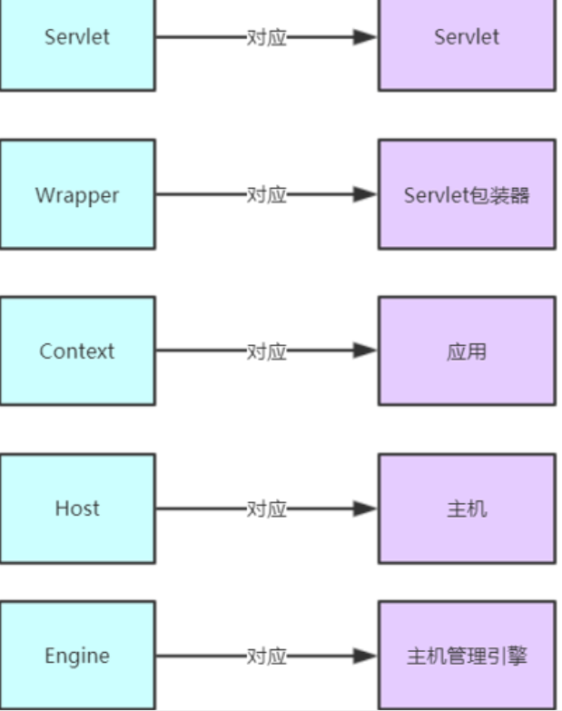
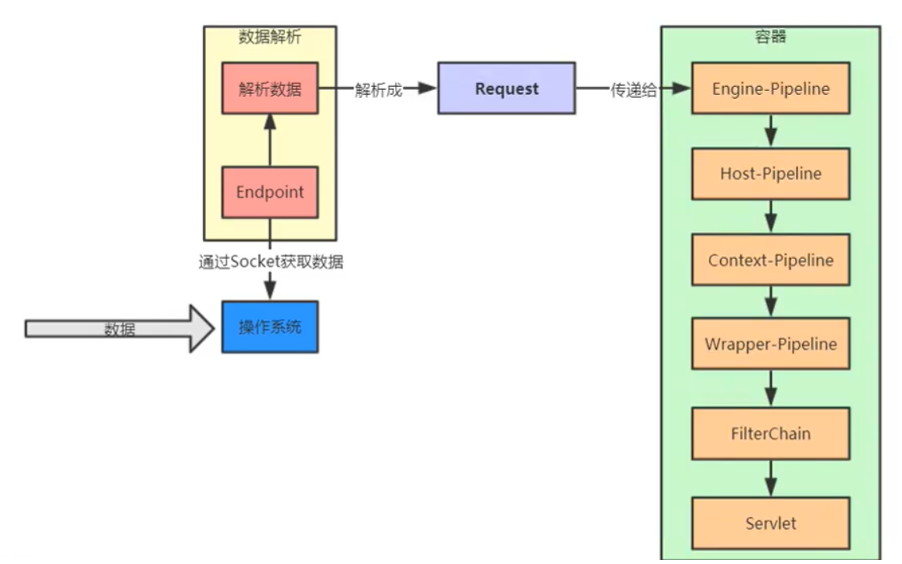

# 1.基础架构

- Server：
    Server，即指的WEB服务器,一个Server包括多个Service。

- Service：

    Service的作用是在`Connector`和`Engine`外面包了一层（可看上图），把它们组装在一起，对外提供服务。一个`Service`可以包含多个`Connector`，但是只能包含一个`Engine`，其中`Connector`的作用是从客户端接收请求，Engine的作用是处理接收进来的请求。后面再来细节分析Service。

- Connector：

    Tomcat有两个典型的`Connector`，一个直接侦听来自browser的http请求，一个侦听来自其它WebServer的请求Coyote Http/1.1 Connector 在端口8080处侦听来自客户browser的http请求
    Coyote JK2 Connector 在端口8009处侦听来自其它WebServer(Apache)的servlet/jsp代理请求。

- Engine：

    Engine下可以配置多个虚拟主机，每个虚拟主机都有一个域名当`Engine`获得一个请求时，它把该请求匹配到某个`Host`上，然后把该请求交给该`Host`来处理`Engine`有一个默认虚拟主机，当请求无法匹配到任何一个`Host`上的时候，将交给该默认Host来处理。

- Host：

    代表一个虚拟主机，每个虚拟主机和某个网络域名Domain Name相匹配
    每个虚拟主机下都可以部署(deploy)一个或者多个Web App，每个Web App对应于一个Context，有一个Context path，当Host获得一个请求时，将把该请求匹配到某个Context上，然后把该请求交给该Context来处理匹配的方法是“最长匹配”，所以一个path==""的Context将成为该Host的默认Context所有无法和其它Context的路径名匹配的请求都将最终和该默认Context匹配。

- Context：

    一个Context对应于一个Web Application，一个`WebApplication`由一个或者多个Servlet组成
    Context在创建的时候将根据配置文件`$CATALINA_HOME/conf/web.xml`和`$WEBAPP_HOME/WEB-INF/web.xml`载入Servlet类，当Context获得请求时，将在自己的映射表(mapping table)中寻找相匹配的Servlet类。如果找到，则执行该类，获得请求的回应，并返回。

    

    

    