感觉很多人都对溯源反制这个事情，感觉很神奇。


今天就讲一下我所知道的目前的溯源反制的手段，以及技术原理


# 1.ip层面


这个维度主要就是对攻击者的ip进行威胁情报查询，微步在线跑一遍，重点关注历史绑定域名、绑定域名的备案等等。或者可以扫一下攻击ip开发的端口等等，可能有一些脆弱服务什么的。


# 2.浏览器层面

也就是目前蜜罐主流的手段，


## 2.1 jsonp

浏览器层面主要发力点是在JSONP漏洞上，jsonp是早期浏览器对跨域支持不完善，开发人员想到的一种绕过机制。

大家都知道在HTML页面中，我a站直接ajax b站，如果没有做特别配置的话，浏览器肯定是会直接拦截的。


示例代码如下

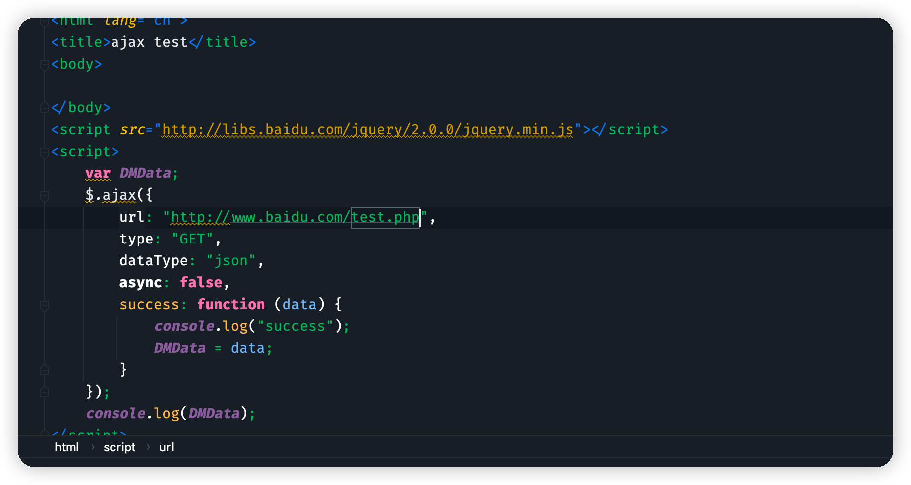

在开发者工具中看流量记录，test.php报了CORS错误。

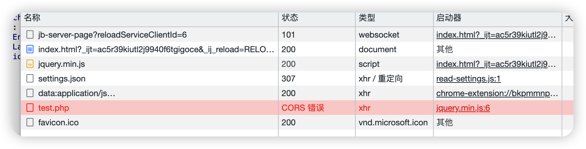

这个是肯定，具体的浏览器跨域策略，有兴趣可以百度了解，我这里不深入了。

早期的web开发者也遇到过这个问题，于是想到了一个很巧妙的办法来进行跨域。

大家看前面的示例代码，ajax是被拦截了。但是前面的script标签中的jquery.min.js文件可是被正常加载了。

script标签是可以正常跨域的，那么我如果想让a站从b站上获取数据，进行跨域的话，我只需要在b站构造一个特别的js文件即可完成数据交换，代码如下。


在b站写入如下t2.php文件

```php
<?php
header('Content-type: application/json');
$uid = 123;
$jsoncallback = htmlspecialchars($_REQUEST ['jsoncallback']);
echo $jsoncallback . "(" . $uid . ")";
```


然后a站代码如下

```php
<script>
    function a(data){
        alert(data);
    }
</script>
<script src="http://127.0.0.1:8082/t2.php?jsoncallback=a"></script>
```

我们提前定义好函数a，然后引入前面写好的文件，成功获取到b站中存储的uid，完成跨域。

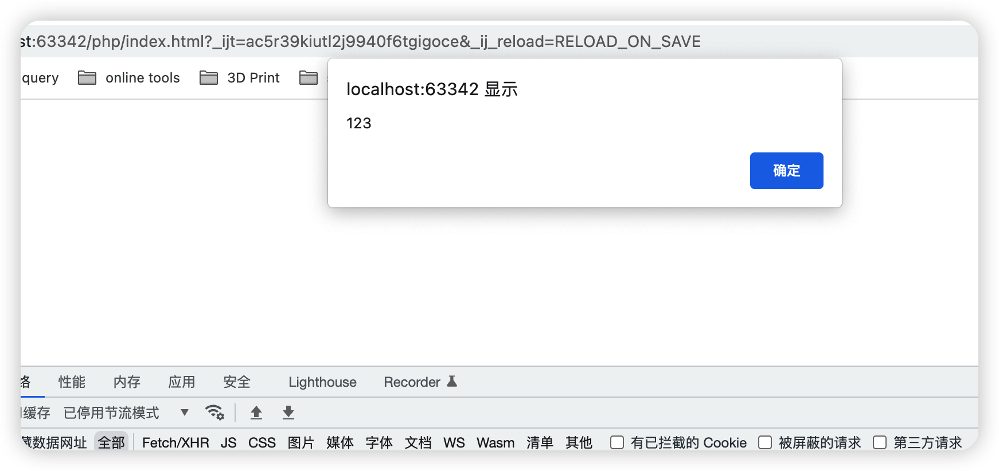

在很多大型网站中，比如百度、腾讯网站中也会存在jsonp这种机制，用了和一些网站跨站，而且这些接口传递的数据中很可能就包含了一些个人信息，如昵称、QQ号啥的。

而蜜罐只需要找到这些特殊的接口，然后自己构造好a函数，就能接受到这些个人信息了。

比如我以前挖到过的某一个大站的jsonp漏洞，就包含了昵称信息，还有一些唯一标识码

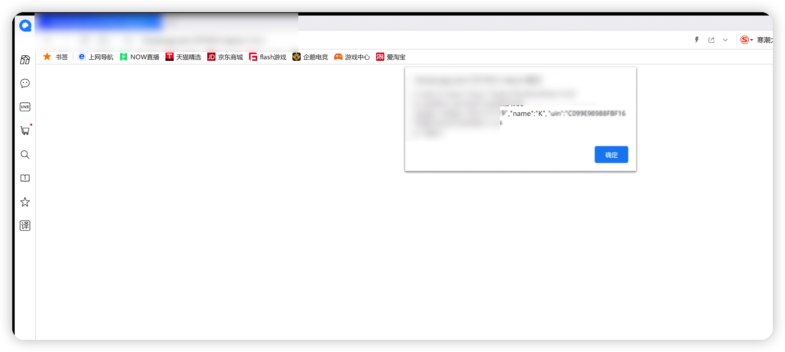

虽然jsonp可以直接跨域交换信息，但是也要依托于浏览器的登录状态，就像csrf漏洞。但是如果你在b站上压根都没登录的话，那么也是无法获取到个人信息的。而且新版的chrome内核在加载js的时候，已经是不会再传递cookie了。

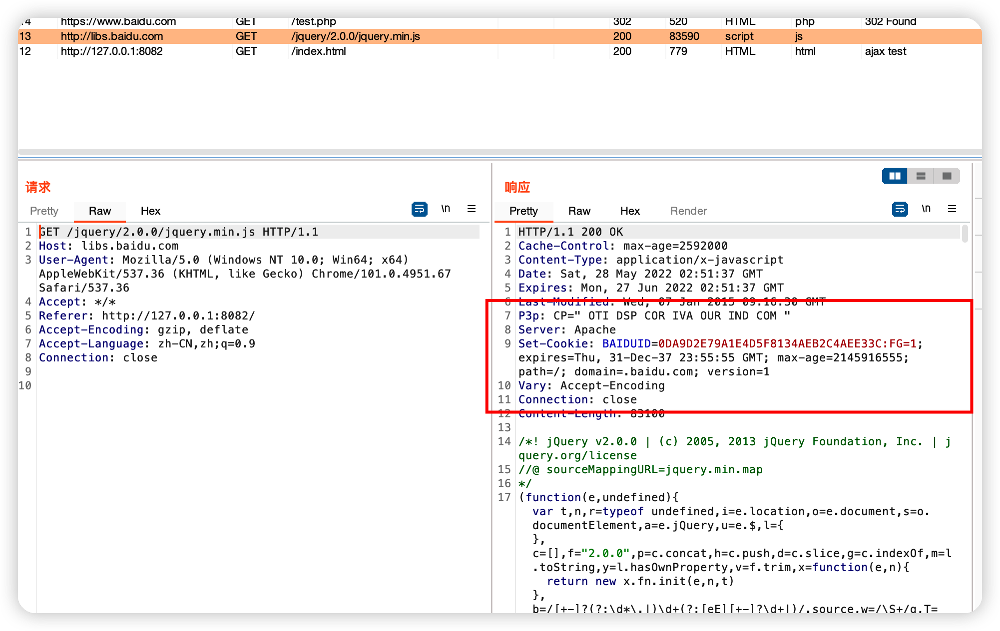

cookie中还是为空，可以一定程度上避免此类问题。

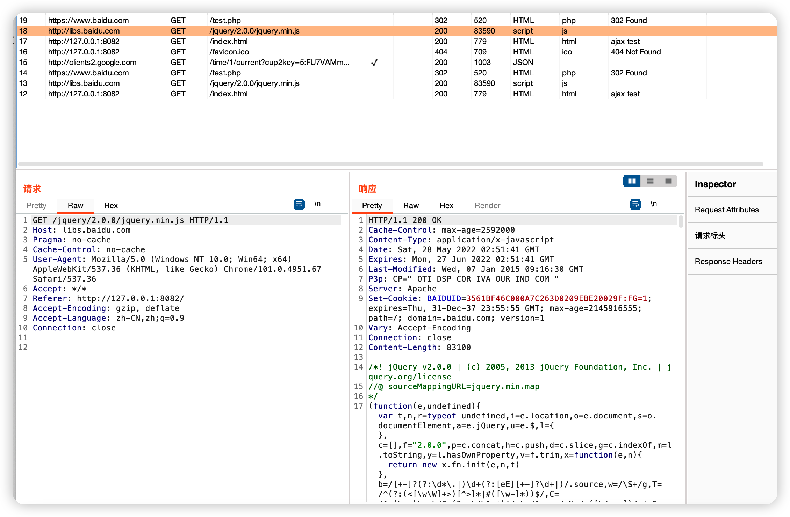

但是如果是运营商层面的话，就有点难顶了。毕竟是直接流量层面的。这种要么有线挂代理要么匿名物联网卡。

## 2.2 云指纹

这个我也是在一篇文章中看过，大概过程是。将蜜罐部署在多家单位中，然后攻击者访问了a单位的a网站，又访问了和a单位完全没有任何关系的b单位的b网站。那么可以大概率确定是该访问对象为攻击者。


那么蜜罐是如何确定是同一个人访问了A、b两个网站的呢。a和b是两个独立的网站，依托cookie来进行确定肯定是不行的，因为cookie肯定是不共享的，单独引入一个第三方域来做统计的话，那下次别人只要看到这个第三方域就知道是蜜罐了，那肯定不行。


这就要用到浏览器指纹技术了，浏览器指纹顾名思义就是用来标识唯一浏览器的。具体效果就是，你用电脑上的chrome浏览器去访问任何一个网站，通过一段js代码都能运算出一个相同的标识符。该标识符不受cookie、无痕模式的影响。只受浏览器的影响，需要你换一个其他浏览器可能改标识符才会改变。


常见的浏览器指纹技术有Canvas指纹、AudioContext指纹、硬件指纹


### 什么是 Canvas 指纹？

从根本上来说，每一种浏览器都会使用`不同`的`图像处理引擎`，不同的`导出选项`，不同的`压缩等级`，所以每一台电脑绘制出的图形都会有些许不同，这些图案可以被用来给用户设备`分配特定编号`（`指纹`），也就是说可以用来识别不同用户。

那么，如何给我们的网站增加 `Canvas指纹` 呢？

我们可以通过`html5`的`canvas`接口，在网页上绘制一个`隐藏`的画布图像。

值得注意的是，如果用户的`设备`，`操作系统`，`浏览器`都一样的话，计算出来的 canvas 指纹是`一样`的。换句话说：`canvas` 指纹`不具备唯一性`，要和其他的浏览器指纹相互结合利用来进一步计算出区分度更高的指纹标识。


以Canvas指纹举例，通过这个链接可以获取到自己浏览器的Canvas指纹

> https://jsbin.com/qisodaz/edit?html,js,output

以我的chrome浏览器打开，结果如下。可以看到是不受无痕模式的影响的。

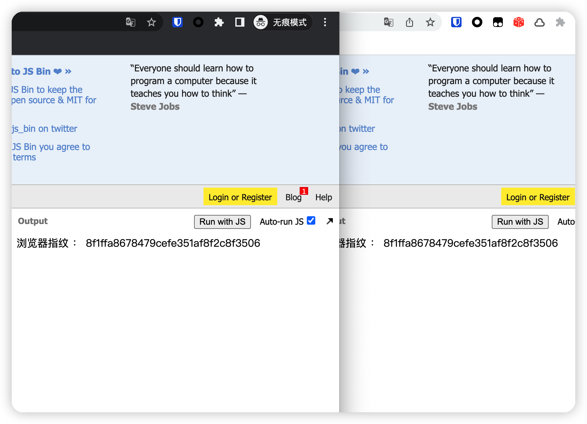

那么如何对抗这种指纹检测技术呢？

我个人使用的Brave浏览器，也是内核也是用的chrom的内核。

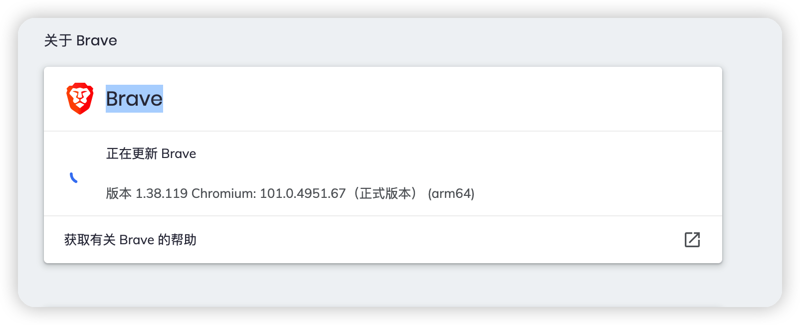

但是更加注重隐私，示例如下

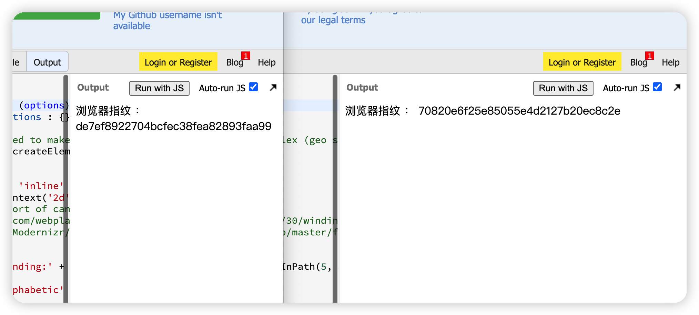

然后配合上，会放心一点

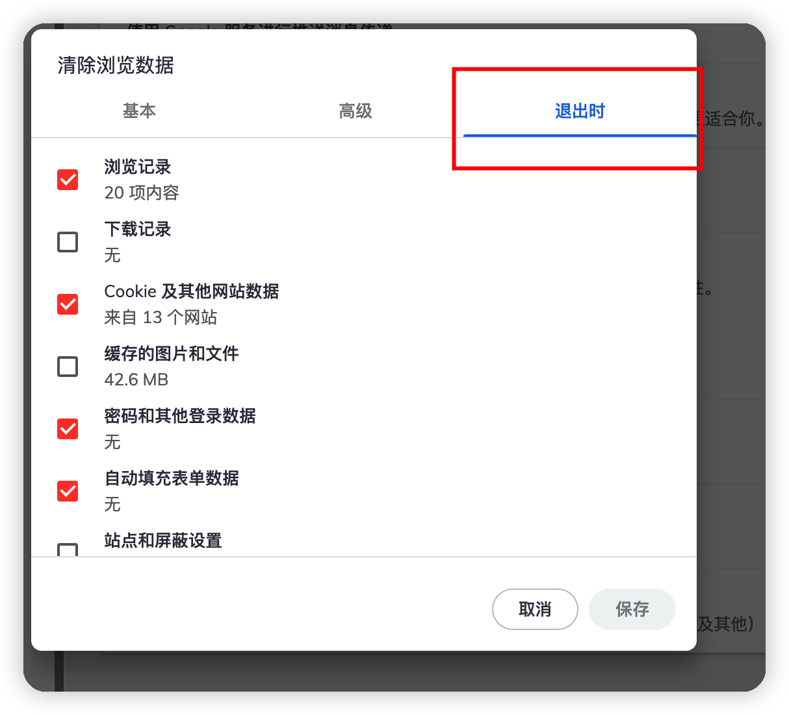

Canvas指纹只是浏览器指纹技术的一种，不保证Brave浏览器能对抗所有指纹。

# 3.钓鱼

这个层面常见的套路有

1.mysql弱口令，故意给你扫出来一个mysql弱口令。然后你去连接的话，服务器端会尝试获取你的微信id、浏览器的sqlite文件等等。最好规避的方法就是在虚拟机中去链接，千万避免物理机直接链接。

2.搞一个vpn软件和账号密码放到网站目录下或者藏到一个比较容易获取到的地方。你一看这不是妥妥的内网的诱惑吗，赶紧安装。然后就中木马了，场面一度十分尴尬。

3.chrome 0day，如果你的价值毕竟高的话，不排除防守方会申请浏览器的0day来专门反制你，这种也很好解决。懂得都懂。

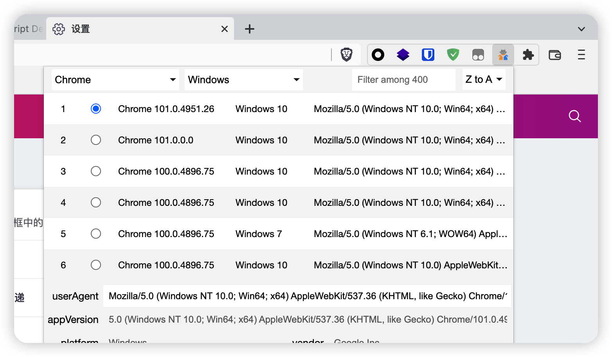

