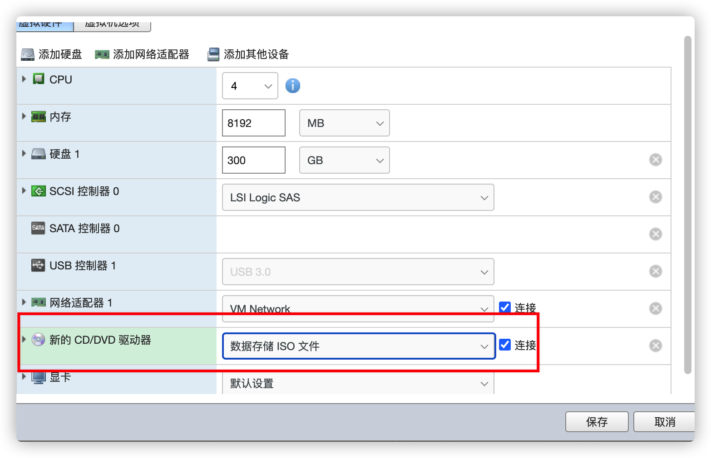
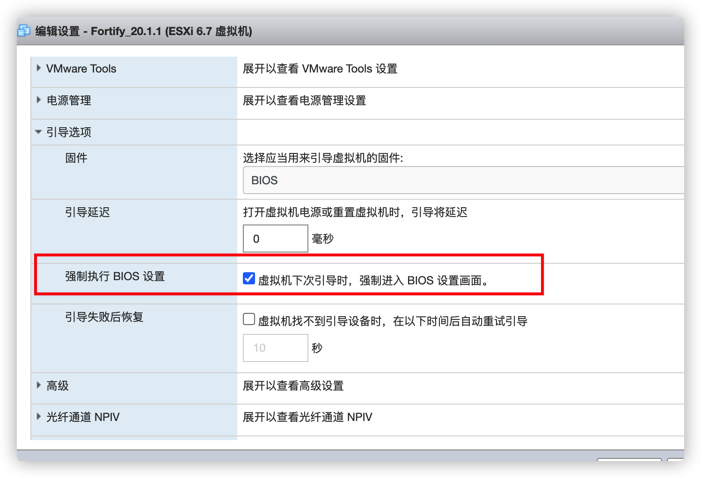
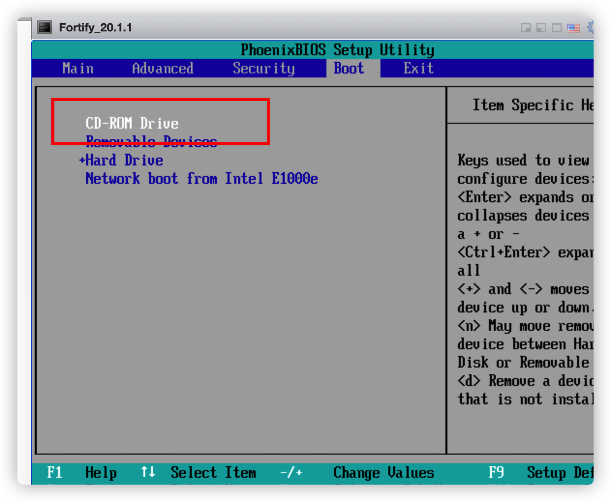
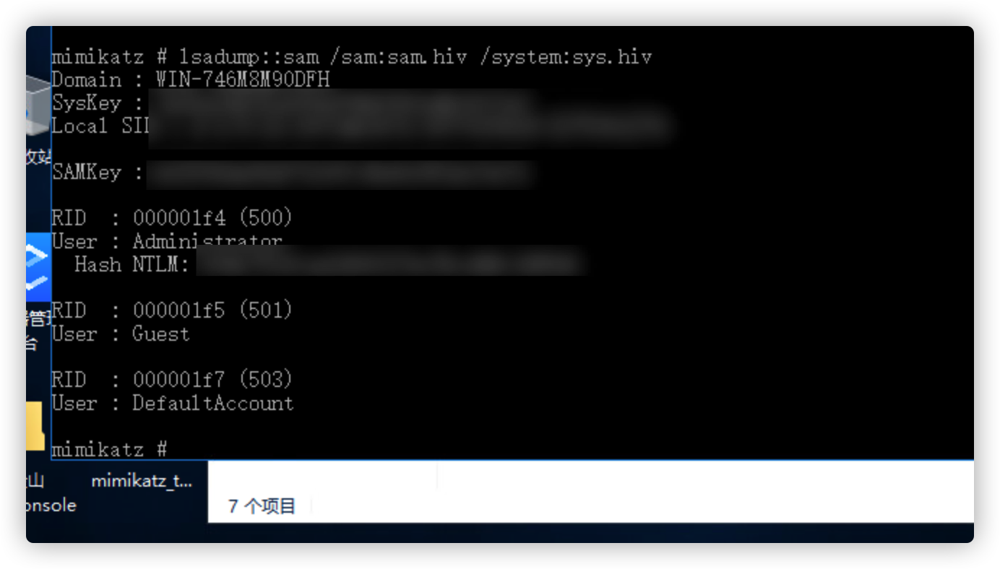

在项目里面，经常会碰到vm的esxi，或者其他虚拟化平台，如云桌面啥的。

但是一般服务器都是需要开机密码才能进入桌面的，或者在内网横向的时候，也需要有虚拟机的hash来做碰撞。


在这种情境下，我们可以通过kon-boot来在无密码的情况下抓取虚拟机的hash

---

1、kon-boot是什么？

KON-Boot是一款专门针对Windows、Linux、MAC登陆密码破解工具，他能绕过系统所设有的登陆密码，让你的登陆畅通无阻。

2、简单描述工作原理

KON-Boot的原理是在于处理BIOS修改系统内核的引导处理，跳过SAM的检查，直接登陆系统。


为什么选用KON-Boot来抓取hash，而不采取pe等其他方案呢？

因为pe系统往往都是200m以上，而kon-boot只要1.5M，在多级代理的时候，体积越小越好上传。

---


# 1.添加Iso引导

以esxi为例，我们可以先对目标虚拟机进行克隆，或者快照，以便造成任何问题以后，方便恢复










保存更改后退出，再重启后会进入window界面，输入任意密码即可进入window系统


# 2.导出hash

首先导出hiv文件

```
reg save HKLM\SYSTEM sys.hiv
reg save HKLM\SAM sam.hiv
reg save hklm\security security.hiv
```

然后在运行mimikatz导出hash

`lsadump:sam /sam:sam.hiv /system:system.hiv`


