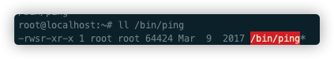
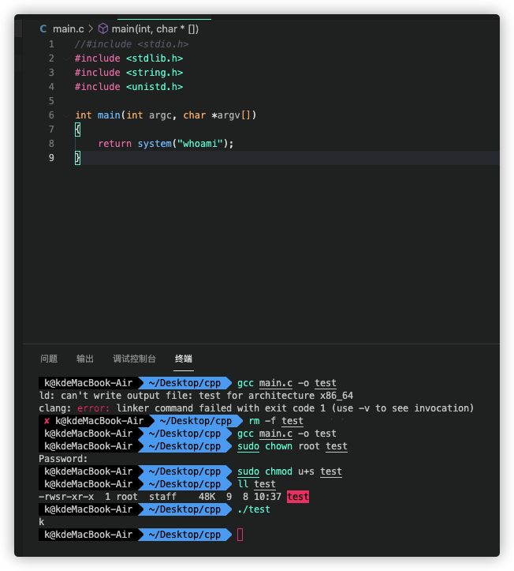
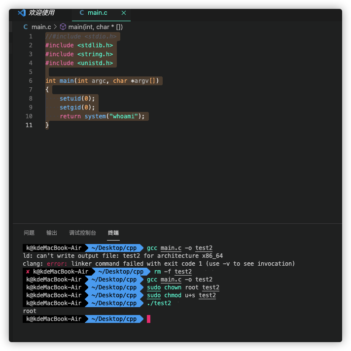
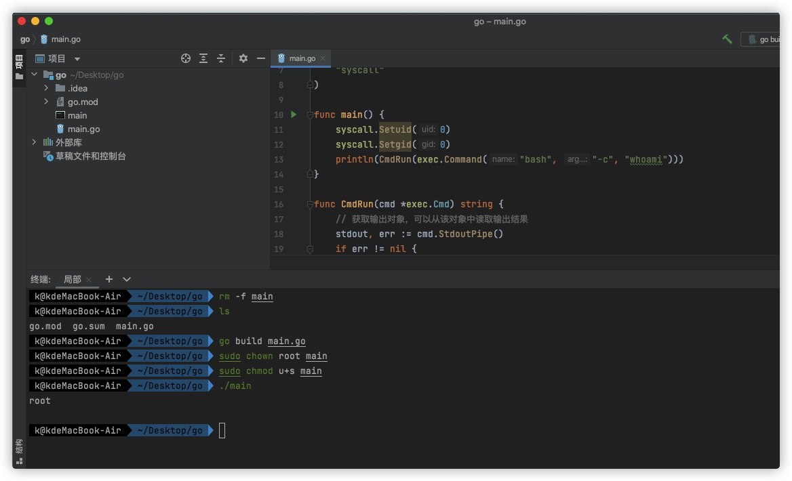

# 1.前言

这几天在写一个mac下的golang的小程序，需要用到root权限，但是sudo的话每次都输入密码，配置免密的话，又比较麻烦。

于是想到了suid，这个第一次接触还是在提权的文章中看到过。


# 2.suid介绍

 我们都知道，在执行某个程序时，默认情况下用户发起一个进程，进程的属主是进程的发起者，也就是说这个进程是以发起者的身份运行。

用户运行某个程序时，如果该程序有SUID权限，那么程序运行为进程时，进程的属主不是发起者，而是程序文件所属的属主。

一句话讲清楚，就是一个程序，属于root用户，并且具有suid权限位。那么就算普通用户执行的时候，这个程序运行的时候拥有的是root权限的。

suid最常见的应用场景就是ping，我们最用的ping就是一个suid的程序。



# 3.suid程序实现

给程序设置suid很简单，先`chown root file`把文件权限给root，通过命令`chmod u+s fille`加上suid权限即可。

但是网上的文章都有一个坑，文章里面举得实验的例子都是系统自带的命令，比如cat等等。

但是自己如果是开发的程序的想加上suid权限,以C语言为例

```c
//#include <stdio.h>
#include <stdlib.h>
#include <string.h>
#include <unistd.h>

int main(int argc, char *argv[])
{
    return system("whoami");
}
```



并没有继承到root权限，系统对system函数进行了限制。需要在程序中显式设置suid，才能正常继承权限



但是在golang开发的程序中，也显式设置。

```go
package main

import (
	"io/ioutil"
	"log"
	"os/exec"
	"syscall"
)

func main() {
	syscall.Setuid(0)
	syscall.Setgid(0)
	println(CmdRun(exec.Command("bash", "-c", "whoami")))
}

func CmdRun(cmd *exec.Cmd) string {
	// 获取输出对象，可以从该对象中读取输出结果
	stdout, err := cmd.StdoutPipe()
	if err != nil {
		log.Fatal(err)
	}
	// 保证关闭输出流
	defer stdout.Close()
	// 运行命令
	if err := cmd.Start(); err != nil {
		log.Fatal(err)
	}
	// 读取输出结果
	opBytes, err := ioutil.ReadAll(stdout)
	if err != nil {
		log.Fatal(err)
	}
	return string(opBytes)
}

```



# 4.suid的适用场景

1.适用自己开发的程序，但是不想每次都配置免密的时候。

2.提权，如果管理员错误配置了一些系统命令，如bash，namp等等的suid权限，就可以通过这些程序直接获取到root权限

已经可用于提权的

```
nmap
vim
find
bash
more
less
nano
cp
```

查找suid权限文件

```shell
#以下命令将尝试查找具有root权限的SUID的文件，不同系统适用于不同的命令，一个一个试
find / -perm -u=s -type f 2>/dev/null
find / -user root -perm -4000-print2>/dev/null
find / -user root -perm -4000-exec ls -ldb {} \;
```

3.在已有root权限的情况下，留一个suid的后门，用作权限维持。
