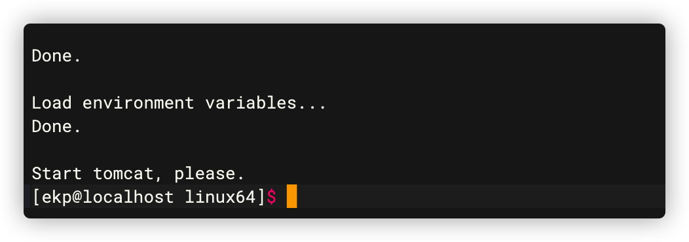
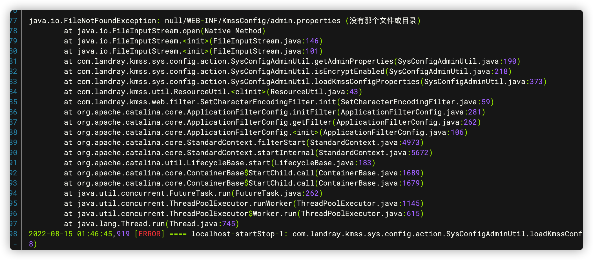
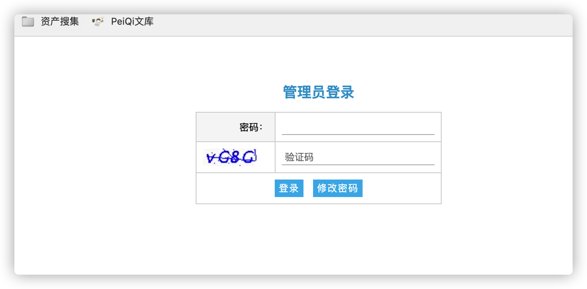
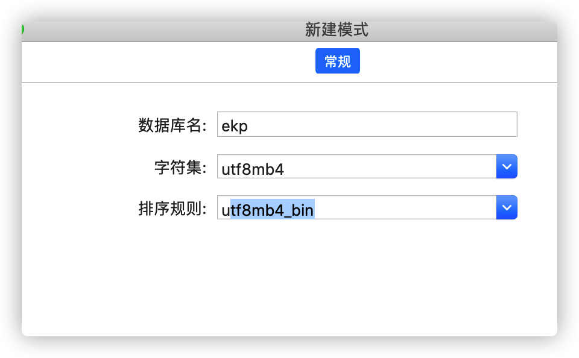
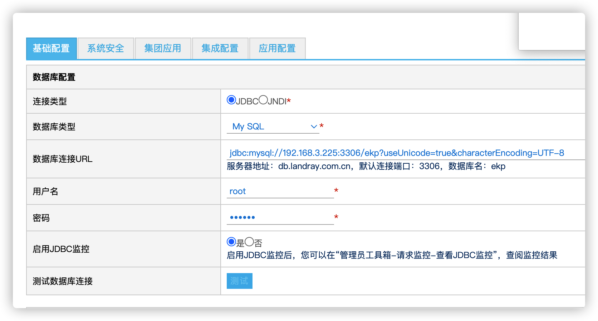
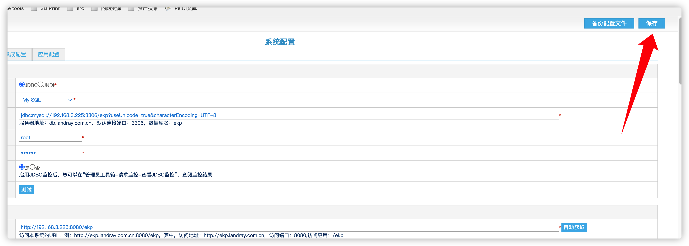
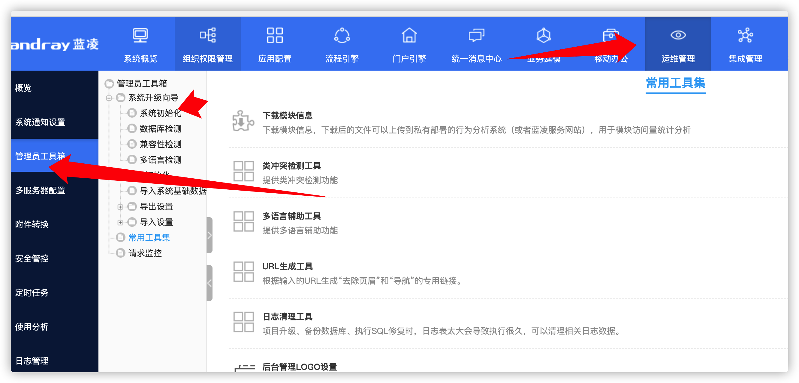
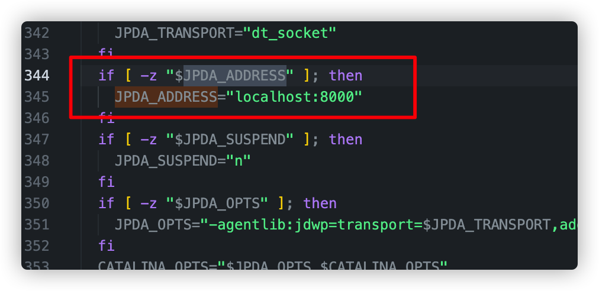

## 1.创建ekp用户

```text
useradd ekp  //添加用户名ekp  
passwd ekp  //为用户ekp设置密码  
```

# 2.使用ekp用户登录

```shell
unzip linux64.zip  
unzip ekp.zip
cd linux64
chmod +x *.sh
```

# 3.启动/关闭Tomcat服务器

确定当前目录路径为`/home/ekp/linux64`

```text
./init.sh
```



初始化成功后，退出ssh，再重新登录ssh，使环境变量生效。再启动tomcat

`./start-safe64.sh`

如果提示`The Apache Tomcat Native library which allows using OpenSSL was not found on the java.library.path`,可忽略，不影响后面使用

如果报错`没有找到配置文件：null/WEB-INF/KmssConfig/admin.properties`,为授权已经过期



配置数据库，访问http://192.168.3.225:8080/ekp/admin.do 密码在ekp/WEB-INF/KmssConfig/admin.properties文件中




通过docker来启动mysql

`docker run -itd --restart=always --name mysql -p 3306:3306 -e MYSQL_ROOT_PASSWORD=123456 mysql:5.7`

创建对应数据库



测试数据库是否正常



配置完成后，保存



执行`./stop-tomcat.sh `,关闭tomcat,然后启动`./start-normal64.sh`,第一次启动会创建数据库,启动成功以后访问

http://192.168.3.225:8080/ekp/sys/


然后执行系统初始化



# 4.远程debug

修改tomcat下bin文件夹中的`catalina64.sh`,localhost修改为0.0.0.0



然后重新启动tomcat

