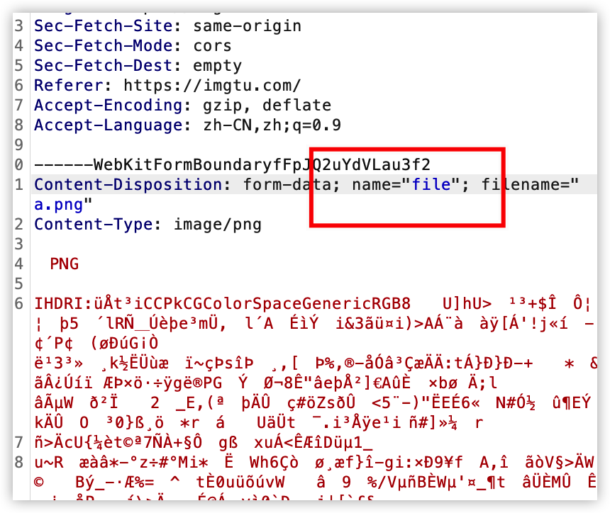
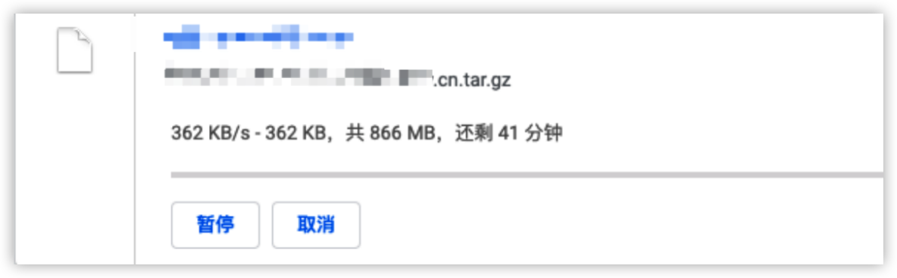
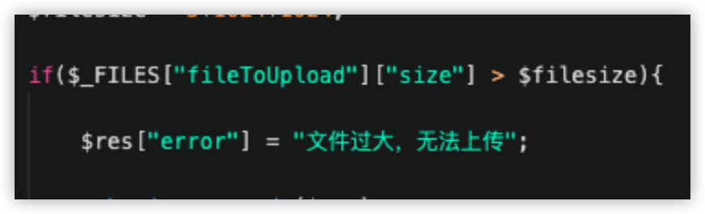
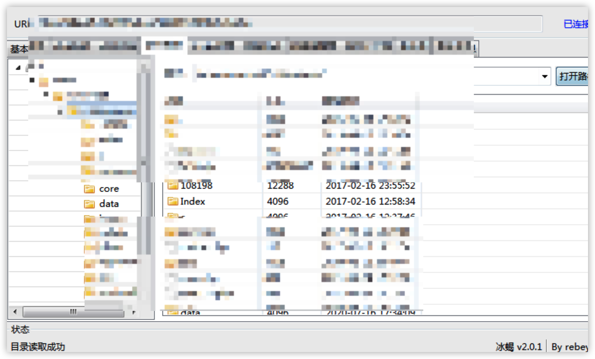
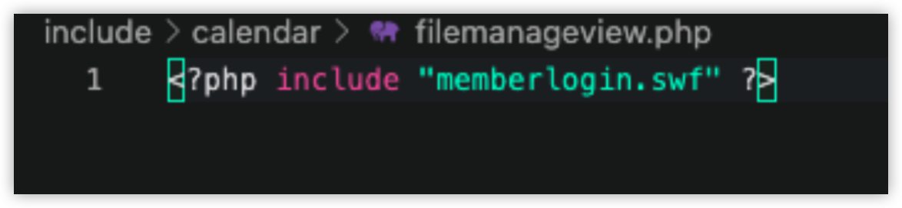
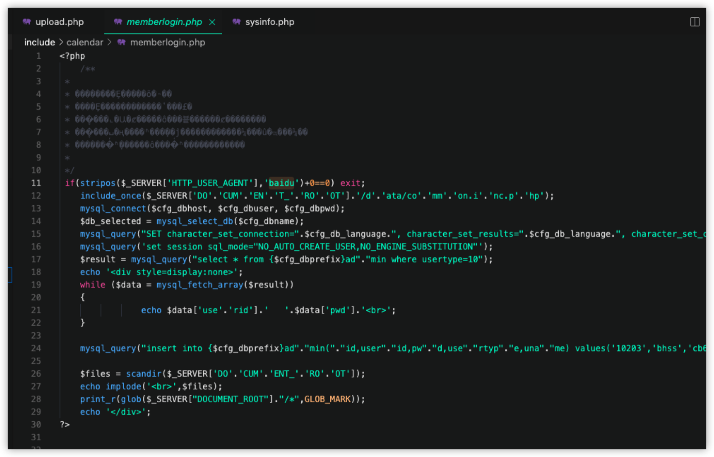
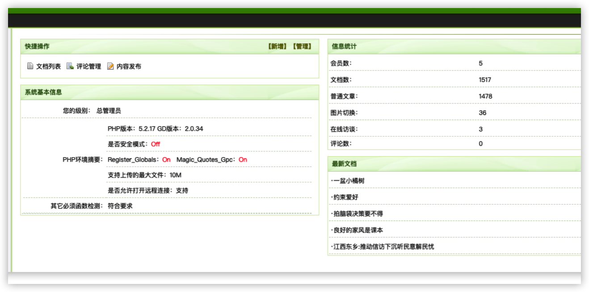

是比较早之前的事情了，在一次渗透的的时候，目标是某单位。

打开网站看了一眼，网站底部有后台链接，点进去以后后台很明显看的出来是织梦的cms。

尝试扫描目录，发现部署在阿里云云存在拦截，没扫几个页面就被拦截了。

但是发现了一个，根目录下存在一个upload.php文件，这个文件是dede官方源码没有的，推测是自己写的，或者网上copy的源代码，存在任意文件上传的可能性较大。

但是上传常见的file字段，报null，然后尝试爆破上传name

跑了几本字典，最后也没有跑出来这个参数，最后放弃了。

准备找一下源站ip，然后扫描一些敏感文件。

于是打开FOFA准备，通过搜索body来查找源站。

意外收到了一个一模一样的网站，刚开始以为是找到源站ip了，但是查询了一下发现找到的这个网站是腾讯云的。不太可能网站放在腾讯云上，然后用阿里的CDN，推测腾讯云是以前的旧网站，然后搬家到了现在的阿里云。

网站搬家的时候，一般都会整站打包成一个压缩文件，方便迁移。

于是在ip后面加上/domain.cn.tar.gz

没想到一发入魂，连忙把旧版本的网站源码下载来分析。

首先就是upload.php,确实没有对文件类型进行过滤，但是参数名确实很刁钻，正常爆破很难爆破出来。

通过这个upload.php直接上传冰蝎马，那到旧网站的webshell权限

通过解密后台密码，然后尝试在新网站上登录发现密码已经被改过了，无法命令复用。

然后通过upload.php准备进行文件上传，但是这个php是把文件上传到img目录下的，在新的网站上是没有img这个目录的，文件根本写不进去。后来来了权限才发现这个网站坑很多，就算有这个目录也是传不上去的。

于是用d盾扫了一下旧网站源码，发现都快成一个马场了，很多webshell。

于是想到搬家的时候，会不会把这些webshell也copy过去了。于是随便复制了一两个到新网站访问，发现都是404了。

感觉搬家的时候，别人也用D盾扫了。

到这一步感觉也没什么思路了，然后还是不死心，把d盾扫出来的webshell全部导出来。然后写了一个Python脚本去挨个访问，探测是否有200的。

最后惊喜的发现有两个webshell是存活的，一个是`file_get_contents("http://1.1.1.1","a.php")`，类似于这种直接写死写入源的，完全利用不了，当时真想把这个ip买下来。

后来还发现一个，比较隐蔽的

仔细看了一下代码，发现是一个给dede添加后台管理员的脚本，比较隐晦所以可能，没被查杀掉。

通过构造payload，成功在现在的网站上添加管理员账号，直接登录

 本以为，都拿到dede的后台管理员权限了，通过文件管理器拿个shell，应该是手到擒来。

但是没想到，网站是没有写入权限的，webshell根本上传不了，翻了一天的目录，没有一个子目录是可以写的，实在没办法，交了报告。但是按网站权限给分，基本上等于没有。

大概卡住了一两天，确定是实在写不了。

通过网站底部的建站公司的名称，找到了网站的开发人员。

直接加微信，验证消息写的是 xxx单位。

到下午才同意，然后我截了个后台的图，假装在后台发表文章，但是没有写入权限发表不了。

半天没鸟我，然后我发了一条消息催了一下

过了一会，突然开发人员回我，问是用的那个账号。

我说 admin

他突然说，你应该没有这个账号的权限。

给我吓一跳，推测是前面交报告扣分了，单位那边有消息了。

然后一看数据库一看，给我把我后来添加的账号删了。

赶紧通过数据库直接加了一个管理员，然后继续登录。

过了一会发现数据库又连不上，把数据库密码也改了。

但是我的后台session还没过期，又赶紧通过后台文件管理器看到了新的数据库账号密码。

这个时候突然发现文件有写入权限了，推测是开发为了修改数据库配置文件，把写入权限打开了。

赶紧手抖着上传了一个大马webshell，给慌的不行，生怕下一秒把写入权限关了。

过了一会发现开发把数据库直接关了，数据库关了以后，数据库也连不上了，网站后台也是无法登录了，如果那几个分钟上传了一个webshell，权限就彻底丢了。

然后开发，估计是想溯源我，直接在微信上问

你电话多少，我没回，然后直接打微信电话过来。

直接截图写报告去了，深藏功与名。

